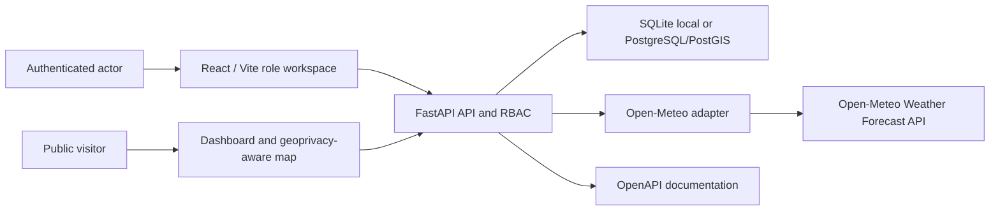
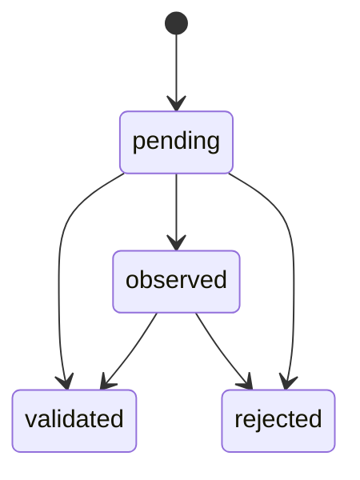

# Sprint 1C architecture

The platform identity is **InfinityAtlas**. The UNICEF solution is
**InfinityAtlas Climate & Health MRV Toolkit**, owned by **INFINITYGAIA S.A.S. B.I.C.**

The prototype remains a modular monolith:

- one React/Vite frontend;
- one FastAPI backend;
- one relational database;
- one isolated Open-Meteo adapter;
- backend-owned dashboard, map, reporting, and export projections;
- no microservices.

## Runtime flow

The frontend never connects directly to the database or climate provider. Permissions are enforced in
the backend even when controls are hidden in the frontend.

Dashboard counts and trends are calculated in the backend. The public map receives a purpose-built
safe projection rather than the internal observation model. Leaflet renders OpenStreetMap tiles and
keeps provider attribution visible.

## Dashboard and map projections

The same validated filter contract drives dashboard metrics, charts, map points, PDF reports, and CSV
exports. Public responses exclude actors, validation comments, internal evidence, credentials, and
session details.

Each observation owns `public_location_mode`:

- `exact`: return the stored coordinate;
- `approximate`: round to the configured public precision, three decimal places by default;
- `aggregate`: use the territory reference coordinate;
- `hidden`: omit public coordinates.

Authenticated map responses remain role-scoped and may use stored coordinates. The public default for
new observations is `approximate`.

## Authentication and authorization

Passwords use Argon2 through `pwdlib`. Login creates a signed, time-limited JWT containing `sub`, `jti`,
role, issuer, issued time and expiry. The signing key is required from `JWT_SECRET_KEY`.

The JWT `jti` is also stored in `auth_sessions`. Every protected request verifies:

1. signature, issuer and expiry;
2. an existing non-revoked session;
3. an active user;
4. the role required by the endpoint;
5. observation ownership where the actor is a monitor.

Logout revokes the stored session. This is a prototype security model; a funded web deployment should
prefer a hardened same-site HttpOnly cookie, CSRF controls, rate limiting, password recovery and an
external identity review.

## Permission model

| Action | Admin | Monitor | Validator | Public |
| --- | --- | --- | --- | --- |
| Read internal observations | All | Own | All | No |
| Create observation | Yes | Yes | No | No |
| Update observation content | Yes | Own pending | No | No |
| Edit record title | Any state | Own pending or observed | No | No |
| Validate / observe / reject | Yes | No | Yes | No |
| Read observation audit | Yes | Own | Yes | No |
| Manage demo-user active state | Yes | No | No | No |
| Read public dashboard and map | Yes | Yes | Yes | Yes |
| Read internal map | All | Own | All | No |

## Validation flow

`observed` and `rejected` require a comment. Every decision creates an immutable validation row and
append-only `validation_created` plus `status_changed` audit events.

## Risk calculation

The backend service under `backend/app/services/risk.py` owns the formula:

`Risk Score = Hazard + Exposure + Vulnerability`

Each component is restricted to 1-4. Bands are low 3-5, moderate 6-8, high 9-10 and critical 11-12.
Each calculation stores the components, result, level, provenance, responsible actor, UTC timestamp,
non-clinical flag and methodology version `climate-health-risk-v0.1`. Updating a component appends a
new score snapshot instead of changing the previous calculation.

## Traceability

`audit_events` is append-only through normal application APIs. It records actor, role, UTC timestamp,
event type, entity, prior and next states, comment and methodology version when applicable. Sprint 1B
does not claim cryptographic immutability; privileged database operators can still alter storage.

Every record-title change creates a `record_title_changed` event with the previous title, new title,
actor, role, UTC timestamp and observation identifier. The same backend authorization rules apply
regardless of whether the client displays an edit control.

## Time handling

The database stores UTC. Each territory owns an IANA timezone. The reference San Cristobal territory
uses `Pacific/Galapagos`. A naive browser `datetime-local` value is interpreted by the backend in that
territory timezone and converted to UTC.

## Reference and demo operations

Alembic migrations contain schema changes only. `python -m app.bootstrap` manages the reference project
and territory. `python -m app.demo_users` creates local identities and is blocked outside
local/development/test. Neither command is part of normal Docker or production startup.

English remains the default UNICEF demonstration language. Spanish is selectable. Visible text is
stored under `frontend/src/i18n/`; code, endpoints and technical documentation remain English.
