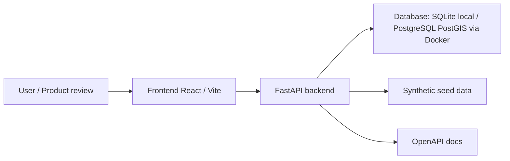

# Sprint 0 architecture

The first prototype uses a modular monolith approach:

- one frontend application;
- one backend API;
- one relational database;
- documented modules that can later evolve without becoming microservices now.

## Diagram

## Why this architecture

The UNICEF deadline requires a small executable product, not an enterprise system. A modular monolith keeps the prototype fast, portable and reviewable while preserving clear domains:

- users and roles;
- projects and territories;
- observations and evidence;
- validation;
- climate data;
- risk scoring;
- dashboard summary.

## Local database decision

Sprint 0 supports SQLite for immediate local validation because Docker is not installed in the current environment. Docker Compose is included for PostgreSQL/PostGIS so the project can move to the intended geospatial stack when Docker is available.

## API first rule

The frontend does not connect directly to the database. It reads data through the backend API.

## Local seed guard

`POST /api/v1/admin/seed` is a development utility only. It is available in local/development/test environments and hidden/disabled outside those environments until an administrative permission model exists.

## Internationalization baseline

The frontend defaults to English for the UNICEF demo and exposes Spanish as a selectable language. Visible UI text is stored under `frontend/src/i18n/`; code, endpoints and technical documentation remain in English.

## Open source boundary

This repository must contain only the open-source UNICEF toolkit scope. It must not include confidential UNICEF documents, secrets, private InfinityAtlas Core assets, or data that identifies children.
