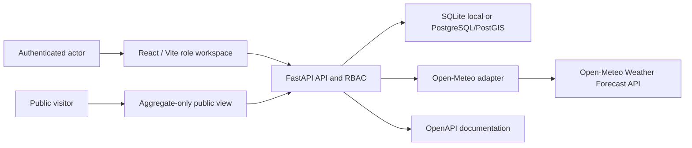
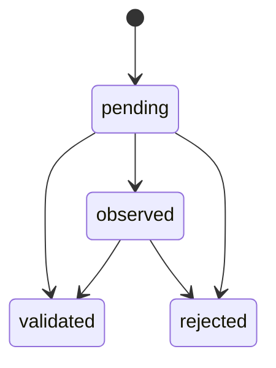

# Sprint 1B architecture

The platform identity is **InfinityAtlas**. The UNICEF solution is
**InfinityAtlas Climate & Health MRV Toolkit**, owned by **INFINITYGAIA S.A.S. B.I.C.**

The prototype remains a modular monolith:

- one React/Vite frontend;
- one FastAPI backend;
- one relational database;
- one isolated Open-Meteo adapter;
- no microservices and no Sprint 1C modules.

## Runtime flow

The frontend never connects directly to the database or climate provider. Permissions are enforced in
the backend even when controls are hidden in the frontend.

## Authentication and authorization

Passwords use Argon2 through `pwdlib`. Login creates a signed, time-limited JWT containing `sub`, `jti`,
role, issuer, issued time and expiry. The signing key is required from `JWT_SECRET_KEY`.

The JWT `jti` is also stored in `auth_sessions`. Every protected request verifies:

1. signature, issuer and expiry;
2. an existing non-revoked session;
3. an active user;
4. the role required by the endpoint;
5. observation ownership where the actor is a monitor.

Logout revokes the stored session. This is a prototype security model; a funded web deployment should
prefer a hardened same-site HttpOnly cookie, CSRF controls, rate limiting, password recovery and an
external identity review.

## Permission model

| Action | Admin | Monitor | Validator | Public |
| --- | --- | --- | --- | --- |
| Read internal observations | All | Own | All | No |
| Create observation | Yes | Yes | No | No |
| Update observation | Yes | Own pending | No | No |
| Validate / observe / reject | Yes | No | Yes | No |
| Read observation audit | Yes | Own | Yes | No |
| Manage demo-user active state | Yes | No | No | No |
| Read aggregate public summary | Yes | Yes | Yes | Yes |

## Validation flow

`observed` and `rejected` require a comment. Every decision creates an immutable validation row and
append-only `validation_created` plus `status_changed` audit events.

## Risk calculation

The backend service under `backend/app/services/risk.py` owns the formula:

`Risk Score = Hazard + Exposure + Vulnerability`

Each component is restricted to 1-4. Bands are low 3-5, moderate 6-8, high 9-10 and critical 11-12.
Each calculation stores the components, result, level, provenance, responsible actor, UTC timestamp,
non-clinical flag and methodology version `climate-health-risk-v0.1`. Updating a component appends a
new score snapshot instead of changing the previous calculation.

## Traceability

`audit_events` is append-only through normal application APIs. It records actor, role, UTC timestamp,
event type, entity, prior and next states, comment and methodology version when applicable. Sprint 1B
does not claim cryptographic immutability; privileged database operators can still alter storage.

## Time handling

The database stores UTC. Each territory owns an IANA timezone. The reference San Cristobal territory
uses `Pacific/Galapagos`. A naive browser `datetime-local` value is interpreted by the backend in that
territory timezone and converted to UTC.

## Reference and demo operations

Alembic migrations contain schema changes only. `python -m app.bootstrap` manages the reference project
and territory. `python -m app.demo_users` creates local identities and is blocked outside
local/development/test. Neither command is part of normal Docker or production startup.

English remains the default UNICEF demonstration language. Spanish is selectable. Visible text is
stored under `frontend/src/i18n/`; code, endpoints and technical documentation remain English.
