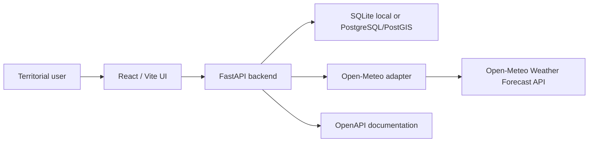
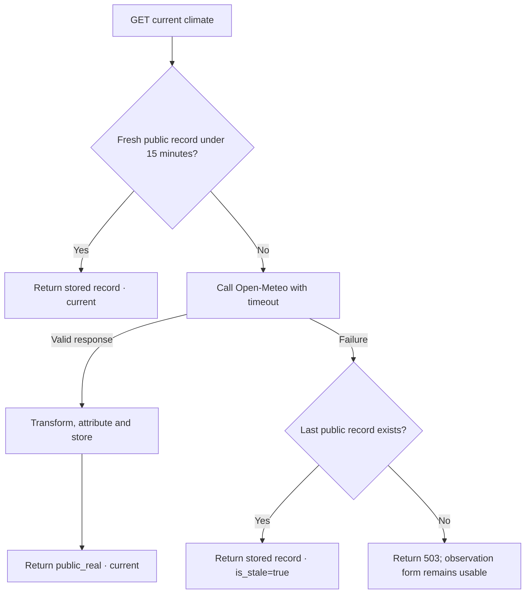

# Sprint 1A architecture

The prototype remains a modular monolith:

- one React/Vite frontend;
- one FastAPI backend;
- one relational database;
- one isolated external climate adapter;
- no microservices and no future modules.

## Runtime flow

## Climate request behavior

## Data boundaries

The frontend never connects directly to the database or Open-Meteo. The backend owns:

- provider timeout and response validation;
- climate data transformation and source attribution;
- cache and stale fallback behavior;
- observation status and provenance rules;
- evidence URL validation and persistence.

Evidence uses external URL references in Sprint 1A. Files, photographs and documents are not uploaded
to the repository or local application storage. This keeps personal, clinical and confidential material
outside the prototype until a reviewed private storage design exists.

## Internationalization

English remains the default for the UNICEF demonstration. Spanish is selectable. Visible interface text
is stored under `frontend/src/i18n/`; code, endpoints and technical documentation remain in English.

## Security guard

`POST /api/v1/admin/seed` is hidden and returns 404 outside local/development/test environments.
Automatic startup seeding is also limited to those environments and remains disabled by default.

## Reference and demo data operations

Alembic migrations contain schema transformations only. Reference data are created or updated
manually with the idempotent `python -m app.bootstrap` command.

The clean demonstration operation requires both `--clean-demo` and `--confirm-clean-demo`, is blocked
outside local/development/test, and is never part of normal application or Docker startup. It
preserves the reference prototype and San Cristobal while replacing observations with one explicit
`controlled_test` record.
