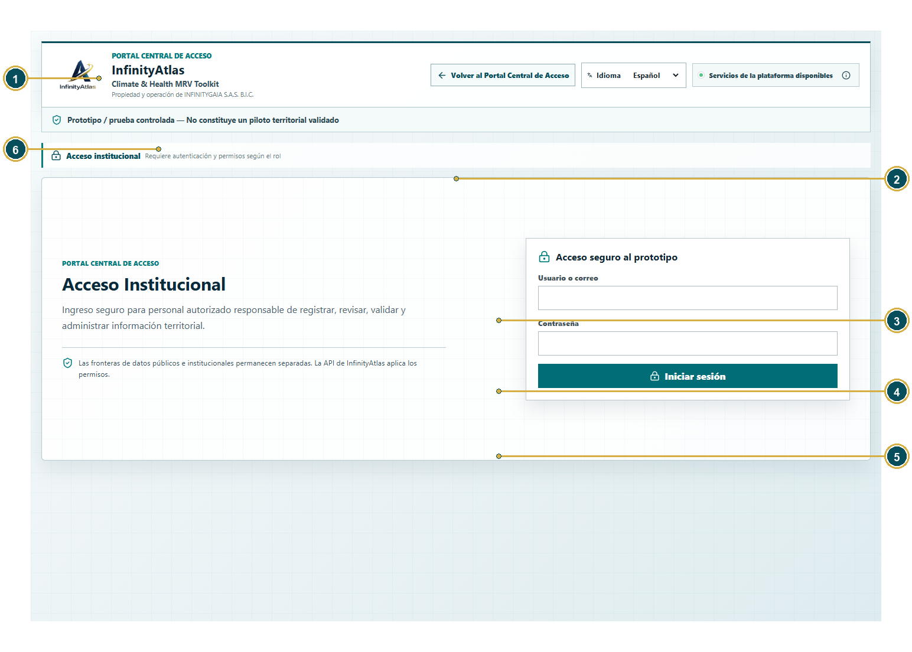
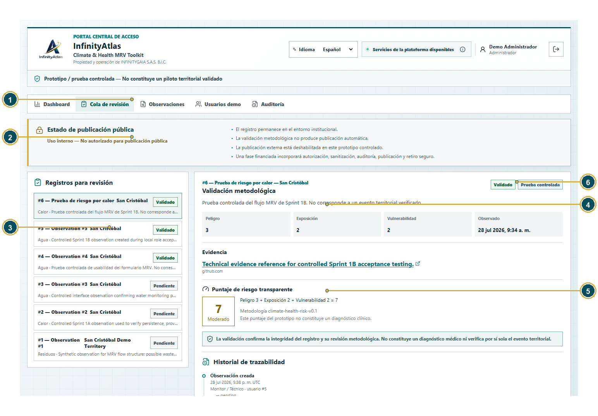
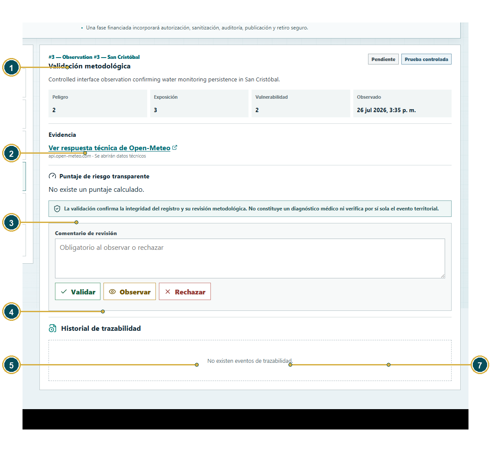
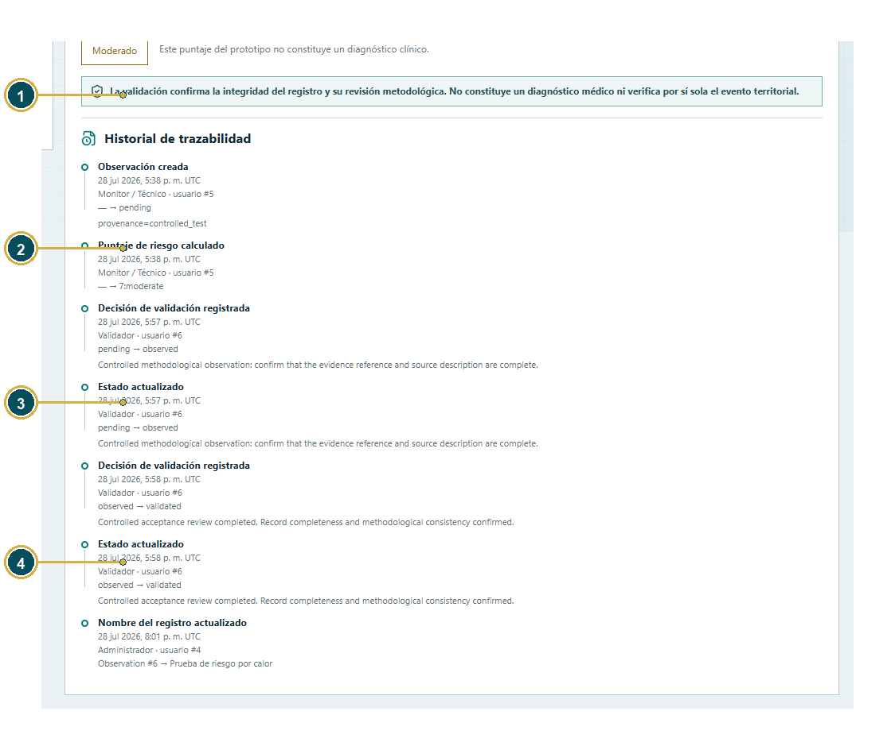
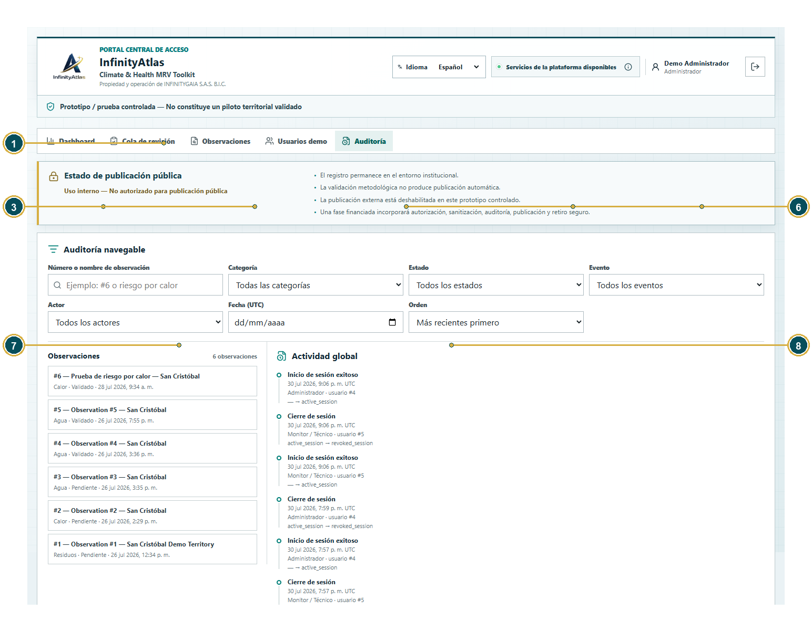
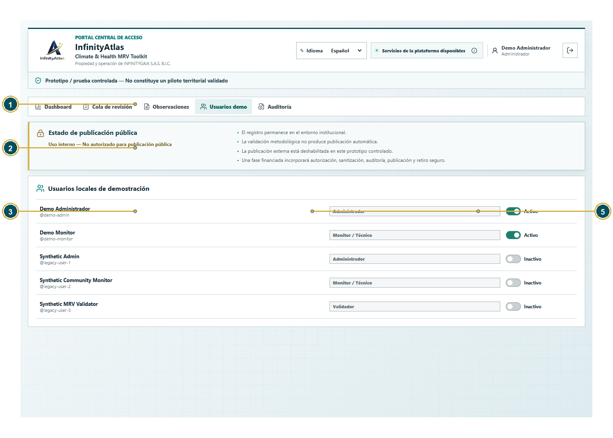

# Manual de Usuario Administrador

## Revisión, validación, auditoría y control institucional

**Producto:** InfinityAtlas Climate & Health MRV Toolkit  
**Propiedad y operación:** INFINITYGAIA S.A.S. B.I.C.  
**Versión del manual:** 1.0 - Borrador para UAT  
**Fecha:** 30 de julio de 2026  
**Commit documentado:** `2543f7b3bd57598f22698f175b9eb50a671c59e0`  
**Rama:** `feature/sprint-1d-b-unified-demo-flow`

> Prototipo / prueba controlada - No constituye un piloto territorial validado.

## Control documental

| Versión | Fecha | Descripción del cambio | Preparado por | Aprobado por |
| --- | --- | --- | --- | --- |
| 1.0 - Borrador para UAT | 30 de julio de 2026 | Segunda edición corregida: ortografía, localización visible, fichas específicas, índice navegable, enlaces internos y marcadores PDF. | Ciro (Codex) para INFINITYGAIA S.A.S. B.I.C. | Pendiente de aprobación final de Carlos y Nova |

<a id="indice"></a>

## Tabla de contenidos

- [1. ¿Qué es InfinityAtlas?](#chapter-1)
  - [1.1 ¿Qué significa MRV?](#section-1-1)
- [2. Qué hace el Administrador](#chapter-2)
- [3. Cómo encender InfinityAtlas](#chapter-3)
  - [3.1 ¿Qué es PowerShell?](#section-3-1)
- [4. Cómo entrar al Portal Central](#chapter-4)
- [5. Pestañas del Administrador](#chapter-5)
- [6. Cola de revisión: elementos del registro](#chapter-6)
- [7. Estados de revisión](#chapter-7)
- [8. Flujo paso a paso de validación](#chapter-8)
- [9. Historial de trazabilidad](#chapter-9)
- [10. Auditoría: campo por campo](#chapter-10)
  - [10.1 Ejemplo: buscar todos los eventos del registro número 6](#section-10-1)
- [11. Usuarios demo y Validador inactivo](#chapter-11)
- [12. Panel de publicación pública](#chapter-12)
- [13. Qué permanece privado](#chapter-13)
- [14. Ejercicio completo del Administrador](#chapter-14)
- [15. Cómo cerrar sesión y apagar el sistema](#chapter-15)
- [16. Errores frecuentes del Administrador](#chapter-16)
- [17. Apéndice A. Cómo presentar InfinityAtlas en una demostración en vivo](#chapter-17)
- [18. Apéndice B. Solución de problemas](#chapter-18)

---

<a id="chapter-1"></a>

# 1. ¿Qué es InfinityAtlas?

[Volver al índice](#indice)

InfinityAtlas Climate & Health MRV Toolkit organiza información territorial para que sea más fácil observar, registrar, revisar y explicar riesgos relacionados con clima, salud, agua, residuos y contaminación ambiental.

<a id="section-1-1"></a>

## 1.1 ¿Qué significa MRV?

| Palabra | Explicación sencilla |
| --- | --- |
| Medir | Registrar qué se observó, dónde, cuándo y con qué nivel metodológico. |
| Reportar | Guardar la información de forma ordenada y producir reportes comprensibles. |
| Verificar | Revisar que el registro esté completo y siga la metodología acordada. |

En este manual el enfoque es revisar, decidir, supervisar y conservar trazabilidad. InfinityAtlas puede apoyar decisiones que protejan a niños, familias y comunidades, pero no reemplaza la evaluación de especialistas.

> **Límite importante**  
> InfinityAtlas no es una herramienta de diagnóstico médico. No ingreses nombres de niños, historias clínicas, documentos de identidad, fotografías identificables ni otros datos personales.

<a id="chapter-2"></a>

# 2. Qué hace el Administrador

[Volver al índice](#indice)

| Acción | Significado |
| --- | --- |
| Crear | Registrar una observación. En la demostración principal esta tarea corresponde al Monitor. |
| Revisar | Leer datos, evidencia, puntaje, procedencia y geoprivacidad. |
| Observar | Pedir aclaraciones o correcciones antes de validar. |
| Validar | Confirmar integridad y consistencia metodológica. |
| Rechazar | Cerrar el flujo porque no cumple requisitos mínimos. |
| Publicar | Transferir información autorizada a una superficie pública. Esta función no está habilitada. |
| Auditar | Consultar quién hizo cada acción, cuándo y con qué cambio. |

> **Rol Validador**  
> El Administrador realiza la validación metodológica durante el prototipo. demo-validator está inactivo y oculto. Los modelos, permisos y pruebas históricas del rol Validador se conservan para una futura separación de responsabilidades.

<a id="chapter-3"></a>

# 3. Cómo encender InfinityAtlas

[Volver al índice](#indice)

InfinityAtlas funciona localmente mediante tres servicios: el Portal Central, la API institucional y el Dashboard Público. El script de inicio los enciende juntos.

<a id="section-3-1"></a>

## 3.1 ¿Qué es PowerShell?

PowerShell es una ventana de Windows donde se escriben instrucciones. No necesitas saber programar. Solo debes copiar los dos comandos exactamente como aparecen.

1. Presiona la tecla Windows.
2. Escribe PowerShell.
3. Abre Windows PowerShell.
4. Copia el primer comando y presiona Enter.
5. Copia el segundo comando y presiona Enter.
6. Espera hasta que aparezcan las direcciones de los servicios.

```powershell
cd "C:\Users\carlo\OneDrive\Documentos\InfinityAtlas_GitHub_Publication"
.\start-local.ps1
```

> **Resultado esperado**  
> El Portal Central debe responder en <http://127.0.0.1:5173/> y la API debe responder en <http://127.0.0.1:8000/health>. Si una página no abre, espera 20 segundos y actualiza una vez.

<a id="chapter-4"></a>

# 4. Cómo entrar al Portal Central

[Volver al índice](#indice)

1. Abre Google Chrome.
2. Escribe <http://127.0.0.1:5173/> en la barra superior.
3. Presiona Enter.
4. Selecciona Español.
5. Presiona Iniciar sesión.
6. Escribe demo-admin en Usuario o correo.
7. Escribe la contraseña local. La contraseña no aparece en este manual.
8. Presiona Iniciar sesión.
9. Confirma que el encabezado muestra Demo Administrador y el rol Administrador.

> **Protege la contraseña**  
> No fotografíes, grabes, copies en un chat ni compartas la contraseña. Si Chrome ofrece guardarla, Carlos decide si acepta. Este manual nunca contiene contraseñas.


*Figura 1. Portal Central de InfinityAtlas. 1: marca; 2: idioma; 3: estado de servicios; 4: acceso público; 5: acceso institucional; 6: aviso de prototipo; 7: frontera de datos.*



*Figura 2. Acceso institucional. 1: marca; 2: volver al portal; 3: idioma; 4: usuario; 5: contraseña protegida; 6: iniciar sesión; 7: aviso de prototipo.*

> **Contraseña local del Administrador**  
> Usa únicamente la contraseña local configurada en backend/.env. Este manual no contiene su valor. No la fotografíes, copies en chats ni guardes en documentación.

<a id="chapter-5"></a>

# 5. Pestañas del Administrador

[Volver al índice](#indice)



*Figura 3. Cola de revisión del Administrador. 1: identidad; 2: navegación; 3: publicación; 4: cola; 5: detalle; 6: estado y procedencia; 7: componentes; 8: evidencia.*

### Ficha: Dashboard

| Elemento | Explicación |
| --- | --- |
| Nombre exacto en español | Dashboard |
| Nombre exacto en inglés | Dashboard |
| Tipo de elemento | Campo opcional |
| ¿Para qué sirve? | Muestra métricas generales y accesos rápidos. |
| ¿Qué debe escribir o seleccionar el usuario? | Presiona para regresar al resumen. |
| Ejemplo correcto | Resumen institucional. |
| Ejemplo incorrecto | Dashboard Público. |
| ¿Es obligatorio? | No |
| ¿Qué sucede si se deja vacío? | El registro puede continuar. InfinityAtlas conserva el valor predeterminado o deja este dato opcional sin registrar, según corresponda. |
| ¿Quién puede verlo? | Administrador |
| ¿Contiene información privada? | Sí: métricas internas. |
| ¿Puede incluirse en una publicación pública? | No en su forma institucional. Requiere autorización, sanitización y una revisión de privacidad. |
| Error común | Confundirlo con la vista pública. |
| Cómo corregirlo | Usa el Portal para abrir información pública. |

### Ficha: Cola de revisión

| Elemento | Explicación |
| --- | --- |
| Nombre exacto en español | Cola de revisión |
| Nombre exacto en inglés | Review queue |
| Tipo de elemento | Campo opcional |
| ¿Para qué sirve? | Lista registros que el Administrador puede revisar. |
| ¿Qué debe escribir o seleccionar el usuario? | Selecciona un registro. |
| Ejemplo correcto | #3 - Pendiente. |
| Ejemplo incorrecto | Elegir sin leer procedencia. |
| ¿Es obligatorio? | No |
| ¿Qué sucede si se deja vacío? | El registro puede continuar. InfinityAtlas conserva el valor predeterminado o deja este dato opcional sin registrar, según corresponda. |
| ¿Quién puede verlo? | Administrador |
| ¿Contiene información privada? | Sí |
| ¿Puede incluirse en una publicación pública? | No en su forma institucional. Requiere autorización, sanitización y una revisión de privacidad. |
| Error común | No aparece un registro. |
| Cómo corregirlo | Limpia filtros o revisa el alcance. |

### Ficha: Observaciones

| Elemento | Explicación |
| --- | --- |
| Nombre exacto en español | Observaciones |
| Nombre exacto en inglés | Observations |
| Tipo de elemento | Campo opcional |
| ¿Para qué sirve? | Muestra registros territoriales disponibles. |
| ¿Qué debe escribir o seleccionar el usuario? | Busca por número o nombre. |
| Ejemplo correcto | #6 o prueba de riesgo. |
| Ejemplo incorrecto | Buscar una contraseña. |
| ¿Es obligatorio? | No |
| ¿Qué sucede si se deja vacío? | El registro puede continuar. InfinityAtlas conserva el valor predeterminado o deja este dato opcional sin registrar, según corresponda. |
| ¿Quién puede verlo? | Administrador |
| ¿Contiene información privada? | Sí |
| ¿Puede incluirse en una publicación pública? | No en su forma institucional. Requiere autorización, sanitización y una revisión de privacidad. |
| Error común | No encontrar un título histórico. |
| Cómo corregirlo | Busca por número. |

### Ficha: Usuarios demo

| Elemento | Explicación |
| --- | --- |
| Nombre exacto en español | Usuarios demo |
| Nombre exacto en inglés | Demo users |
| Tipo de elemento | Campo opcional |
| ¿Para qué sirve? | Muestra cuentas locales y su estado. |
| ¿Qué debe escribir o seleccionar el usuario? | Consulta o cambia solo cuando esté autorizado. |
| Ejemplo correcto | Demo Monitor activo. |
| Ejemplo incorrecto | Publicar contraseñas. |
| ¿Es obligatorio? | No |
| ¿Qué sucede si se deja vacío? | El registro puede continuar. InfinityAtlas conserva el valor predeterminado o deja este dato opcional sin registrar, según corresponda. |
| ¿Quién puede verlo? | Administrador |
| ¿Contiene información privada? | Sí |
| ¿Puede incluirse en una publicación pública? | No en su forma institucional. Requiere autorización, sanitización y una revisión de privacidad. |
| Error común | Intentar activar demo-validator deshabilitado. |
| Cómo corregirlo | Respeta la configuración del prototipo. |

### Ficha: Auditoría

| Elemento | Explicación |
| --- | --- |
| Nombre exacto en español | Auditoría |
| Nombre exacto en inglés | Audit |
| Tipo de elemento | Campo opcional |
| ¿Para qué sirve? | Explora eventos globales o por observación. |
| ¿Qué debe escribir o seleccionar el usuario? | Aplica filtros y selecciona una observación. |
| Ejemplo correcto | Eventos del registro #6. |
| Ejemplo incorrecto | Editar la auditoría. |
| ¿Es obligatorio? | No |
| ¿Qué sucede si se deja vacío? | El registro puede continuar. InfinityAtlas conserva el valor predeterminado o deja este dato opcional sin registrar, según corresponda. |
| ¿Quién puede verlo? | Administrador |
| ¿Contiene información privada? | Sí: contiene actores y acciones. |
| ¿Puede incluirse en una publicación pública? | No en su forma institucional. Requiere autorización, sanitización y una revisión de privacidad. |
| Error común | Esperar un botón eliminar. |
| Cómo corregirlo | La auditoría es append-only. |

### Ficha: Estado de publicación pública

| Elemento | Explicación |
| --- | --- |
| Nombre exacto en español | Estado de publicación pública |
| Nombre exacto en inglés | Public release status |
| Tipo de elemento | Campo opcional |
| ¿Para qué sirve? | Explica la frontera entre validación interna y publicación. |
| ¿Qué debe escribir o seleccionar el usuario? | Lee el estado antes de presentar un registro. |
| Ejemplo correcto | Uso interno - No autorizado para publicación pública. |
| Ejemplo incorrecto | Afirmar que Validado significa publicado. |
| ¿Es obligatorio? | No |
| ¿Qué sucede si se deja vacío? | El registro puede continuar. InfinityAtlas conserva el valor predeterminado o deja este dato opcional sin registrar, según corresponda. |
| ¿Quién puede verlo? | Administrador |
| ¿Contiene información privada? | Sí |
| ¿Puede incluirse en una publicación pública? | No en su forma institucional. Requiere autorización, sanitización y una revisión de privacidad. |
| Error común | Confundir validación con publicación. |
| Cómo corregirlo | Recuerda que D1 pública está separada. |

<a id="chapter-6"></a>

# 6. Cola de revisión: elementos del registro

[Volver al índice](#indice)

### Ficha: Número del registro

| Elemento | Explicación |
| --- | --- |
| Nombre exacto en español | Número del registro |
| Nombre exacto en inglés | Record number |
| Tipo de elemento | Campo opcional |
| ¿Para qué sirve? | Identifica la observación institucional. |
| ¿Qué debe escribir o seleccionar el usuario? | Úsalo para búsqueda y auditoría. |
| Ejemplo correcto | #6. |
| Ejemplo incorrecto | Número público 101. |
| ¿Es obligatorio? | No |
| ¿Qué sucede si se deja vacío? | El registro puede continuar. InfinityAtlas conserva el valor predeterminado o deja este dato opcional sin registrar, según corresponda. |
| ¿Quién puede verlo? | Administrador |
| ¿Contiene información privada? | No |
| ¿Puede incluirse en una publicación pública? | Solo después de revisión, autorización y sanitización; nunca de forma automática. |
| Error común | Confundir ID institucional con ID público. |
| Cómo corregirlo | Menciona el contexto de la base. |

### Ficha: Nombre corto

| Elemento | Explicación |
| --- | --- |
| Nombre exacto en español | Nombre corto |
| Nombre exacto en inglés | Record title |
| Tipo de elemento | Campo obligatorio |
| ¿Para qué sirve? | Resume el registro. |
| ¿Qué debe escribir o seleccionar el usuario? | Lee el título antes de decidir. |
| Ejemplo correcto | Prueba de riesgo por calor. |
| Ejemplo incorrecto | Un título con nombre personal. |
| ¿Es obligatorio? | Sí en el registro |
| ¿Qué sucede si se deja vacío? | InfinityAtlas detiene el guardado o la acción y señala este campo para que el usuario lo complete. |
| ¿Quién puede verlo? | Administrador |
| ¿Contiene información privada? | Puede contener datos si fue mal escrito. |
| ¿Puede incluirse en una publicación pública? | Solo después de revisión, autorización y sanitización; nunca de forma automática. |
| Error común | Título histórico en inglés. |
| Cómo corregirlo | Usa el número y registra la inconsistencia. |

### Ficha: Categoría

| Elemento | Explicación |
| --- | --- |
| Nombre exacto en español | Categoría |
| Nombre exacto en inglés | Category |
| Tipo de elemento | Campo obligatorio |
| ¿Para qué sirve? | Clasifica el tema. |
| ¿Qué debe escribir o seleccionar el usuario? | Comprueba que coincide con la descripción. |
| Ejemplo correcto | Calor. |
| Ejemplo incorrecto | Agua para un registro de residuos. |
| ¿Es obligatorio? | Sí |
| ¿Qué sucede si se deja vacío? | InfinityAtlas detiene el guardado o la acción y señala este campo para que el usuario lo complete. |
| ¿Quién puede verlo? | Administrador |
| ¿Contiene información privada? | No |
| ¿Puede incluirse en una publicación pública? | Solo después de revisión, autorización y sanitización; nunca de forma automática. |
| Error común | Categoría incoherente. |
| Cómo corregirlo | Observa el registro y pide corrección. |

### Ficha: Estado

| Elemento | Explicación |
| --- | --- |
| Nombre exacto en español | Estado |
| Nombre exacto en inglés | Status |
| Tipo de elemento | Campo obligatorio |
| ¿Para qué sirve? | Muestra Pendiente, Observado, Validado o Rechazado. |
| ¿Qué debe escribir o seleccionar el usuario? | Comprueba la transición permitida. |
| Ejemplo correcto | Pendiente antes de revisar. |
| Ejemplo incorrecto | Validado sin revisión. |
| ¿Es obligatorio? | Sí |
| ¿Qué sucede si se deja vacío? | InfinityAtlas detiene el guardado o la acción y señala este campo para que el usuario lo complete. |
| ¿Quién puede verlo? | Administrador |
| ¿Contiene información privada? | No |
| ¿Puede incluirse en una publicación pública? | Solo después de revisión, autorización y sanitización; nunca de forma automática. |
| Error común | Intentar una transición no permitida. |
| Cómo corregirlo | Sigue el flujo definido. |

### Ficha: Procedencia

| Elemento | Explicación |
| --- | --- |
| Nombre exacto en español | Procedencia |
| Nombre exacto en inglés | Provenance |
| Tipo de elemento | Campo obligatorio |
| ¿Para qué sirve? | Distingue real, controlado o sintético. |
| ¿Qué debe escribir o seleccionar el usuario? | Verifica que la fuente lo demuestre. |
| Ejemplo correcto | Prueba controlada. |
| Ejemplo incorrecto | Dato público real sin fuente. |
| ¿Es obligatorio? | Sí |
| ¿Qué sucede si se deja vacío? | InfinityAtlas detiene el guardado o la acción y señala este campo para que el usuario lo complete. |
| ¿Quién puede verlo? | Administrador |
| ¿Contiene información privada? | No |
| ¿Puede incluirse en una publicación pública? | Solo después de revisión, autorización y sanitización; nunca de forma automática. |
| Error común | Ocultar que es sintético. |
| Cómo corregirlo | Rechaza u observa hasta corregir. |

### Ficha: Descripción

| Elemento | Explicación |
| --- | --- |
| Nombre exacto en español | Descripción |
| Nombre exacto en inglés | Description |
| Tipo de elemento | Campo obligatorio |
| ¿Para qué sirve? | Explica el hecho registrado. |
| ¿Qué debe escribir o seleccionar el usuario? | Lee si contiene contexto suficiente y seguro. |
| Ejemplo correcto | Descripción factual sin personas. |
| Ejemplo incorrecto | Diagnóstico individual. |
| ¿Es obligatorio? | Sí |
| ¿Qué sucede si se deja vacío? | InfinityAtlas detiene el guardado o la acción y señala este campo para que el usuario lo complete. |
| ¿Quién puede verlo? | Administrador |
| ¿Contiene información privada? | Sí si fue mal redactada. |
| ¿Puede incluirse en una publicación pública? | No en su forma institucional. Requiere autorización, sanitización y una revisión de privacidad. |
| Error común | Datos personales visibles. |
| Cómo corregirlo | No continúes; aplica el protocolo de privacidad. |

### Ficha: Evidencia

| Elemento | Explicación |
| --- | --- |
| Nombre exacto en español | Evidencia |
| Nombre exacto en inglés | Evidence |
| Tipo de elemento | Campo obligatorio |
| ¿Para qué sirve? | Abre la referencia autorizada. |
| ¿Qué debe escribir o seleccionar el usuario? | Comprueba fuente, fecha y relación. |
| Ejemplo correcto | Rama pública controlada. |
| Ejemplo incorrecto | Enlace roto o privado. |
| ¿Es obligatorio? | Sí en este prototipo |
| ¿Qué sucede si se deja vacío? | InfinityAtlas detiene el guardado o la acción y señala este campo para que el usuario lo complete. |
| ¿Quién puede verlo? | Administrador |
| ¿Contiene información privada? | Puede ser sensible. |
| ¿Puede incluirse en una publicación pública? | Solo después de revisión, autorización y sanitización; nunca de forma automática. |
| Error común | El enlace no abre. |
| Cómo corregirlo | Observa el registro y solicita nueva referencia. |

### Ficha: Peligro

| Elemento | Explicación |
| --- | --- |
| Nombre exacto en español | Peligro |
| Nombre exacto en inglés | Hazard |
| Tipo de elemento | Campo obligatorio |
| ¿Para qué sirve? | Componente 1-4 del puntaje. |
| ¿Qué debe escribir o seleccionar el usuario? | Comprueba coherencia metodológica. |
| Ejemplo correcto | 3. |
| Ejemplo incorrecto | 5. |
| ¿Es obligatorio? | Sí |
| ¿Qué sucede si se deja vacío? | InfinityAtlas detiene el guardado o la acción y señala este campo para que el usuario lo complete. |
| ¿Quién puede verlo? | Administrador |
| ¿Contiene información privada? | No |
| ¿Puede incluirse en una publicación pública? | Solo después de revisión, autorización y sanitización; nunca de forma automática. |
| Error común | Valor fuera de rango. |
| Cómo corregirlo | El backend debe rechazarlo; no valides. |

### Ficha: Exposición

| Elemento | Explicación |
| --- | --- |
| Nombre exacto en español | Exposición |
| Nombre exacto en inglés | Exposure |
| Tipo de elemento | Campo obligatorio |
| ¿Para qué sirve? | Componente 1-4 sobre alcance. |
| ¿Qué debe escribir o seleccionar el usuario? | Comprueba que no se confunda con gravedad. |
| Ejemplo correcto | 2. |
| Ejemplo incorrecto | Nombres de personas. |
| ¿Es obligatorio? | Sí |
| ¿Qué sucede si se deja vacío? | InfinityAtlas detiene el guardado o la acción y señala este campo para que el usuario lo complete. |
| ¿Quién puede verlo? | Administrador |
| ¿Contiene información privada? | No |
| ¿Puede incluirse en una publicación pública? | Solo después de revisión, autorización y sanitización; nunca de forma automática. |
| Error común | Valor incoherente. |
| Cómo corregirlo | Observa y explica qué aclarar. |

### Ficha: Vulnerabilidad

| Elemento | Explicación |
| --- | --- |
| Nombre exacto en español | Vulnerabilidad |
| Nombre exacto en inglés | Vulnerability |
| Tipo de elemento | Campo obligatorio |
| ¿Para qué sirve? | Componente 1-4 sobre capacidad de respuesta. |
| ¿Qué debe escribir o seleccionar el usuario? | Comprueba contexto general. |
| Ejemplo correcto | 2. |
| Ejemplo incorrecto | Historia clínica. |
| ¿Es obligatorio? | Sí |
| ¿Qué sucede si se deja vacío? | InfinityAtlas detiene el guardado o la acción y señala este campo para que el usuario lo complete. |
| ¿Quién puede verlo? | Administrador |
| ¿Contiene información privada? | No |
| ¿Puede incluirse en una publicación pública? | Solo después de revisión, autorización y sanitización; nunca de forma automática. |
| Error común | Usar información clínica. |
| Cómo corregirlo | Solicita una clasificación territorial. |

### Ficha: Puntaje y nivel

| Elemento | Explicación |
| --- | --- |
| Nombre exacto en español | Puntaje y nivel |
| Nombre exacto en inglés | Risk score and level |
| Tipo de elemento | Resultado calculado |
| ¿Para qué sirve? | Muestra la suma calculada en backend. |
| ¿Qué debe escribir o seleccionar el usuario? | Verifica fórmula y versión. |
| Ejemplo correcto | 3 + 2 + 2 = 7 Moderado. |
| Ejemplo incorrecto | Cambiar el total manualmente. |
| ¿Es obligatorio? | Automático |
| ¿Qué sucede si se deja vacío? | El usuario no lo escribe. Si faltan datos de origen, InfinityAtlas muestra el resultado como no disponible; nunca debe inventarse manualmente. |
| ¿Quién puede verlo? | Administrador |
| ¿Contiene información privada? | No |
| Publicación pública | No aplica: no es un dato territorial publicable. |
| Error común | No existe puntaje en un registro histórico. |
| Cómo corregirlo | No inventes el valor; documenta que no está disponible. |

### Ficha: Historial de trazabilidad

| Elemento | Explicación |
| --- | --- |
| Nombre exacto en español | Historial de trazabilidad |
| Nombre exacto en inglés | Traceability history |
| Tipo de elemento | Indicador informativo |
| ¿Para qué sirve? | Muestra eventos append-only. |
| ¿Qué debe escribir o seleccionar el usuario? | Lee actor, rol, UTC, transición y comentario. |
| Ejemplo correcto | pending -> observed. |
| Ejemplo incorrecto | Editar un evento. |
| ¿Es obligatorio? | Automático |
| ¿Qué sucede si se deja vacío? | El usuario no lo escribe. Si no aparece, debe comprobar la fuente o el estado del servicio y no suponer un valor. |
| ¿Quién puede verlo? | Administrador |
| ¿Contiene información privada? | Sí |
| ¿Puede incluirse en una publicación pública? | No en su forma institucional. Requiere autorización, sanitización y una revisión de privacidad. |
| Error común | Pensar que se puede borrar. |
| Cómo corregirlo | La interfaz normal no permite editar. |

<a id="chapter-7"></a>

# 7. Estados de revisión

[Volver al índice](#indice)

| Estado | Explicación sencilla |
| --- | --- |
| Pendiente | El registro fue creado, pero todavía no ha sido revisado. |
| Observado | Necesita aclaración, corrección o evidencia adicional. |
| Validado | El Administrador confirmó integridad y consistencia metodológica. |
| Rechazado | No cumple requisitos o no puede continuar en el flujo. |

> **Validar no es verificar el evento**  
> La validación confirma la integridad del registro y su revisión metodológica. No constituye un diagnóstico médico ni verifica por sí sola el evento territorial.

<a id="chapter-8"></a>

# 8. Flujo paso a paso de validación

[Volver al índice](#indice)



*Figura 4. Registro pendiente y acciones. 1: selección; 2: evidencia; 3: puntaje disponible o ausente; 4: aviso metodológico; 5: comentario; 6: decisiones; 7: historial.*

### Ficha: Comentario de revisión

| Elemento | Explicación |
| --- | --- |
| Nombre exacto en español | Comentario de revisión |
| Nombre exacto en inglés | Review comment |
| Tipo de elemento | Campo obligatorio cuando aplica |
| ¿Para qué sirve? | Explica la decisión. |
| ¿Qué debe escribir o seleccionar el usuario? | Escribe una frase clara. Es obligatorio al Observar o Rechazar. |
| Ejemplo correcto | La referencia necesita una descripción más clara. |
| Ejemplo incorrecto | Corregir. |
| ¿Es obligatorio? | Condicional |
| ¿Qué sucede si se deja vacío? | Cuando la condición está activa, InfinityAtlas detiene la acción hasta completarlo; si la condición no aplica, puede permanecer vacío. |
| ¿Quién puede verlo? | Administrador |
| ¿Contiene información privada? | Sí: comentario interno. |
| ¿Puede incluirse en una publicación pública? | No en su forma institucional. Requiere autorización, sanitización y una revisión de privacidad. |
| Error común | Comentario vacío al observar. |
| Cómo corregirlo | Explica qué falta y por qué. |

### Ficha: Validar

| Elemento | Explicación |
| --- | --- |
| Nombre exacto en español | Validar |
| Nombre exacto en inglés | Validate |
| Tipo de elemento | Botón o acción |
| ¿Para qué sirve? | Cambia un registro permitido a Validado. |
| ¿Qué debe escribir o seleccionar el usuario? | Presiona solo tras revisar integridad. |
| Ejemplo correcto | Se revisó la integridad del registro y su consistencia metodológica. |
| Ejemplo incorrecto | Validado porque parece real. |
| ¿Es obligatorio? | No |
| ¿Qué sucede si se deja vacío? | No es un campo para llenar. Si no se pulsa, la operación asociada no se ejecuta y no cambia ningún registro. |
| ¿Quién puede verlo? | Administrador |
| ¿Contiene información privada? | Sí: decisión interna. |
| Publicación pública | No aplica: no es un dato territorial publicable. |
| Error común | Validar sin evidencia. |
| Cómo corregirlo | Regresa y revisa todos los componentes. |

### Ficha: Observar

| Elemento | Explicación |
| --- | --- |
| Nombre exacto en español | Observar |
| Nombre exacto en inglés | Observe |
| Tipo de elemento | Botón o acción |
| ¿Para qué sirve? | Solicita aclaración o corrección. |
| ¿Qué debe escribir o seleccionar el usuario? | Escribe comentario y confirma. |
| Ejemplo correcto | La referencia necesita una descripción más clara antes de la validación. |
| Ejemplo incorrecto | Falta algo. |
| ¿Es obligatorio? | No |
| ¿Qué sucede si se deja vacío? | No es un campo para llenar. Si no se pulsa, la operación asociada no se ejecuta y no cambia ningún registro. |
| ¿Quién puede verlo? | Administrador |
| ¿Contiene información privada? | Sí |
| Publicación pública | No aplica: no es un dato territorial publicable. |
| Error común | No escribir comentario. |
| Cómo corregirlo | Añade una solicitud concreta. |

### Ficha: Rechazar

| Elemento | Explicación |
| --- | --- |
| Nombre exacto en español | Rechazar |
| Nombre exacto en inglés | Reject |
| Tipo de elemento | Botón o acción |
| ¿Para qué sirve? | Detiene el flujo por requisitos insuficientes. |
| ¿Qué debe escribir o seleccionar el usuario? | Escribe motivo y confirma. |
| Ejemplo correcto | El registro no contiene evidencia suficiente para continuar. |
| Ejemplo incorrecto | No me gusta. |
| ¿Es obligatorio? | No |
| ¿Qué sucede si se deja vacío? | No es un campo para llenar. Si no se pulsa, la operación asociada no se ejecuta y no cambia ningún registro. |
| ¿Quién puede verlo? | Administrador |
| ¿Contiene información privada? | Sí |
| Publicación pública | No aplica: no es un dato territorial publicable. |
| Error común | Rechazar sin motivo. |
| Cómo corregirlo | Explica el requisito incumplido. |

### Ficha: Mensaje de éxito

| Elemento | Explicación |
| --- | --- |
| Nombre exacto en español | Mensaje de éxito |
| Nombre exacto en inglés | Success message |
| Tipo de elemento | Resultado calculado |
| ¿Para qué sirve? | Confirma que la decisión fue guardada. |
| ¿Qué debe escribir o seleccionar el usuario? | Lee número y estado. |
| Ejemplo correcto | El registro #3 cambió a Observado. |
| Ejemplo incorrecto | Cerrar antes de confirmar. |
| ¿Es obligatorio? | Automático |
| ¿Qué sucede si se deja vacío? | El usuario no lo escribe. Si faltan datos de origen, InfinityAtlas muestra el resultado como no disponible; nunca debe inventarse manualmente. |
| ¿Quién puede verlo? | Administrador |
| ¿Contiene información privada? | No |
| Publicación pública | No aplica: no es un dato territorial publicable. |
| Error común | No aparece el mensaje. |
| Cómo corregirlo | Revisa /health y no repitas indiscriminadamente. |

1. Selecciona el registro.
2. Lee nombre, descripción y procedencia.
3. Abre la evidencia.
4. Comprueba Peligro, Exposición y Vulnerabilidad.
5. Confirma el puntaje y la versión cuando estén disponibles.
6. Revisa si la ubicación pública es segura.
7. Elige Observar, Validar o Rechazar.
8. Escribe un comentario claro cuando corresponda.
9. Confirma la decisión.
10. Lee el mensaje de éxito.
11. Revisa el historial.

<div style="page-break-after: always;"></div>

<a id="chapter-9"></a>

# 9. Historial de trazabilidad

[Volver al índice](#indice)



*Figura 5. Puntaje e historial de un registro controlado validado. 1: evidencia; 2: puntaje; 3: aviso metodológico; 4: historial; 5: evento auditado. Los datos históricos pueden conservar textos en inglés.*

| Evento | Qué significa |
| --- | --- |
| Observación creada | Se guardó el registro inicial. |
| Puntaje de riesgo calculado | El backend calculó total, nivel y versión. |
| Decisión de validación registrada | Se guardó una decisión con actor y comentario. |
| Estado actualizado | Se conservó la transición anterior y nueva. |
| Nombre del registro actualizado | Se cambió el nombre corto y se guardó el valor anterior. |
| Inicio de sesión exitoso/fallido | Se registró un intento de acceso. |
| Cierre de sesión | Se revocó la sesión. |

<a id="chapter-10"></a>

# 10. Auditoría: campo por campo

[Volver al índice](#indice)



*Figura 6. Auditoría navegable. 1: pestaña; 2: frontera pública; 3: búsqueda; 4: categoría; 5: estado; 6: evento; 7: actor; 8: fecha UTC; 9: orden; 10: lista y actividad.*

### Ficha: Número o nombre de observación

| Elemento | Explicación |
| --- | --- |
| Nombre exacto en español | Número o nombre de observación |
| Nombre exacto en inglés | Observation number or record title |
| Tipo de elemento | Campo opcional |
| ¿Para qué sirve? | Busca una observación. |
| ¿Qué debe escribir o seleccionar el usuario? | Escribe #6 o parte del nombre. |
| Ejemplo correcto | #6. |
| Ejemplo incorrecto | Una contraseña. |
| ¿Es obligatorio? | No |
| ¿Qué sucede si se deja vacío? | El registro puede continuar. InfinityAtlas conserva el valor predeterminado o deja este dato opcional sin registrar, según corresponda. |
| ¿Quién puede verlo? | Administrador |
| ¿Contiene información privada? | No |
| ¿Puede incluirse en una publicación pública? | Solo después de revisión, autorización y sanitización; nunca de forma automática. |
| Error común | Usar un número público 101. |
| Cómo corregirlo | Comprueba si buscas base institucional o pública. |

### Ficha: Categoría

| Elemento | Explicación |
| --- | --- |
| Nombre exacto en español | Categoría |
| Nombre exacto en inglés | Category |
| Tipo de elemento | Campo opcional |
| ¿Para qué sirve? | Filtra Agua, Residuos, Calor o Contaminación. |
| ¿Qué debe escribir o seleccionar el usuario? | Selecciona una categoría o Todas. |
| Ejemplo correcto | Calor. |
| Ejemplo incorrecto | Un estado. |
| ¿Es obligatorio? | No |
| ¿Qué sucede si se deja vacío? | El registro puede continuar. InfinityAtlas conserva el valor predeterminado o deja este dato opcional sin registrar, según corresponda. |
| ¿Quién puede verlo? | Administrador |
| ¿Contiene información privada? | No |
| ¿Puede incluirse en una publicación pública? | Solo después de revisión, autorización y sanitización; nunca de forma automática. |
| Error común | Combinar filtros incompatibles. |
| Cómo corregirlo | Limpia o ajusta filtros. |

### Ficha: Estado

| Elemento | Explicación |
| --- | --- |
| Nombre exacto en español | Estado |
| Nombre exacto en inglés | Status |
| Tipo de elemento | Campo opcional |
| ¿Para qué sirve? | Filtra por estado actual. |
| ¿Qué debe escribir o seleccionar el usuario? | Selecciona Pendiente, Observado, Validado o Rechazado. |
| Ejemplo correcto | Validado. |
| Ejemplo incorrecto | Publicado. |
| ¿Es obligatorio? | No |
| ¿Qué sucede si se deja vacío? | El registro puede continuar. InfinityAtlas conserva el valor predeterminado o deja este dato opcional sin registrar, según corresponda. |
| ¿Quién puede verlo? | Administrador |
| ¿Contiene información privada? | No |
| ¿Puede incluirse en una publicación pública? | Solo después de revisión, autorización y sanitización; nunca de forma automática. |
| Error común | Esperar un estado Publicado. |
| Cómo corregirlo | La publicación es separada. |

### Ficha: Evento

| Elemento | Explicación |
| --- | --- |
| Nombre exacto en español | Evento |
| Nombre exacto en inglés | Event |
| Tipo de elemento | Campo opcional |
| ¿Para qué sirve? | Filtra el tipo de acción auditada. |
| ¿Qué debe escribir o seleccionar el usuario? | Selecciona el evento. |
| Ejemplo correcto | Estado actualizado. |
| Ejemplo incorrecto | Un nombre de usuario. |
| ¿Es obligatorio? | No |
| ¿Qué sucede si se deja vacío? | El registro puede continuar. InfinityAtlas conserva el valor predeterminado o deja este dato opcional sin registrar, según corresponda. |
| ¿Quién puede verlo? | Administrador |
| ¿Contiene información privada? | Sí |
| ¿Puede incluirse en una publicación pública? | No en su forma institucional. Requiere autorización, sanitización y una revisión de privacidad. |
| Error común | No encontrar el evento. |
| Cómo corregirlo | Prueba Todos los eventos. |

### Ficha: Actor

| Elemento | Explicación |
| --- | --- |
| Nombre exacto en español | Actor |
| Nombre exacto en inglés | Actor |
| Tipo de elemento | Campo opcional |
| ¿Para qué sirve? | Filtra quién realizó la acción. |
| ¿Qué debe escribir o seleccionar el usuario? | Selecciona un actor disponible. |
| Ejemplo correcto | Administrador - usuario #4. |
| Ejemplo incorrecto | Nombre público. |
| ¿Es obligatorio? | No |
| ¿Qué sucede si se deja vacío? | El registro puede continuar. InfinityAtlas conserva el valor predeterminado o deja este dato opcional sin registrar, según corresponda. |
| ¿Quién puede verlo? | Administrador |
| ¿Contiene información privada? | Sí: identidad interna. |
| ¿Puede incluirse en una publicación pública? | No en su forma institucional. Requiere autorización, sanitización y una revisión de privacidad. |
| Error común | Presentarlo en público. |
| Cómo corregirlo | Mantén la auditoría institucional. |

### Ficha: Fecha (UTC)

| Elemento | Explicación |
| --- | --- |
| Nombre exacto en español | Fecha (UTC) |
| Nombre exacto en inglés | Date (UTC) |
| Tipo de elemento | Campo opcional |
| ¿Para qué sirve? | Limita eventos a una fecha universal. |
| ¿Qué debe escribir o seleccionar el usuario? | Selecciona la fecha UTC. |
| Ejemplo correcto | 28/07/2026. |
| Ejemplo incorrecto | Fecha local sin revisar zona. |
| ¿Es obligatorio? | No |
| ¿Qué sucede si se deja vacío? | El registro puede continuar. InfinityAtlas conserva el valor predeterminado o deja este dato opcional sin registrar, según corresponda. |
| ¿Quién puede verlo? | Administrador |
| ¿Contiene información privada? | No |
| ¿Puede incluirse en una publicación pública? | Solo después de revisión, autorización y sanitización; nunca de forma automática. |
| Error común | Confundir UTC con Galápagos. |
| Cómo corregirlo | Lee la etiqueta UTC. |

### Ficha: Orden

| Elemento | Explicación |
| --- | --- |
| Nombre exacto en español | Orden |
| Nombre exacto en inglés | Order |
| Tipo de elemento | Campo opcional |
| ¿Para qué sirve? | Ordena más recientes o antiguos. |
| ¿Qué debe escribir o seleccionar el usuario? | Selecciona el orden. |
| Ejemplo correcto | Más recientes primero. |
| Ejemplo incorrecto | Orden alfabético. |
| ¿Es obligatorio? | No |
| ¿Qué sucede si se deja vacío? | El registro puede continuar. InfinityAtlas conserva el valor predeterminado o deja este dato opcional sin registrar, según corresponda. |
| ¿Quién puede verlo? | Administrador |
| ¿Contiene información privada? | No |
| ¿Puede incluirse en una publicación pública? | Solo después de revisión, autorización y sanitización; nunca de forma automática. |
| Error común | Pensar que altera los datos. |
| Cómo corregirlo | Solo cambia la vista. |

### Ficha: Observaciones

| Elemento | Explicación |
| --- | --- |
| Nombre exacto en español | Observaciones |
| Nombre exacto en inglés | Observations |
| Tipo de elemento | Campo opcional |
| ¿Para qué sirve? | Lista registros coincidentes. |
| ¿Qué debe escribir o seleccionar el usuario? | Selecciona uno para ver su línea de tiempo. |
| Ejemplo correcto | #6 - Prueba de riesgo por calor. |
| Ejemplo incorrecto | Modificar desde la lista. |
| ¿Es obligatorio? | No |
| ¿Qué sucede si se deja vacío? | El registro puede continuar. InfinityAtlas conserva el valor predeterminado o deja este dato opcional sin registrar, según corresponda. |
| ¿Quién puede verlo? | Administrador |
| ¿Contiene información privada? | Sí |
| ¿Puede incluirse en una publicación pública? | No en su forma institucional. Requiere autorización, sanitización y una revisión de privacidad. |
| Error común | No aparecen resultados. |
| Cómo corregirlo | Revisa filtros. |

### Ficha: Actividad global

| Elemento | Explicación |
| --- | --- |
| Nombre exacto en español | Actividad global |
| Nombre exacto en inglés | Global activity |
| Tipo de elemento | Elemento de navegación |
| ¿Para qué sirve? | Muestra todos los eventos permitidos. |
| ¿Qué debe escribir o seleccionar el usuario? | Consulta o vuelve desde una línea de tiempo. |
| Ejemplo correcto | Actividad global. |
| Ejemplo incorrecto | Dashboard Público. |
| ¿Es obligatorio? | No |
| ¿Qué sucede si se deja vacío? | No es un campo para llenar. Si no se utiliza, el usuario permanece en la vista o sección actual. |
| ¿Quién puede verlo? | Administrador |
| ¿Contiene información privada? | Sí |
| Publicación pública | No aplica: no es un dato territorial publicable. |
| Error común | Confundirla con eventos públicos. |
| Cómo corregirlo | No compartas capturas sin sanitizar. |

### Ficha: Línea de tiempo por observación

| Elemento | Explicación |
| --- | --- |
| Nombre exacto en español | Línea de tiempo por observación |
| Nombre exacto en inglés | Observation timeline |
| Tipo de elemento | Elemento de navegación |
| ¿Para qué sirve? | Muestra solo eventos del registro seleccionado. |
| ¿Qué debe escribir o seleccionar el usuario? | Selecciona la observación. |
| Ejemplo correcto | Creación -> puntaje -> observado -> validado. |
| Ejemplo incorrecto | Editar la secuencia. |
| ¿Es obligatorio? | No |
| ¿Qué sucede si se deja vacío? | No es un campo para llenar. Si no se utiliza, el usuario permanece en la vista o sección actual. |
| ¿Quién puede verlo? | Administrador |
| ¿Contiene información privada? | Sí |
| Publicación pública | No aplica: no es un dato territorial publicable. |
| Error común | Pensar que reemplaza la actividad global. |
| Cómo corregirlo | Usa Volver a la actividad global. |

### Ficha: Volver a la actividad global

| Elemento | Explicación |
| --- | --- |
| Nombre exacto en español | Volver a la actividad global |
| Nombre exacto en inglés | Back to global activity |
| Tipo de elemento | Botón o acción |
| ¿Para qué sirve? | Quita la selección de una observación. |
| ¿Qué debe escribir o seleccionar el usuario? | Presiona el botón. |
| Ejemplo correcto | Regresar a todos los eventos. |
| Ejemplo incorrecto | Usar Volver del navegador. |
| ¿Es obligatorio? | No |
| ¿Qué sucede si se deja vacío? | No es un campo para llenar. Si no se pulsa, la operación asociada no se ejecuta y no cambia ningún registro. |
| ¿Quién puede verlo? | Administrador |
| ¿Contiene información privada? | No |
| Publicación pública | No aplica: no es un dato territorial publicable. |
| Error común | Perder el contexto. |
| Cómo corregirlo | Usa el botón de la auditoría. |

<a id="section-10-1"></a>

## 10.1 Ejemplo: buscar todos los eventos del registro número 6

1. Abre Auditoría.
2. Escribe #6.
3. Deja las demás opciones en Todos.
4. Selecciona #6 - Prueba de riesgo por calor.
5. Lee la línea de tiempo.
6. Presiona Volver a la actividad global.

<a id="chapter-11"></a>

# 11. Usuarios demo y Validador inactivo

[Volver al índice](#indice)



*Figura 7. Usuarios demo. 1: Administrador activo; 2: Monitor activo; 3: cuentas heredadas inactivas; 4: frontera de publicación. demo-validator está oculto y deshabilitado por configuración.*

> **No hay contraseñas en esta pantalla**  
> La pantalla muestra nombre, identificador, rol y estado. No muestra ni permite copiar contraseñas. demo-validator no debe mostrarse como opción operativa.

<a id="chapter-12"></a>

# 12. Panel de publicación pública

[Volver al índice](#indice)

“Existe control de publicación pública” significa que el sistema separa la información interna de la información que cualquier persona puede consultar.

### Ficha: Uso interno - No autorizado para publicación pública

| Elemento | Explicación |
| --- | --- |
| Nombre exacto en español | Uso interno - No autorizado para publicación pública |
| Nombre exacto en inglés | Internal use - Not authorized for public release |
| Tipo de elemento | Indicador informativo |
| ¿Para qué sirve? | Informa que el registro sigue siendo institucional. |
| ¿Qué debe escribir o seleccionar el usuario? | Lee el estado antes de presentar. |
| Ejemplo correcto | Validado pero no publicado. |
| Ejemplo incorrecto | Validado y publicado automáticamente. |
| ¿Es obligatorio? | Automático |
| ¿Qué sucede si se deja vacío? | El usuario no lo escribe. Si no aparece, debe comprobar la fuente o el estado del servicio y no suponer un valor. |
| ¿Quién puede verlo? | Administrador |
| ¿Contiene información privada? | Sí |
| ¿Puede incluirse en una publicación pública? | No en su forma institucional. Requiere autorización, sanitización y una revisión de privacidad. |
| Error común | Confundir ambos conceptos. |
| Cómo corregirlo | Explica la frontera. |

### Ficha: Validación metodológica

| Elemento | Explicación |
| --- | --- |
| Nombre exacto en español | Validación metodológica |
| Nombre exacto en inglés | Methodological validation |
| Tipo de elemento | Campo opcional |
| ¿Para qué sirve? | Confirma integridad, no publicación. |
| ¿Qué debe escribir o seleccionar el usuario? | Finaliza la revisión interna. |
| Ejemplo correcto | Registro completo. |
| Ejemplo incorrecto | Evento territorial verificado. |
| ¿Es obligatorio? | Según flujo |
| ¿Qué sucede si se deja vacío? | El registro puede continuar. InfinityAtlas conserva el valor predeterminado o deja este dato opcional sin registrar, según corresponda. |
| ¿Quién puede verlo? | Administrador |
| ¿Contiene información privada? | Sí |
| ¿Puede incluirse en una publicación pública? | No en su forma institucional. Requiere autorización, sanitización y una revisión de privacidad. |
| Error común | Afirmar que confirma el evento. |
| Cómo corregirlo | Usa el aviso metodológico. |

### Ficha: Publicación externa deshabilitada

| Elemento | Explicación |
| --- | --- |
| Nombre exacto en español | Publicación externa deshabilitada |
| Nombre exacto en inglés | External publication disabled |
| Tipo de elemento | Indicador informativo |
| ¿Para qué sirve? | Evita sincronización no autorizada. |
| ¿Qué debe escribir o seleccionar el usuario? | No busques un botón de publicación. |
| Ejemplo correcto | D1 permanece separada. |
| Ejemplo incorrecto | Intentar escribir en D1. |
| ¿Es obligatorio? | Automático |
| ¿Qué sucede si se deja vacío? | El usuario no lo escribe. Si no aparece, debe comprobar la fuente o el estado del servicio y no suponer un valor. |
| ¿Quién puede verlo? | Administrador |
| ¿Contiene información privada? | Sí |
| ¿Puede incluirse en una publicación pública? | No en su forma institucional. Requiere autorización, sanitización y una revisión de privacidad. |
| Error común | Esperar cambio automático del Dashboard. |
| Cómo corregirlo | La fase financiada requerirá autorización y sanitización. |

<a id="chapter-13"></a>

# 13. Qué permanece privado

[Volver al índice](#indice)

- Usuarios y cuentas.
- Actores y comentarios internos.
- Auditoría completa.
- Evidencia restringida.
- Coordenadas exactas sensibles.
- Contraseñas y tokens.
- Nombres personales e información clínica.
- Datos de niños.
- Documentación confidencial.

<a id="chapter-14"></a>

# 14. Ejercicio completo del Administrador

[Volver al índice](#indice)

> **Use un registro nuevo de prueba controlada**  
> No cambie registros históricos solo para completar el ejercicio. El Monitor crea primero un registro controlado. El ejercicio se realiza únicamente en la base local.

1. Ingresa como Administrador.
2. Abre Cola de revisión.
3. Selecciona el registro nuevo en estado Pendiente.
4. Revisa fuente, evidencia, ubicación y puntaje.
5. Escribe: “La referencia de evidencia necesita una descripción más clara antes de la validación.”
6. Presiona Observar.
7. Comprueba pending -> observed en el historial.
8. Cuando la aclaración esté completa, escribe: “Se revisó la integridad del registro y su consistencia metodológica.”
9. Presiona Validar.
10. Abre Auditoría y confirma todos los eventos.
11. Comprueba que el Monitor no tuvo controles de validación.
12. Comprueba que demo-validator permanece inactivo y oculto.

<a id="chapter-15"></a>

# 15. Cómo cerrar sesión y apagar el sistema

[Volver al índice](#indice)

1. Presiona el botón Cerrar sesión del encabezado.
2. Confirma que regresaste al Portal Central.
3. No dejes una sesión institucional abierta en un equipo compartido.
4. Abre PowerShell cuando termine la demostración.
5. Ejecuta los comandos siguientes.

```powershell
cd "C:\Users\carlo\OneDrive\Documentos\InfinityAtlas_GitHub_Publication"
.\stop-local.ps1
```

Cerrar la pestaña no siempre revoca la sesión de la misma forma que el botón Cerrar sesión. Usa primero el botón y después apaga los servicios.

<a id="chapter-16"></a>

# 16. Errores frecuentes del Administrador

[Volver al índice](#indice)

| Situación | Respuesta |
| --- | --- |
| Registro no aparece | Revisa filtros, alcance y usuario creador. |
| Estado no cambia | Comprueba transición y comentario obligatorio. |
| Comentario vacío | Es obligatorio al Observar o Rechazar. |
| Transición no permitida | No intentes cambiar un estado fuera del flujo. |
| Evidencia no abre | Observa el registro y solicita una referencia válida. |
| Auditoría desordenada | Cambia Orden y verifica UTC. |
| Filtro no devuelve datos | Regresa a Todos y agrega un filtro a la vez. |
| Contraseña desactualizada | Elimina la credencial antigua de Chrome. |
| Validador intenta entrar | La cuenta demo-validator está deshabilitada. |
| Token expirado | Inicia sesión nuevamente. |
| API no conectada | Comprueba /health. |
| Se confunde validación con publicación | Lee Estado de publicación pública. |
| Se espera cambio automático del Dashboard | No existe sincronización automática con D1. |

<div style="page-break-after: always;"></div>

<a id="chapter-17"></a>

# 17. Apéndice A. Cómo presentar InfinityAtlas en una demostración en vivo

[Volver al índice](#indice)

Este recorrido dura aproximadamente siete minutos. Las frases entre comillas pueden ser leídas por Carlos durante la presentación.

| Minuto | Qué mostrar | Frase exacta sugerida |
| --- | --- | --- |
| 0-1 | Portal Central, dos accesos y estado de servicios. | “InfinityAtlas reúne en una sola plataforma el acceso público y el trabajo institucional, manteniendo separadas las fronteras de datos y permisos.” |
| 1-2 | Dashboard Público: indicadores, clima, mapa, gráficos, filtros y reportes. | “La superficie pública es de solo lectura. Presenta información controlada, geoprivada y explicable, sin usuarios, comentarios internos ni evidencia restringida.” |
| 2-4 | Monitor: inicio seguro, formulario, evidencia y puntaje. | “El Monitor registra una observación territorial y una referencia de evidencia. El puntaje se calcula en el backend y el Monitor no puede validar su propio registro.” |
| 4-6 | Administrador: cola, decisión, comentario, historial y auditoría. | “El Administrador revisa la integridad metodológica, registra una decisión y deja una trazabilidad que no puede editarse desde la interfaz normal.” |
| 6-7 | Valor para una demostración dirigida a UNICEF. | “Para una demostración dirigida a UNICEF, InfinityAtlas muestra cómo mejorar la información territorial, proteger datos y apoyar decisiones basadas en evidencia sobre clima, agua, residuos y salud. Este prototipo no implica selección, financiamiento, asociación ni respaldo de UNICEF.” |

<div style="page-break-after: always;"></div>

<a id="chapter-18"></a>

# 18. Apéndice B. Solución de problemas

[Volver al índice](#indice)

| Problema | Posible causa | Solución paso a paso | Cuándo pedir ayuda técnica |
| --- | --- | --- | --- |
| El sistema está apagado | No se ejecutó start-local.ps1. | Abre PowerShell, entra a la carpeta y ejecuta .\start-local.ps1. | Si el script termina con error. |
| Puerto ocupado | Otro programa usa 5173, 4173 u 8000. | Cierra la otra copia de InfinityAtlas. Ejecuta stop-local.ps1 y vuelve a iniciar. | Si el mensaje continúa. |
| Backend no disponible | La API no inició. | Abre <http://127.0.0.1:8000/health>. Reinicia con stop-local.ps1 y start-local.ps1. | Si /health no responde 200. |
| Frontend no disponible | El Portal Central no inició. | Abre <http://127.0.0.1:5173/>. Reinicia los servicios. | Si la página sigue en blanco. |
| API desconectada | El Portal no recibe respuesta del backend. | Comprueba /health y espera 20 segundos. | Si el estado sigue rojo. |
| Contraseña antigua | Chrome guardó una clave anterior. | Borra la entrada antigua del administrador de contraseñas y usa la clave local actual. | Si Carlos no conoce la clave local vigente. |
| Usuario inactivo | La cuenta fue desactivada. | Pide al Administrador que compruebe Usuarios demo. | Si la cuenta correcta sigue inactiva. |
| Token expirado | La sesión terminó. | Vuelve al acceso institucional e inicia sesión otra vez. | Si ocurre inmediatamente después de ingresar. |
| Error 401 | Falta sesión o la sesión expiró. | Cierra sesión, vuelve a entrar y repite la acción. | Si ocurre con una sesión nueva. |
| Error 404 | La ruta o el recurso no existe. | Revisa la URL y vuelve al Portal Central. | Si una ruta documentada devuelve 404. |
| Error 405 | Se intentó escribir en una ruta de solo lectura. | No repitas la solicitud. Usa únicamente los botones visibles. | Si una acción permitida devuelve 405. |
| Error 422 | Falta un campo o su formato no es válido. | Revisa los campos marcados, la URL y los valores 1-4. | Si todos los campos parecen correctos. |
| Open-Meteo no responde | El proveedor climático no está disponible temporalmente. | Espera y pulsa Actualizar clima una vez. Usa el último dato solo si aparece como desactualizado. | Si no hay dato almacenado. |
| El mapa no carga | Red, mosaicos o navegador bloqueados. | Actualiza una vez y comprueba la conexión. | Si la atribución y el mapa siguen ausentes. |
| D1 no responde | La base pública remota está temporalmente inaccesible. | Prueba la versión local o espera unos minutos. | Si /health público falla. |
| PDF vacío | La descarga fue interrumpida o no hay resultados. | Revisa los filtros, limpia filtros y descarga otra vez. | Si el archivo sigue vacío. |
| CSV en una columna | Se abrió el CSV técnico con configuración regional española. | Descarga CSV para Excel, que usa punto y coma y BOM UTF-8. | Si Excel no separa columnas. |
| Idioma mezclado | Hay datos históricos controlados en inglés o caché antigua. | Cambia de idioma y actualiza una vez. | Si botones críticos permanecen mezclados. |
| Navegador congelado | La pestaña tiene demasiados recursos o quedó esperando. | Cierra solo la pestaña, abre el Portal y repite. | Si ocurre en varios intentos. |
| Pantalla pequeña | El zoom o el ancho no permiten ver la tabla. | Usa 100% de zoom o gira el dispositivo. En móvil, desplázate verticalmente. | Si existe desplazamiento horizontal incoherente. |
| Caché antigua | Chrome conserva una versión anterior. | Presiona Ctrl+F5 una vez. | Si la interfaz no coincide con este manual. |
| Servicio local apagado | PowerShell se cerró o stop-local.ps1 fue ejecutado. | Ejecuta start-local.ps1 nuevamente. | Si el servicio se apaga solo. |
| Error al guardar | Falta un dato, la URL es inválida o la API no está disponible. | Revisa los campos obligatorios y /health. Presiona Guardar una sola vez. | Si no aparece un mensaje claro. |
| Campo obligatorio | Un casillero requerido está vacío. | Busca el campo señalado, complétalo y vuelve a guardar. | Si no se identifica el campo. |
| URL de evidencia inválida | No empieza por http:// o https://. | Usa una dirección pública completa y segura. | Si el enlace correcto es rechazado. |

---

InfinityAtlas Climate & Health MRV Toolkit  
Propiedad y operación de INFINITYGAIA S.A.S. B.I.C.  
Prototipo / prueba controlada - No constituye un piloto territorial validado.
