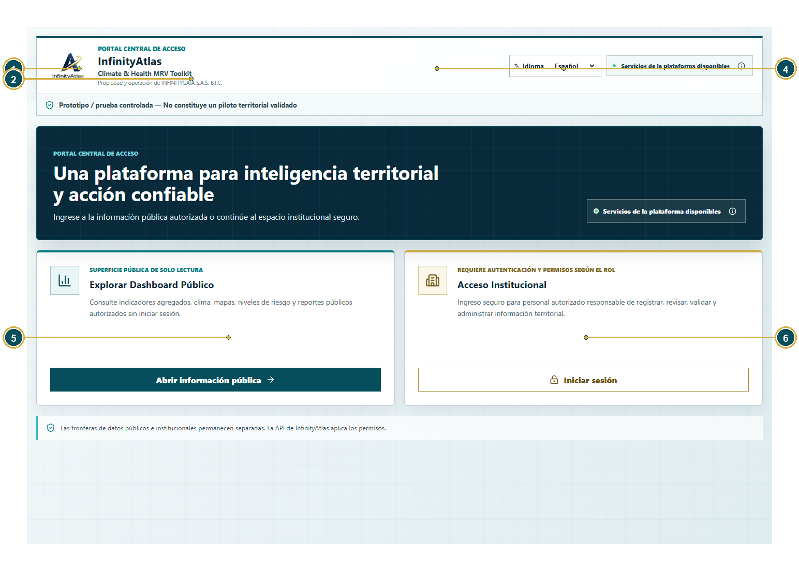
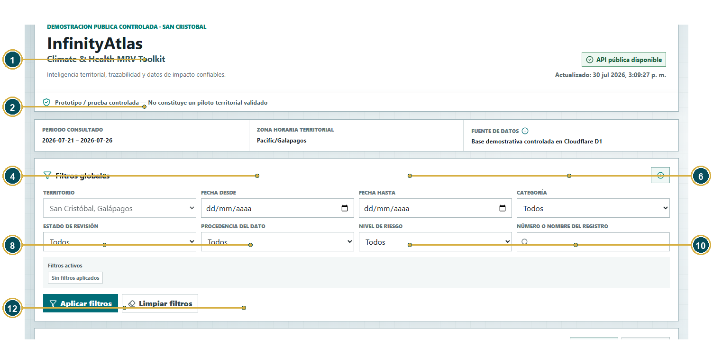
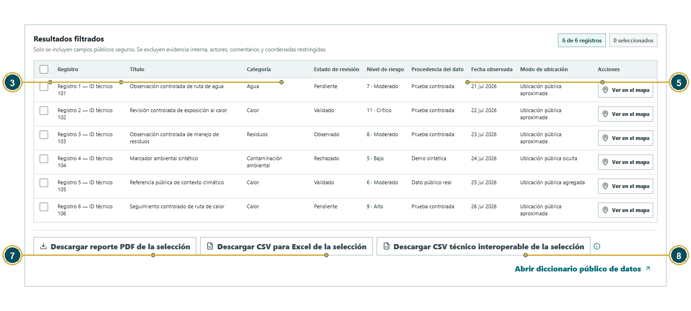
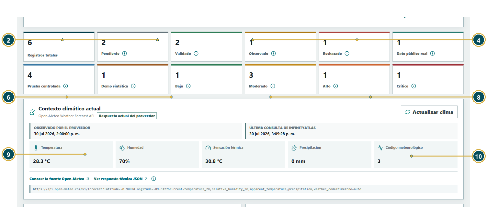
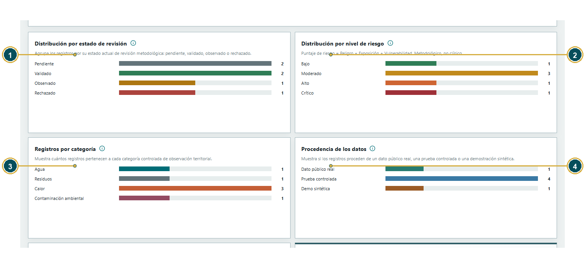
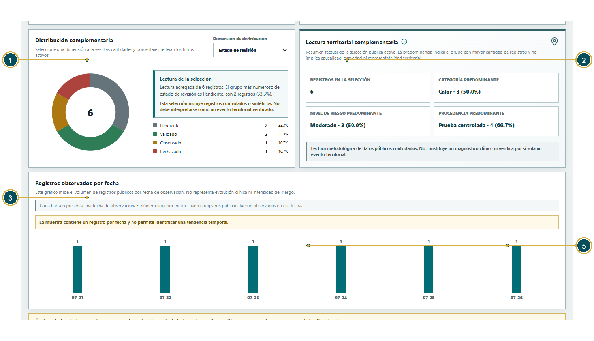
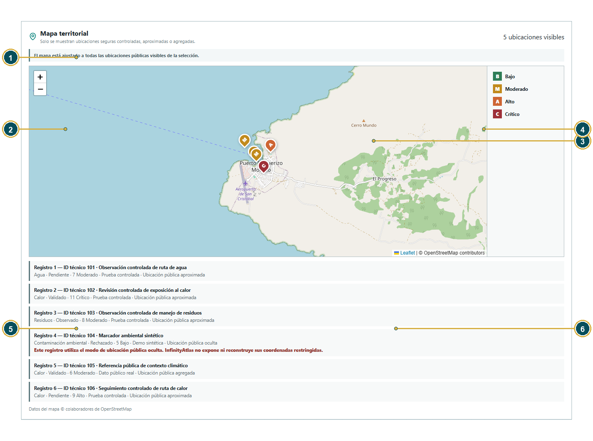
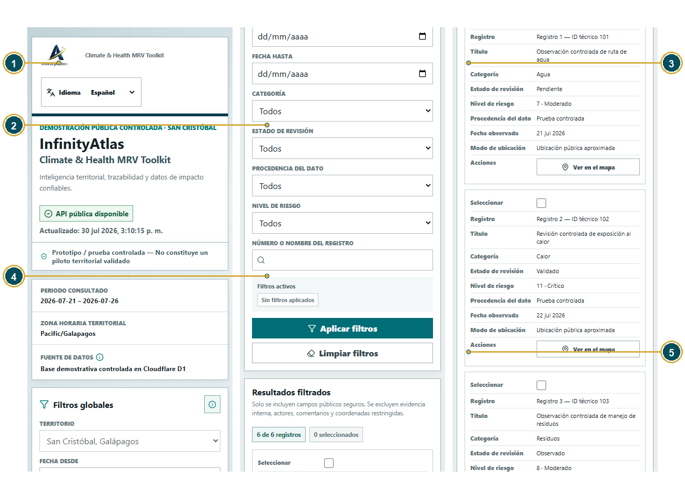

# Manual del Dashboard Público

## Consulta de información territorial segura

**Producto:** InfinityAtlas Climate & Health MRV Toolkit  
**Propiedad y operación:** INFINITYGAIA S.A.S. B.I.C.  
**Versión del manual:** 1.0 — Cierre de entrega
**Fecha:** 8 de agosto de 2026
**Etiqueta de entrega:** `unicef-rfps-503931-submission-2026-08-08-final`

> Prototipo / prueba controlada - No constituye un piloto territorial validado.

## Control documental

| Versión | Fecha | Descripción del cambio | Preparado por | Aprobado por |
| --- | --- | --- | --- | --- |
| 1.0 — Cierre de entrega | 8 de agosto de 2026 | Edición institucional final: control documental actualizado, referencias personales eliminadas y comportamiento funcional sincronizado con el cierre de entrega. | INFINITYGAIA S.A.S. B.I.C. — Product & Technical Team | INFINITYGAIA S.A.S. B.I.C. |

## Tabla de contenidos

- [1. ¿Qué es InfinityAtlas?](#chapter-1)
  - [1.1 ¿Qué significa MRV?](#section-1-1)
- [2. Cómo entrar](#chapter-2)
- [3. Encabezado y filtros](#chapter-3)
  - [3.1 Ejercicios con filtros](#section-3-1)
- [4. Resultados filtrados y descargas](#chapter-4)
- [5. Contexto climático](#chapter-5)
- [6. Indicadores principales](#chapter-6)
- [7. Gráficos y lectura interpretativa](#chapter-7)
- [8. Mapa territorial y geoprivacidad](#chapter-8)
- [9. Contenido del PDF público](#chapter-9)
- [10. CSV técnico y CSV para Excel](#chapter-10)
  - [10.1 Encabezados de la descarga para Excel](#section-10-1)
- [11. Qué puede y qué no puede ver el público](#chapter-11)
- [12. Errores frecuentes del Dashboard Público](#chapter-12)
- [13. Apéndice A. Cómo presentar InfinityAtlas en una demostración en vivo](#chapter-13)
- [14. Apéndice B. Solución de problemas](#chapter-14)

---

# 1. ¿Qué es InfinityAtlas?

[Volver al índice](#indice)

InfinityAtlas Climate & Health MRV Toolkit organiza información territorial para que sea más fácil observar, registrar, revisar y explicar riesgos relacionados con clima, salud, agua, residuos y contaminación ambiental.

## 1.1 ¿Qué significa MRV?

| Palabra | Explicación sencilla |
| --- | --- |
| Medir | Registrar qué se observó, dónde, cuándo y con qué nivel metodológico. |
| Reportar | Guardar la información de forma ordenada y producir reportes comprensibles. |
| Verificar | Revisar que el registro esté completo y siga la metodología acordada. |

En este manual el enfoque es consultar información pública segura sin iniciar sesión. InfinityAtlas puede apoyar decisiones que protejan a niños, familias y comunidades, pero no reemplaza la evaluación de especialistas.

> **Límite importante**  
> InfinityAtlas no es una herramienta de diagnóstico médico. No ingreses nombres de niños, historias clínicas, documentos de identidad, fotografías identificables ni otros datos personales.

> **Qué contiene esta demostración**  
> Los seis registros son datos públicos controlados: prueba controlada, dato público real o demo sintética. No contienen nombres personales, comentarios internos ni auditoría privada. La superficie pública no puede crear, editar, validar, rechazar ni eliminar observaciones.

# 2. Cómo entrar

[Volver al índice](#indice)

1. Abre <http://127.0.0.1:5173/> para la versión local.
2. Presiona Abrir información pública.
3. También puedes abrir directamente <http://127.0.0.1:5173/#public>.
4. Para la versión pública activa usa <https://infinityatlas-public-demo.infinitygaia.workers.dev>.
5. No necesitas usuario ni contraseña.

| Versión | Qué significa |
| --- | --- |
| Local | Se ejecuta en un entorno local autorizado. Puede documentar cambios aún no publicados. |
| Pública de Internet | Worker HTTPS activo, de solo lectura, conectado a D1 controlada. |
| Preview | Versión temporal de Cloudflare para UAT; no necesariamente recibe tráfico estable. |
| Versión activa | Versión que responde en la URL workers.dev estable. |
| Información institucional | Datos internos del backend local. No forman parte del Dashboard Público. |

*Figura 1. Desde el Portal Central, el acceso público está separado del acceso institucional.*

# 3. Encabezado y filtros

[Volver al índice](#indice)

*Figura 2. Encabezado y filtros. 1: marca; 2: idioma; 3: API; 4: prototipo; 5: periodo, zona y fuente; 6: territorio; 7: fechas; 8: filtros; 9: resumen activo; 10: aplicar/limpiar.*

### Ficha: Logo InfinityAtlas

| Elemento | Explicación |
| --- | --- |
| Nombre exacto en español | Logo InfinityAtlas |
| Nombre exacto en inglés | InfinityAtlas logo |
| Tipo de elemento | Elemento de navegación |
| ¿Para qué sirve? | Identifica la superficie oficial. |
| ¿Qué debe escribir o seleccionar el usuario? | Comprueba la marca unida. |
| Ejemplo correcto | InfinityAtlas. |
| Ejemplo incorrecto | Infinity Atlas. |
| ¿Es obligatorio? | No |
| ¿Qué sucede si se deja vacío? | No es un campo para llenar. Si no se utiliza, el usuario permanece en la vista o sección actual. |
| ¿Quién puede verlo? | Público |
| ¿Contiene información privada? | No |
| Publicación pública | No aplica: no es un dato territorial publicable. |
| Error común | Confundir con otra plataforma. |
| Cómo corregirlo | Regresa a la URL oficial. |

### Ficha: Propiedad de INFINITYGAIA S.A.S. B.I.C.

| Elemento | Explicación |
| --- | --- |
| Nombre exacto en español | Propiedad de INFINITYGAIA S.A.S. B.I.C. |
| Nombre exacto en inglés | Owned by INFINITYGAIA S.A.S. B.I.C. |
| Tipo de elemento | Indicador informativo |
| ¿Para qué sirve? | Identifica la empresa propietaria. |
| ¿Qué debe escribir o seleccionar el usuario? | Lee el pie y encabezado. |
| Ejemplo correcto | INFINITYGAIA S.A.S. B.I.C. |
| Ejemplo incorrecto | UNICEF. |
| ¿Es obligatorio? | No |
| ¿Qué sucede si se deja vacío? | El usuario no lo escribe. Si no aparece, debe comprobar la fuente o el estado del servicio y no suponer un valor. |
| ¿Quién puede verlo? | Público |
| ¿Contiene información privada? | No |
| ¿Es visible en la interfaz pública? | Sí. Forma parte de la superficie pública de solo lectura, con los límites de privacidad indicados. |
| Error común | Afirmar respaldo de UNICEF. |
| Cómo corregirlo | No hagas afirmaciones de selección o financiamiento. |

### Ficha: Idioma

| Elemento | Explicación |
| --- | --- |
| Nombre exacto en español | Idioma |
| Nombre exacto en inglés | Language |
| Tipo de elemento | Elemento de navegación |
| ¿Para qué sirve? | Cambia toda la superficie pública. |
| ¿Qué debe escribir o seleccionar el usuario? | Selecciona Español o English. |
| Ejemplo correcto | Español. |
| Ejemplo incorrecto | Seleccionar un rol. |
| ¿Es obligatorio? | No |
| ¿Qué sucede si se deja vacío? | No es un campo para llenar. Si no se utiliza, el usuario permanece en la vista o sección actual. |
| ¿Quién puede verlo? | Público |
| ¿Contiene información privada? | No |
| Publicación pública | No aplica: no es un dato territorial publicable. |
| Error común | Ver textos históricos distintos. |
| Cómo corregirlo | Los títulos controlados se traducen; recarga si hay caché. |

### Ficha: API pública disponible

| Elemento | Explicación |
| --- | --- |
| Nombre exacto en español | API pública disponible |
| Nombre exacto en inglés | Public API available |
| Tipo de elemento | Campo opcional |
| ¿Para qué sirve? | Muestra salud de la superficie pública. |
| ¿Qué debe escribir o seleccionar el usuario? | Comprueba estado antes de descargar. |
| Ejemplo correcto | Disponible. |
| Ejemplo incorrecto | Creer que habilita escritura. |
| ¿Es obligatorio? | No |
| ¿Qué sucede si se deja vacío? | El registro puede continuar. InfinityAtlas conserva el valor predeterminado o deja este dato opcional sin registrar, según corresponda. |
| ¿Quién puede verlo? | Público |
| ¿Contiene información privada? | No |
| ¿Es visible en la interfaz pública? | Sí. Forma parte de la superficie pública de solo lectura, con los límites de privacidad indicados. |
| Error común | Confundir disponibilidad con permisos. |
| Cómo corregirlo | La API pública continúa siendo de solo lectura. |

### Ficha: Actualizado

| Elemento | Explicación |
| --- | --- |
| Nombre exacto en español | Actualizado |
| Nombre exacto en inglés | Updated |
| Tipo de elemento | Campo opcional |
| ¿Para qué sirve? | Indica cuándo cargó el dashboard. |
| ¿Qué debe escribir o seleccionar el usuario? | Lee fecha y hora. |
| Ejemplo correcto | 30 jul 2026. |
| Ejemplo incorrecto | Hora del evento territorial. |
| ¿Es obligatorio? | No |
| ¿Qué sucede si se deja vacío? | El registro puede continuar. InfinityAtlas conserva el valor predeterminado o deja este dato opcional sin registrar, según corresponda. |
| ¿Quién puede verlo? | Público |
| ¿Contiene información privada? | No |
| ¿Es visible en la interfaz pública? | Sí. Forma parte de la superficie pública de solo lectura, con los límites de privacidad indicados. |
| Error común | Confundir con hora climática. |
| Cómo corregirlo | Cada bloque tiene su propia hora. |

### Ficha: Aviso de prototipo

| Elemento | Explicación |
| --- | --- |
| Nombre exacto en español | Aviso de prototipo |
| Nombre exacto en inglés | Prototype notice |
| Tipo de elemento | Indicador informativo |
| ¿Para qué sirve? | Evita presentar la demo como piloto validado. |
| ¿Qué debe escribir o seleccionar el usuario? | Mantenlo visible en demostraciones. |
| Ejemplo correcto | Prototipo / prueba controlada. |
| Ejemplo incorrecto | Sistema territorial validado. |
| ¿Es obligatorio? | No |
| ¿Qué sucede si se deja vacío? | El usuario no lo escribe. Si no aparece, debe comprobar la fuente o el estado del servicio y no suponer un valor. |
| ¿Quién puede verlo? | Público |
| ¿Contiene información privada? | No |
| ¿Es visible en la interfaz pública? | Sí. Forma parte de la superficie pública de solo lectura, con los límites de privacidad indicados. |
| Error común | Omitirlo en capturas. |
| Cómo corregirlo | Incluye el aviso. |

### Ficha: Periodo consultado

| Elemento | Explicación |
| --- | --- |
| Nombre exacto en español | Periodo consultado |
| Nombre exacto en inglés | Consulted period |
| Tipo de elemento | Indicador informativo |
| ¿Para qué sirve? | Resume el rango de registros visibles. |
| ¿Qué debe escribir o seleccionar el usuario? | Lee las fechas. |
| Ejemplo correcto | 2026-07-21 - 2026-07-26. |
| Ejemplo incorrecto | Rango clínico. |
| ¿Es obligatorio? | No |
| ¿Qué sucede si se deja vacío? | El usuario no lo escribe. Si no aparece, debe comprobar la fuente o el estado del servicio y no suponer un valor. |
| ¿Quién puede verlo? | Público |
| ¿Contiene información privada? | No |
| ¿Es visible en la interfaz pública? | Sí. Forma parte de la superficie pública de solo lectura, con los límites de privacidad indicados. |
| Error común | Confundir con pronóstico. |
| Cómo corregirlo | Es el rango de observaciones. |

### Ficha: Zona horaria territorial

| Elemento | Explicación |
| --- | --- |
| Nombre exacto en español | Zona horaria territorial |
| Nombre exacto en inglés | Territory timezone |
| Tipo de elemento | Indicador informativo |
| ¿Para qué sirve? | Indica la zona usada para mostrar fechas. |
| ¿Qué debe escribir o seleccionar el usuario? | Comprueba Pacific/Galapagos. |
| Ejemplo correcto | Pacific/Galapagos. |
| Ejemplo incorrecto | UTC como hora local. |
| ¿Es obligatorio? | No |
| ¿Qué sucede si se deja vacío? | El usuario no lo escribe. Si no aparece, debe comprobar la fuente o el estado del servicio y no suponer un valor. |
| ¿Quién puede verlo? | Público |
| ¿Contiene información privada? | No |
| ¿Es visible en la interfaz pública? | Sí. Forma parte de la superficie pública de solo lectura, con los límites de privacidad indicados. |
| Error común | Comparar sin zona. |
| Cómo corregirlo | Usa la zona indicada. |

### Ficha: Fuente de datos

| Elemento | Explicación |
| --- | --- |
| Nombre exacto en español | Fuente de datos |
| Nombre exacto en inglés | Data source |
| Tipo de elemento | Indicador informativo |
| ¿Para qué sirve? | Indica que la base pública es D1 controlada. |
| ¿Qué debe escribir o seleccionar el usuario? | Abre el tooltip para conocer el límite. |
| Ejemplo correcto | Base demostrativa controlada en Cloudflare D1. |
| Ejemplo incorrecto | backend/local.db. |
| ¿Es obligatorio? | No |
| ¿Qué sucede si se deja vacío? | El usuario no lo escribe. Si no aparece, debe comprobar la fuente o el estado del servicio y no suponer un valor. |
| ¿Quién puede verlo? | Público |
| ¿Contiene información privada? | No |
| ¿Es visible en la interfaz pública? | Sí. Forma parte de la superficie pública de solo lectura, con los límites de privacidad indicados. |
| Error común | Creer que D1 contiene usuarios. |
| Cómo corregirlo | El tooltip explica que no contiene datos internos. |

### Ficha: Territorio

| Elemento | Explicación |
| --- | --- |
| Nombre exacto en español | Territorio |
| Nombre exacto en inglés | Territory |
| Tipo de elemento | Campo obligatorio |
| ¿Para qué sirve? | Limita al territorio disponible. |
| ¿Qué debe escribir o seleccionar el usuario? | Mantén San Cristóbal, Galápagos. |
| Ejemplo correcto | San Cristóbal. |
| Ejemplo incorrecto | Una dirección privada. |
| ¿Es obligatorio? | Sí, fijo |
| ¿Qué sucede si se deja vacío? | InfinityAtlas detiene el guardado o la acción y señala este campo para que el usuario lo complete. |
| ¿Quién puede verlo? | Público |
| ¿Contiene información privada? | No |
| ¿Es visible en la interfaz pública? | Sí. Forma parte de la superficie pública de solo lectura, con los límites de privacidad indicados. |
| Error común | Esperar varios territorios. |
| Cómo corregirlo | El prototipo documenta uno. |

### Ficha: Fecha desde

| Elemento | Explicación |
| --- | --- |
| Nombre exacto en español | Fecha desde |
| Nombre exacto en inglés | From date |
| Tipo de elemento | Campo opcional |
| ¿Para qué sirve? | Define el inicio del rango. |
| ¿Qué debe escribir o seleccionar el usuario? | Elige una fecha igual o anterior a Fecha hasta. |
| Ejemplo correcto | 21/07/2026. |
| Ejemplo incorrecto | 31/07/2026 cuando Fecha hasta es 21/07. |
| ¿Es obligatorio? | No |
| ¿Qué sucede si se deja vacío? | El registro puede continuar. InfinityAtlas conserva el valor predeterminado o deja este dato opcional sin registrar, según corresponda. |
| ¿Quién puede verlo? | Público |
| ¿Contiene información privada? | No |
| ¿Es visible en la interfaz pública? | Sí. Forma parte de la superficie pública de solo lectura, con los límites de privacidad indicados. |
| Error común | Rango invertido. |
| Cómo corregirlo | Corrige las fechas. |

### Ficha: Fecha hasta

| Elemento | Explicación |
| --- | --- |
| Nombre exacto en español | Fecha hasta |
| Nombre exacto en inglés | To date |
| Tipo de elemento | Campo opcional |
| ¿Para qué sirve? | Define el final del rango. |
| ¿Qué debe escribir o seleccionar el usuario? | Elige la fecha final. |
| Ejemplo correcto | 26/07/2026. |
| Ejemplo incorrecto | Una fecha anterior al inicio. |
| ¿Es obligatorio? | No |
| ¿Qué sucede si se deja vacío? | El registro puede continuar. InfinityAtlas conserva el valor predeterminado o deja este dato opcional sin registrar, según corresponda. |
| ¿Quién puede verlo? | Público |
| ¿Contiene información privada? | No |
| ¿Es visible en la interfaz pública? | Sí. Forma parte de la superficie pública de solo lectura, con los límites de privacidad indicados. |
| Error común | No aparecen resultados. |
| Cómo corregirlo | Limpia o amplía el rango. |

### Ficha: Categoría

| Elemento | Explicación |
| --- | --- |
| Nombre exacto en español | Categoría |
| Nombre exacto en inglés | Category |
| Tipo de elemento | Campo opcional |
| ¿Para qué sirve? | Filtra Agua, Residuos, Calor o Contaminación. |
| ¿Qué debe escribir o seleccionar el usuario? | Selecciona una opción. |
| Ejemplo correcto | Calor. |
| Ejemplo incorrecto | Moderado. |
| ¿Es obligatorio? | No |
| ¿Qué sucede si se deja vacío? | El registro puede continuar. InfinityAtlas conserva el valor predeterminado o deja este dato opcional sin registrar, según corresponda. |
| ¿Quién puede verlo? | Público |
| ¿Contiene información privada? | No |
| ¿Es visible en la interfaz pública? | Sí. Forma parte de la superficie pública de solo lectura, con los límites de privacidad indicados. |
| Error común | Elegir dimensión equivocada. |
| Cómo corregirlo | Lee la etiqueta. |

### Ficha: Estado de revisión

| Elemento | Explicación |
| --- | --- |
| Nombre exacto en español | Estado de revisión |
| Nombre exacto en inglés | Review status |
| Tipo de elemento | Campo opcional |
| ¿Para qué sirve? | Filtra Pendiente, Validado, Observado o Rechazado. |
| ¿Qué debe escribir o seleccionar el usuario? | Selecciona un estado. |
| Ejemplo correcto | Validado. |
| Ejemplo incorrecto | Publicado. |
| ¿Es obligatorio? | No |
| ¿Qué sucede si se deja vacío? | El registro puede continuar. InfinityAtlas conserva el valor predeterminado o deja este dato opcional sin registrar, según corresponda. |
| ¿Quién puede verlo? | Público |
| ¿Contiene información privada? | No |
| ¿Es visible en la interfaz pública? | Sí. Forma parte de la superficie pública de solo lectura, con los límites de privacidad indicados. |
| Error común | Confundir validado con verificado. |
| Cómo corregirlo | Abre el tooltip. |

### Ficha: Procedencia del dato

| Elemento | Explicación |
| --- | --- |
| Nombre exacto en español | Procedencia del dato |
| Nombre exacto en inglés | Data provenance |
| Tipo de elemento | Campo opcional |
| ¿Para qué sirve? | Filtra real, controlado o sintético. |
| ¿Qué debe escribir o seleccionar el usuario? | Selecciona la procedencia. |
| Ejemplo correcto | Prueba controlada. |
| Ejemplo incorrecto | Dato real sin fuente. |
| ¿Es obligatorio? | No |
| ¿Qué sucede si se deja vacío? | El registro puede continuar. InfinityAtlas conserva el valor predeterminado o deja este dato opcional sin registrar, según corresponda. |
| ¿Quién puede verlo? | Público |
| ¿Contiene información privada? | No |
| ¿Es visible en la interfaz pública? | Sí. Forma parte de la superficie pública de solo lectura, con los límites de privacidad indicados. |
| Error común | Interpretar controlado como evento. |
| Cómo corregirlo | Lee el aviso. |

### Ficha: Nivel de riesgo

| Elemento | Explicación |
| --- | --- |
| Nombre exacto en español | Nivel de riesgo |
| Nombre exacto en inglés | Risk level |
| Tipo de elemento | Campo opcional |
| ¿Para qué sirve? | Filtra Bajo, Moderado, Alto o Crítico. |
| ¿Qué debe escribir o seleccionar el usuario? | Selecciona un nivel. |
| Ejemplo correcto | Crítico. |
| Ejemplo incorrecto | Emergencia. |
| ¿Es obligatorio? | No |
| ¿Qué sucede si se deja vacío? | El registro puede continuar. InfinityAtlas conserva el valor predeterminado o deja este dato opcional sin registrar, según corresponda. |
| ¿Quién puede verlo? | Público |
| ¿Contiene información privada? | No |
| ¿Es visible en la interfaz pública? | Sí. Forma parte de la superficie pública de solo lectura, con los límites de privacidad indicados. |
| Error común | Presentarlo como alerta real. |
| Cómo corregirlo | El nivel es metodológico y controlado. |

### Ficha: Número o nombre del registro

| Elemento | Explicación |
| --- | --- |
| Nombre exacto en español | Número o nombre del registro |
| Nombre exacto en inglés | Record number or title |
| Tipo de elemento | Campo opcional |
| ¿Para qué sirve? | Busca por número público, ID técnico o título. |
| ¿Qué debe escribir o seleccionar el usuario? | Escribe 2, 102 o parte del nombre. |
| Ejemplo correcto | calor. |
| Ejemplo incorrecto | Nombre personal. |
| ¿Es obligatorio? | No |
| ¿Qué sucede si se deja vacío? | El registro puede continuar. InfinityAtlas conserva el valor predeterminado o deja este dato opcional sin registrar, según corresponda. |
| ¿Quién puede verlo? | Público |
| ¿Contiene información privada? | No |
| ¿Es visible en la interfaz pública? | Sí. Forma parte de la superficie pública de solo lectura, con los límites de privacidad indicados. |
| Error común | Buscar comentarios internos. |
| Cómo corregirlo | Solo se buscan campos públicos. |

### Ficha: Aplicar filtros

| Elemento | Explicación |
| --- | --- |
| Nombre exacto en español | Aplicar filtros |
| Nombre exacto en inglés | Apply filters |
| Tipo de elemento | Botón o acción |
| ¿Para qué sirve? | Actualiza indicadores, tabla, gráficos, mapa y descargas. |
| ¿Qué debe escribir o seleccionar el usuario? | Presiona una vez. |
| Ejemplo correcto | Calor -> 3 de 6 registros. |
| Ejemplo incorrecto | Aplicar repetidamente. |
| ¿Es obligatorio? | No |
| ¿Qué sucede si se deja vacío? | No es un campo para llenar. Si no se pulsa, la operación asociada no se ejecuta y no cambia ningún registro. |
| ¿Quién puede verlo? | Público |
| ¿Contiene información privada? | No |
| Publicación pública | No aplica: no es un dato territorial publicable. |
| Error común | No ver cambios. |
| Cómo corregirlo | Lee el resumen activo y la URL. |

### Ficha: Limpiar filtros

| Elemento | Explicación |
| --- | --- |
| Nombre exacto en español | Limpiar filtros |
| Nombre exacto en inglés | Clear filters |
| Tipo de elemento | Botón o acción |
| ¿Para qué sirve? | Regresa a los seis registros. |
| ¿Qué debe escribir o seleccionar el usuario? | Presiona una vez. |
| Ejemplo correcto | 6 de 6 registros. |
| Ejemplo incorrecto | Recargar muchas veces. |
| ¿Es obligatorio? | No |
| ¿Qué sucede si se deja vacío? | No es un campo para llenar. Si no se pulsa, la operación asociada no se ejecuta y no cambia ningún registro. |
| ¿Quién puede verlo? | Público |
| ¿Contiene información privada? | No |
| Publicación pública | No aplica: no es un dato territorial publicable. |
| Error común | El mapa parece vacío. |
| Cómo corregirlo | Espera a que se restaure la selección. |

### Ficha: Filtros activos

| Elemento | Explicación |
| --- | --- |
| Nombre exacto en español | Filtros activos |
| Nombre exacto en inglés | Active filters |
| Tipo de elemento | Indicador informativo |
| ¿Para qué sirve? | Resume criterios aplicados. |
| ¿Qué debe escribir o seleccionar el usuario? | Lee los chips. |
| Ejemplo correcto | Categoría: Calor. |
| Ejemplo incorrecto | Pensar que un campo seleccionado ya fue aplicado. |
| ¿Es obligatorio? | Automático |
| ¿Qué sucede si se deja vacío? | El usuario no lo escribe. Si no aparece, debe comprobar la fuente o el estado del servicio y no suponer un valor. |
| ¿Quién puede verlo? | Público |
| ¿Contiene información privada? | No |
| ¿Es visible en la interfaz pública? | Sí. Forma parte de la superficie pública de solo lectura, con los límites de privacidad indicados. |
| Error común | Olvidar presionar Aplicar. |
| Cómo corregirlo | Comprueba el resumen. |

## 3.1 Ejercicios con filtros

1. Selecciona Categoría = Calor y presiona Aplicar filtros.
2. Comprueba 3 de 6 registros.
3. Busca 102 para localizar el registro técnico 102.
4. Selecciona Estado = Validado.
5. Selecciona Riesgo = Crítico y observa el resultado.
6. Presiona Limpiar filtros.
7. Comprueba que regresan 6 de 6 registros y cinco puntos visibles.

# 4. Resultados filtrados y descargas

[Volver al índice](#indice)

*Figura 3. Resultados y descargas. 1: conteo; 2: seleccionar todos; 3: número/ID; 4: título; 5: campos públicos; 6: mapa; 7: PDF; 8: CSV Excel; 9: CSV técnico; 10: diccionario.*

### Ficha: Casilla de selección

| Elemento | Explicación |
| --- | --- |
| Nombre exacto en español | Casilla de selección |
| Nombre exacto en inglés | Selection checkbox |
| Tipo de elemento | Botón o acción |
| ¿Para qué sirve? | Selecciona uno o varios registros. |
| ¿Qué debe escribir o seleccionar el usuario? | Marca o desmarca la fila. |
| Ejemplo correcto | Seleccionar 101 y 103. |
| Ejemplo incorrecto | Pensar que cambia la base. |
| ¿Es obligatorio? | No |
| ¿Qué sucede si se deja vacío? | No es un campo para llenar. Si no se pulsa, la operación asociada no se ejecuta y no cambia ningún registro. |
| ¿Quién puede verlo? | Público |
| ¿Contiene información privada? | No |
| Publicación pública | No aplica: no es un dato territorial publicable. |
| Error común | Olvidar la selección manual. |
| Cómo corregirlo | Revisa el contador. |

### Ficha: Seleccionar todos

| Elemento | Explicación |
| --- | --- |
| Nombre exacto en español | Seleccionar todos |
| Nombre exacto en inglés | Select all |
| Tipo de elemento | Botón o acción |
| ¿Para qué sirve? | Marca todos los resultados visibles. |
| ¿Qué debe escribir o seleccionar el usuario? | Usa la casilla del encabezado. |
| Ejemplo correcto | Seleccionar los seis filtrados. |
| Ejemplo incorrecto | Seleccionar registros fuera del filtro. |
| ¿Es obligatorio? | No |
| ¿Qué sucede si se deja vacío? | No es un campo para llenar. Si no se pulsa, la operación asociada no se ejecuta y no cambia ningún registro. |
| ¿Quién puede verlo? | Público |
| ¿Contiene información privada? | No |
| Publicación pública | No aplica: no es un dato territorial publicable. |
| Error común | Confundir visibles con toda D1. |
| Cómo corregirlo | Lee X de 6. |

### Ficha: Registro público

| Elemento | Explicación |
| --- | --- |
| Nombre exacto en español | Registro público |
| Nombre exacto en inglés | Public record number |
| Tipo de elemento | Indicador informativo |
| ¿Para qué sirve? | Numera la interfaz 1-6. |
| ¿Qué debe escribir o seleccionar el usuario? | Úsalo en la explicación pública. |
| Ejemplo correcto | Registro 2. |
| Ejemplo incorrecto | ID institucional #2. |
| ¿Es obligatorio? | Automático |
| ¿Qué sucede si se deja vacío? | El usuario no lo escribe. Si no aparece, debe comprobar la fuente o el estado del servicio y no suponer un valor. |
| ¿Quién puede verlo? | Público |
| ¿Contiene información privada? | No |
| ¿Es visible en la interfaz pública? | Sí. Forma parte de la superficie pública de solo lectura, con los límites de privacidad indicados. |
| Error común | Confundir con ID técnico. |
| Cómo corregirlo | Menciona ambos cuando sea necesario. |

### Ficha: ID técnico

| Elemento | Explicación |
| --- | --- |
| Nombre exacto en español | ID técnico |
| Nombre exacto en inglés | Technical ID |
| Tipo de elemento | Resultado calculado |
| ¿Para qué sirve? | Mantiene trazabilidad estable 101-106. |
| ¿Qué debe escribir o seleccionar el usuario? | Úsalo en CSV y auditoría técnica. |
| Ejemplo correcto | ID técnico 102. |
| Ejemplo incorrecto | Cambiarlo manualmente. |
| ¿Es obligatorio? | Automático |
| ¿Qué sucede si se deja vacío? | El usuario no lo escribe. Si faltan datos de origen, InfinityAtlas muestra el resultado como no disponible; nunca debe inventarse manualmente. |
| ¿Quién puede verlo? | Público |
| ¿Contiene información privada? | No |
| Publicación pública | No aplica: no es un dato territorial publicable. |
| Error común | Usar N.º público como clave. |
| Cómo corregirlo | El CSV conserva el ID técnico. |

### Ficha: Título

| Elemento | Explicación |
| --- | --- |
| Nombre exacto en español | Título |
| Nombre exacto en inglés | Title |
| Tipo de elemento | Indicador informativo |
| ¿Para qué sirve? | Describe el registro con un nombre público controlado. |
| ¿Qué debe escribir o seleccionar el usuario? | Lee el título traducido. |
| Ejemplo correcto | Revisión controlada de exposición al calor. |
| Ejemplo incorrecto | Nombre de una persona. |
| ¿Es obligatorio? | Automático |
| ¿Qué sucede si se deja vacío? | El usuario no lo escribe. Si no aparece, debe comprobar la fuente o el estado del servicio y no suponer un valor. |
| ¿Quién puede verlo? | Público |
| ¿Contiene información privada? | No |
| ¿Es visible en la interfaz pública? | Sí. Forma parte de la superficie pública de solo lectura, con los límites de privacidad indicados. |
| Error común | Título en idioma distinto por caché. |
| Cómo corregirlo | Cambia idioma o recarga. |

### Ficha: Categoría

| Elemento | Explicación |
| --- | --- |
| Nombre exacto en español | Categoría |
| Nombre exacto en inglés | Category |
| Tipo de elemento | Indicador informativo |
| ¿Para qué sirve? | Muestra el tema. |
| ¿Qué debe escribir o seleccionar el usuario? | Lee Agua, Residuos, Calor o Contaminación. |
| Ejemplo correcto | Calor. |
| Ejemplo incorrecto | Diagnóstico. |
| ¿Es obligatorio? | Automático |
| ¿Qué sucede si se deja vacío? | El usuario no lo escribe. Si no aparece, debe comprobar la fuente o el estado del servicio y no suponer un valor. |
| ¿Quién puede verlo? | Público |
| ¿Contiene información privada? | No |
| ¿Es visible en la interfaz pública? | Sí. Forma parte de la superficie pública de solo lectura, con los límites de privacidad indicados. |
| Error común | Interpretar categoría como causa. |
| Cómo corregirlo | Es solo clasificación. |

### Ficha: Estado de revisión

| Elemento | Explicación |
| --- | --- |
| Nombre exacto en español | Estado de revisión |
| Nombre exacto en inglés | Review status |
| Tipo de elemento | Resultado calculado |
| ¿Para qué sirve? | Muestra el estado metodológico. |
| ¿Qué debe escribir o seleccionar el usuario? | Abre el tooltip si necesitas definición. |
| Ejemplo correcto | Validado. |
| Ejemplo incorrecto | Evento verificado. |
| ¿Es obligatorio? | Automático |
| ¿Qué sucede si se deja vacío? | El usuario no lo escribe. Si faltan datos de origen, InfinityAtlas muestra el resultado como no disponible; nunca debe inventarse manualmente. |
| ¿Quién puede verlo? | Público |
| ¿Contiene información privada? | No |
| Publicación pública | No aplica: no es un dato territorial publicable. |
| Error común | Confundir validación con ocurrencia. |
| Cómo corregirlo | Lee la ayuda. |

### Ficha: Nivel de riesgo

| Elemento | Explicación |
| --- | --- |
| Nombre exacto en español | Nivel de riesgo |
| Nombre exacto en inglés | Risk level |
| Tipo de elemento | Resultado calculado |
| ¿Para qué sirve? | Muestra total y nivel metodológico. |
| ¿Qué debe escribir o seleccionar el usuario? | Lee número y nivel. |
| Ejemplo correcto | 11 - Crítico. |
| Ejemplo incorrecto | Emergencia real. |
| ¿Es obligatorio? | Automático |
| ¿Qué sucede si se deja vacío? | El usuario no lo escribe. Si faltan datos de origen, InfinityAtlas muestra el resultado como no disponible; nunca debe inventarse manualmente. |
| ¿Quién puede verlo? | Público |
| ¿Contiene información privada? | No |
| Publicación pública | No aplica: no es un dato territorial publicable. |
| Error común | Alarmar por un dato controlado. |
| Cómo corregirlo | Lee el aviso de demo. |

### Ficha: Procedencia

| Elemento | Explicación |
| --- | --- |
| Nombre exacto en español | Procedencia |
| Nombre exacto en inglés | Provenance |
| Tipo de elemento | Indicador informativo |
| ¿Para qué sirve? | Explica origen del registro. |
| ¿Qué debe escribir o seleccionar el usuario? | Comprueba real, controlado o sintético. |
| Ejemplo correcto | Prueba controlada. |
| Ejemplo incorrecto | Ocultar la procedencia. |
| ¿Es obligatorio? | Automático |
| ¿Qué sucede si se deja vacío? | El usuario no lo escribe. Si no aparece, debe comprobar la fuente o el estado del servicio y no suponer un valor. |
| ¿Quién puede verlo? | Público |
| ¿Contiene información privada? | No |
| ¿Es visible en la interfaz pública? | Sí. Forma parte de la superficie pública de solo lectura, con los límites de privacidad indicados. |
| Error común | Presentar sintético como real. |
| Cómo corregirlo | Usa la etiqueta visible. |

### Ficha: Fecha observada

| Elemento | Explicación |
| --- | --- |
| Nombre exacto en español | Fecha observada |
| Nombre exacto en inglés | Observed date |
| Tipo de elemento | Indicador informativo |
| ¿Para qué sirve? | Indica la fecha pública del registro. |
| ¿Qué debe escribir o seleccionar el usuario? | Lee la fecha. |
| Ejemplo correcto | 22 jul 2026. |
| Ejemplo incorrecto | Hora climática. |
| ¿Es obligatorio? | Automático |
| ¿Qué sucede si se deja vacío? | El usuario no lo escribe. Si no aparece, debe comprobar la fuente o el estado del servicio y no suponer un valor. |
| ¿Quién puede verlo? | Público |
| ¿Contiene información privada? | No |
| ¿Es visible en la interfaz pública? | Sí. Forma parte de la superficie pública de solo lectura, con los límites de privacidad indicados. |
| Error común | Confundir con actualización. |
| Cómo corregirlo | Cada bloque etiqueta su fecha. |

### Ficha: Modo de ubicación

| Elemento | Explicación |
| --- | --- |
| Nombre exacto en español | Modo de ubicación |
| Nombre exacto en inglés | Location mode |
| Tipo de elemento | Indicador informativo |
| ¿Para qué sirve? | Informa geoprivacidad. |
| ¿Qué debe escribir o seleccionar el usuario? | Lee aproximada, agregada u oculta. |
| Ejemplo correcto | Ubicación pública aproximada. |
| Ejemplo incorrecto | Coordenada exacta restringida. |
| ¿Es obligatorio? | Automático |
| ¿Qué sucede si se deja vacío? | El usuario no lo escribe. Si no aparece, debe comprobar la fuente o el estado del servicio y no suponer un valor. |
| ¿Quién puede verlo? | Público |
| ¿Contiene información privada? | No |
| ¿Es visible en la interfaz pública? | Sí. Forma parte de la superficie pública de solo lectura, con los límites de privacidad indicados. |
| Error común | Buscar coordenadas ocultas. |
| Cómo corregirlo | InfinityAtlas no las expone. |

### Ficha: Ver en el mapa

| Elemento | Explicación |
| --- | --- |
| Nombre exacto en español | Ver en el mapa |
| Nombre exacto en inglés | View on map |
| Tipo de elemento | Gráfico o mapa |
| ¿Para qué sirve? | Centra y abre el marcador permitido. |
| ¿Qué debe escribir o seleccionar el usuario? | Presiona en una fila visible. |
| Ejemplo correcto | Un resultado centra el mapa. |
| Ejemplo incorrecto | Esperar un punto para ubicación oculta. |
| ¿Es obligatorio? | No |
| ¿Qué sucede si se deja vacío? | No es un campo para llenar. Si no existen ubicaciones públicas compatibles con los filtros, el mapa conserva su base y muestra un estado sin puntos. |
| ¿Quién puede verlo? | Público |
| ¿Contiene información privada? | No |
| ¿Es visible en la interfaz pública? | Sí. Forma parte de la superficie pública de solo lectura, con los límites de privacidad indicados. |
| Error común | El registro oculto no muestra punto. |
| Cómo corregirlo | Lee la explicación de geoprivacidad. |

### Ficha: Descargar reporte PDF

| Elemento | Explicación |
| --- | --- |
| Nombre exacto en español | Descargar reporte PDF |
| Nombre exacto en inglés | Download PDF report |
| Tipo de elemento | Botón o acción |
| ¿Para qué sirve? | Genera un informe de filtros o selección. |
| ¿Qué debe escribir o seleccionar el usuario? | Selecciona filas o usa el conjunto filtrado. |
| Ejemplo correcto | Un PDF con 101 y 103. |
| Ejemplo incorrecto | Esperar comentarios internos. |
| ¿Es obligatorio? | No |
| ¿Qué sucede si se deja vacío? | No es un campo para llenar. Si no se pulsa, la operación asociada no se ejecuta y no cambia ningún registro. |
| ¿Quién puede verlo? | Público |
| ¿Contiene información privada? | No |
| Publicación pública | No aplica: no es un dato territorial publicable. |
| Error común | Descargar sin revisar selección. |
| Cómo corregirlo | Lee el texto del botón. |

### Ficha: Descargar CSV para Excel

| Elemento | Explicación |
| --- | --- |
| Nombre exacto en español | Descargar CSV para Excel |
| Nombre exacto en inglés | Download CSV for Excel |
| Tipo de elemento | Botón o acción |
| ¿Para qué sirve? | Abre columnas correctamente en Excel español. |
| ¿Qué debe escribir o seleccionar el usuario? | Usa esta opción para hojas de cálculo. |
| Ejemplo correcto | UTF-8 BOM y punto y coma. |
| Ejemplo incorrecto | CSV técnico en Excel regional sin importar. |
| ¿Es obligatorio? | No |
| ¿Qué sucede si se deja vacío? | No es un campo para llenar. Si no se pulsa, la operación asociada no se ejecuta y no cambia ningún registro. |
| ¿Quién puede verlo? | Público |
| ¿Contiene información privada? | No |
| Publicación pública | No aplica: no es un dato territorial publicable. |
| Error común | Toda la fila aparece en una columna. |
| Cómo corregirlo | Usa CSV para Excel. |

### Ficha: Descargar CSV técnico interoperable

| Elemento | Explicación |
| --- | --- |
| Nombre exacto en español | Descargar CSV técnico interoperable |
| Nombre exacto en inglés | Download interoperable technical CSV |
| Tipo de elemento | Botón o acción |
| ¿Para qué sirve? | Entrega nombres de máquina y coma para Power BI, GIS y auditoría. |
| ¿Qué debe escribir o seleccionar el usuario? | Usa en sistemas técnicos. |
| Ejemplo correcto | Fechas ISO 8601. |
| Ejemplo incorrecto | Convertirlo en informe narrativo. |
| ¿Es obligatorio? | No |
| ¿Qué sucede si se deja vacío? | No es un campo para llenar. Si no se pulsa, la operación asociada no se ejecuta y no cambia ningún registro. |
| ¿Quién puede verlo? | Público |
| ¿Contiene información privada? | No |
| Publicación pública | No aplica: no es un dato territorial publicable. |
| Error común | Abrirlo directamente en Excel español. |
| Cómo corregirlo | Importa delimitado por coma. |

### Ficha: Diccionario público de datos

| Elemento | Explicación |
| --- | --- |
| Nombre exacto en español | Diccionario público de datos |
| Nombre exacto en inglés | Public data dictionary |
| Tipo de elemento | Campo opcional |
| ¿Para qué sirve? | Explica cada columna del CSV. |
| ¿Qué debe escribir o seleccionar el usuario? | Ábrelo antes de integrar. |
| Ejemplo correcto | technical_id = identificador estable. |
| Ejemplo incorrecto | Adivinar el significado. |
| ¿Es obligatorio? | No |
| ¿Qué sucede si se deja vacío? | El registro puede continuar. InfinityAtlas conserva el valor predeterminado o deja este dato opcional sin registrar, según corresponda. |
| ¿Quién puede verlo? | Público |
| ¿Contiene información privada? | No |
| ¿Es visible en la interfaz pública? | Sí. Forma parte de la superficie pública de solo lectura, con los límites de privacidad indicados. |
| Error común | Ignorar geoprivacidad. |
| Cómo corregirlo | Consulta las columnas location_mode y coordenadas públicas. |

# 5. Contexto climático

[Volver al índice](#indice)

*Figura 4. Indicadores y un estado temporal del clima. 1-4: conteos; 5: clima; 6: actualización; 7: fuente/JSON; 8: gráficos. El formulario y los registros siguen disponibles si Open-Meteo falla.*

### Ficha: Open-Meteo

| Elemento | Explicación |
| --- | --- |
| Nombre exacto en español | Open-Meteo |
| Nombre exacto en inglés | Open-Meteo |
| Tipo de elemento | Campo opcional |
| ¿Para qué sirve? | Identifica el proveedor climático público. |
| ¿Qué debe escribir o seleccionar el usuario? | Usa Conocer la fuente para una explicación. |
| Ejemplo correcto | open-meteo.com. |
| Ejemplo incorrecto | Ocultar la atribución. |
| ¿Es obligatorio? | No |
| ¿Qué sucede si se deja vacío? | El registro puede continuar. InfinityAtlas conserva el valor predeterminado o deja este dato opcional sin registrar, según corresponda. |
| ¿Quién puede verlo? | Público |
| ¿Contiene información privada? | No |
| ¿Es visible en la interfaz pública? | Sí. Forma parte de la superficie pública de solo lectura, con los límites de privacidad indicados. |
| Error común | Abrir JSON esperando una página narrativa. |
| Cómo corregirlo | Usa el enlace Conocer la fuente. |

### Ficha: Temperatura

| Elemento | Explicación |
| --- | --- |
| Nombre exacto en español | Temperatura |
| Nombre exacto en inglés | Temperature |
| Tipo de elemento | Indicador informativo |
| ¿Para qué sirve? | Muestra °C actuales del modelo. |
| ¿Qué debe escribir o seleccionar el usuario? | Lee el valor. |
| Ejemplo correcto | 28.4 °C. |
| Ejemplo incorrecto | Diagnóstico clínico. |
| ¿Es obligatorio? | Automático |
| ¿Qué sucede si se deja vacío? | El usuario no lo escribe. Si no aparece, debe comprobar la fuente o el estado del servicio y no suponer un valor. |
| ¿Quién puede verlo? | Público |
| ¿Contiene información privada? | No |
| ¿Es visible en la interfaz pública? | Sí. Forma parte de la superficie pública de solo lectura, con los límites de privacidad indicados. |
| Error común | Confundir con sensación. |
| Cómo corregirlo | Compara las etiquetas. |

### Ficha: Humedad

| Elemento | Explicación |
| --- | --- |
| Nombre exacto en español | Humedad |
| Nombre exacto en inglés | Humidity |
| Tipo de elemento | Indicador informativo |
| ¿Para qué sirve? | Muestra porcentaje relativo. |
| ¿Qué debe escribir o seleccionar el usuario? | Lee %. |
| Ejemplo correcto | 69%. |
| Ejemplo incorrecto | 69 °C. |
| ¿Es obligatorio? | Automático |
| ¿Qué sucede si se deja vacío? | El usuario no lo escribe. Si no aparece, debe comprobar la fuente o el estado del servicio y no suponer un valor. |
| ¿Quién puede verlo? | Público |
| ¿Contiene información privada? | No |
| ¿Es visible en la interfaz pública? | Sí. Forma parte de la superficie pública de solo lectura, con los límites de privacidad indicados. |
| Error común | Unidad incorrecta. |
| Cómo corregirlo | Usa %. |

### Ficha: Sensación térmica

| Elemento | Explicación |
| --- | --- |
| Nombre exacto en español | Sensación térmica |
| Nombre exacto en inglés | Feels like |
| Tipo de elemento | Indicador informativo |
| ¿Para qué sirve? | Muestra temperatura aparente. |
| ¿Qué debe escribir o seleccionar el usuario? | Lee °C. |
| Ejemplo correcto | 31.4 °C. |
| Ejemplo incorrecto | Temperatura corporal. |
| ¿Es obligatorio? | Automático |
| ¿Qué sucede si se deja vacío? | El usuario no lo escribe. Si no aparece, debe comprobar la fuente o el estado del servicio y no suponer un valor. |
| ¿Quién puede verlo? | Público |
| ¿Contiene información privada? | No |
| ¿Es visible en la interfaz pública? | Sí. Forma parte de la superficie pública de solo lectura, con los límites de privacidad indicados. |
| Error común | Interpretación clínica. |
| Cómo corregirlo | Es contexto meteorológico. |

### Ficha: Precipitación

| Elemento | Explicación |
| --- | --- |
| Nombre exacto en español | Precipitación |
| Nombre exacto en inglés | Precipitation |
| Tipo de elemento | Indicador informativo |
| ¿Para qué sirve? | Muestra mm del intervalo. |
| ¿Qué debe escribir o seleccionar el usuario? | Lee mm. |
| Ejemplo correcto | 0 mm. |
| Ejemplo incorrecto | Promedio anual. |
| ¿Es obligatorio? | Automático |
| ¿Qué sucede si se deja vacío? | El usuario no lo escribe. Si no aparece, debe comprobar la fuente o el estado del servicio y no suponer un valor. |
| ¿Quién puede verlo? | Público |
| ¿Contiene información privada? | No |
| ¿Es visible en la interfaz pública? | Sí. Forma parte de la superficie pública de solo lectura, con los límites de privacidad indicados. |
| Error común | Usar periodo equivocado. |
| Cómo corregirlo | Explica el intervalo. |

### Ficha: Código meteorológico

| Elemento | Explicación |
| --- | --- |
| Nombre exacto en español | Código meteorológico |
| Nombre exacto en inglés | Weather code |
| Tipo de elemento | Indicador informativo |
| ¿Para qué sirve? | Código WMO de condición. |
| ¿Qué debe escribir o seleccionar el usuario? | Consulta número y condición. |
| Ejemplo correcto | 2 - Nublado. |
| Ejemplo incorrecto | Nivel de riesgo. |
| ¿Es obligatorio? | Automático |
| ¿Qué sucede si se deja vacío? | El usuario no lo escribe. Si no aparece, debe comprobar la fuente o el estado del servicio y no suponer un valor. |
| ¿Quién puede verlo? | Público |
| ¿Contiene información privada? | No |
| ¿Es visible en la interfaz pública? | Sí. Forma parte de la superficie pública de solo lectura, con los límites de privacidad indicados. |
| Error común | Confundir con puntaje. |
| Cómo corregirlo | Son metodologías distintas. |

### Ficha: Observado por el proveedor

| Elemento | Explicación |
| --- | --- |
| Nombre exacto en español | Observado por el proveedor |
| Nombre exacto en inglés | Observed by provider |
| Tipo de elemento | Indicador informativo |
| ¿Para qué sirve? | Hora del intervalo meteorológico. |
| ¿Qué debe escribir o seleccionar el usuario? | Lee sin modificar. |
| Ejemplo correcto | 12:45 p. m. |
| Ejemplo incorrecto | Hora del clic. |
| ¿Es obligatorio? | Automático |
| ¿Qué sucede si se deja vacío? | El usuario no lo escribe. Si no aparece, debe comprobar la fuente o el estado del servicio y no suponer un valor. |
| ¿Quién puede verlo? | Público |
| ¿Contiene información privada? | No |
| ¿Es visible en la interfaz pública? | Sí. Forma parte de la superficie pública de solo lectura, con los límites de privacidad indicados. |
| Error común | Esperar cambio cada clic. |
| Cómo corregirlo | El proveedor puede conservar intervalo. |

### Ficha: Última consulta de InfinityAtlas

| Elemento | Explicación |
| --- | --- |
| Nombre exacto en español | Última consulta de InfinityAtlas |
| Nombre exacto en inglés | Last InfinityAtlas query |
| Tipo de elemento | Indicador informativo |
| ¿Para qué sirve? | Hora en que se pidió la respuesta. |
| ¿Qué debe escribir o seleccionar el usuario? | Comprueba que cambie al actualizar. |
| Ejemplo correcto | 1:56 p. m. |
| Ejemplo incorrecto | Hora observada. |
| ¿Es obligatorio? | Automático |
| ¿Qué sucede si se deja vacío? | El usuario no lo escribe. Si no aparece, debe comprobar la fuente o el estado del servicio y no suponer un valor. |
| ¿Quién puede verlo? | Público |
| ¿Contiene información privada? | No |
| ¿Es visible en la interfaz pública? | Sí. Forma parte de la superficie pública de solo lectura, con los límites de privacidad indicados. |
| Error común | Confundir ambas horas. |
| Cómo corregirlo | Lee los dos rótulos. |

### Ficha: Actualizar clima

| Elemento | Explicación |
| --- | --- |
| Nombre exacto en español | Actualizar clima |
| Nombre exacto en inglés | Refresh climate |
| Tipo de elemento | Botón o acción |
| ¿Para qué sirve? | Repite la consulta. |
| ¿Qué debe escribir o seleccionar el usuario? | Presiona una vez y espera el giro. |
| Ejemplo correcto | Mensaje de éxito. |
| Ejemplo incorrecto | Clics repetidos. |
| ¿Es obligatorio? | No |
| ¿Qué sucede si se deja vacío? | No es un campo para llenar. Si no se pulsa, la operación asociada no se ejecuta y no cambia ningún registro. |
| ¿Quién puede verlo? | Público |
| ¿Contiene información privada? | No |
| Publicación pública | No aplica: no es un dato territorial publicable. |
| Error común | Pensar que no funcionó si el intervalo no cambió. |
| Cómo corregirlo | Lee el mensaje de consulta terminada. |

### Ficha: Respuesta actual del proveedor

| Elemento | Explicación |
| --- | --- |
| Nombre exacto en español | Respuesta actual del proveedor |
| Nombre exacto en inglés | Current provider response |
| Tipo de elemento | Indicador informativo |
| ¿Para qué sirve? | Confirma que la respuesta vino en vivo. |
| ¿Qué debe escribir o seleccionar el usuario? | Comprueba la etiqueta. |
| Ejemplo correcto | Respuesta actual. |
| Ejemplo incorrecto | Dato almacenado presentado como actual. |
| ¿Es obligatorio? | Automático |
| ¿Qué sucede si se deja vacío? | El usuario no lo escribe. Si no aparece, debe comprobar la fuente o el estado del servicio y no suponer un valor. |
| ¿Quién puede verlo? | Público |
| ¿Contiene información privada? | No |
| ¿Es visible en la interfaz pública? | Sí. Forma parte de la superficie pública de solo lectura, con los límites de privacidad indicados. |
| Error común | Ignorar stale. |
| Cómo corregirlo | Los datos almacenados deben decir desactualizado. |

### Ficha: Dato desactualizado

| Elemento | Explicación |
| --- | --- |
| Nombre exacto en español | Dato desactualizado |
| Nombre exacto en inglés | Stale data |
| Tipo de elemento | Indicador informativo |
| ¿Para qué sirve? | Mantiene resiliencia transparente. |
| ¿Qué debe escribir o seleccionar el usuario? | Úsalo solo como último dato disponible. |
| Ejemplo correcto | Fuente no disponible; último dato real. |
| Ejemplo incorrecto | Dato actual. |
| ¿Es obligatorio? | Automático |
| ¿Qué sucede si se deja vacío? | El usuario no lo escribe. Si no aparece, debe comprobar la fuente o el estado del servicio y no suponer un valor. |
| ¿Quién puede verlo? | Público |
| ¿Contiene información privada? | No |
| ¿Es visible en la interfaz pública? | Sí. Forma parte de la superficie pública de solo lectura, con los límites de privacidad indicados. |
| Error común | Ocultar la falla. |
| Cómo corregirlo | Menciona observación y recuperación. |

### Ficha: Ver respuesta técnica JSON

| Elemento | Explicación |
| --- | --- |
| Nombre exacto en español | Ver respuesta técnica JSON |
| Nombre exacto en inglés | View technical JSON response |
| Tipo de elemento | Campo opcional |
| ¿Para qué sirve? | Permite reproducir la consulta exacta. |
| ¿Qué debe escribir o seleccionar el usuario? | Ábrelo para auditoría técnica. |
| Ejemplo correcto | URL con latitud, longitud y variables. |
| Ejemplo incorrecto | Copiarlo como narrativa. |
| ¿Es obligatorio? | No |
| ¿Qué sucede si se deja vacío? | El registro puede continuar. InfinityAtlas conserva el valor predeterminado o deja este dato opcional sin registrar, según corresponda. |
| ¿Quién puede verlo? | Público |
| ¿Contiene información privada? | No |
| ¿Es visible en la interfaz pública? | Sí. Forma parte de la superficie pública de solo lectura, con los límites de privacidad indicados. |
| Error común | No entender llaves y valores. |
| Cómo corregirlo | JSON es un formato estructurado para sistemas. |

> **Qué no demuestra el clima**  
> El clima sirve como contexto territorial. No demuestra por sí solo que una observación, riesgo o evento haya ocurrido.

# 6. Indicadores principales

[Volver al índice](#indice)

### Ficha: Registros totales

| Elemento | Explicación |
| --- | --- |
| Nombre exacto en español | Registros totales |
| Nombre exacto en inglés | Total records |
| Tipo de elemento | Resultado calculado |
| ¿Para qué sirve? | Cuenta resultados después de filtros. |
| ¿Qué debe escribir o seleccionar el usuario? | Lee el número y abre el tooltip. |
| Ejemplo correcto | 6 sin filtros. |
| Ejemplo incorrecto | No cuenta registros institucionales. |
| ¿Es obligatorio? | Automático |
| ¿Qué sucede si se deja vacío? | El usuario no lo escribe. Si faltan datos de origen, InfinityAtlas muestra el resultado como no disponible; nunca debe inventarse manualmente. |
| ¿Quién puede verlo? | Público |
| ¿Contiene información privada? | No |
| Publicación pública | No aplica: no es un dato territorial publicable. |
| Error común | Interpretar el conteo sin filtros. |
| Cómo corregirlo | Revisa filtros activos. |

### Ficha: Pendientes

| Elemento | Explicación |
| --- | --- |
| Nombre exacto en español | Pendientes |
| Nombre exacto en inglés | Pending |
| Tipo de elemento | Resultado calculado |
| ¿Para qué sirve? | Cuenta registros aún no revisados. |
| ¿Qué debe escribir o seleccionar el usuario? | Lee el número y abre el tooltip. |
| Ejemplo correcto | 2. |
| Ejemplo incorrecto | No significa error. |
| ¿Es obligatorio? | Automático |
| ¿Qué sucede si se deja vacío? | El usuario no lo escribe. Si faltan datos de origen, InfinityAtlas muestra el resultado como no disponible; nunca debe inventarse manualmente. |
| ¿Quién puede verlo? | Público |
| ¿Contiene información privada? | No |
| Publicación pública | No aplica: no es un dato territorial publicable. |
| Error común | Interpretar el conteo sin filtros. |
| Cómo corregirlo | Revisa filtros activos. |

### Ficha: Validados

| Elemento | Explicación |
| --- | --- |
| Nombre exacto en español | Validados |
| Nombre exacto en inglés | Validated |
| Tipo de elemento | Resultado calculado |
| ¿Para qué sirve? | Cuenta registros metodológicamente completos. |
| ¿Qué debe escribir o seleccionar el usuario? | Lee el número y abre el tooltip. |
| Ejemplo correcto | 2. |
| Ejemplo incorrecto | No confirma que ocurrieron. |
| ¿Es obligatorio? | Automático |
| ¿Qué sucede si se deja vacío? | El usuario no lo escribe. Si faltan datos de origen, InfinityAtlas muestra el resultado como no disponible; nunca debe inventarse manualmente. |
| ¿Quién puede verlo? | Público |
| ¿Contiene información privada? | No |
| Publicación pública | No aplica: no es un dato territorial publicable. |
| Error común | Interpretar el conteo sin filtros. |
| Cómo corregirlo | Revisa filtros activos. |

### Ficha: Observados

| Elemento | Explicación |
| --- | --- |
| Nombre exacto en español | Observados |
| Nombre exacto en inglés | Observed |
| Tipo de elemento | Resultado calculado |
| ¿Para qué sirve? | Cuenta registros que necesitan aclaración. |
| ¿Qué debe escribir o seleccionar el usuario? | Lee el número y abre el tooltip. |
| Ejemplo correcto | 1. |
| Ejemplo incorrecto | No es observación meteorológica. |
| ¿Es obligatorio? | Automático |
| ¿Qué sucede si se deja vacío? | El usuario no lo escribe. Si faltan datos de origen, InfinityAtlas muestra el resultado como no disponible; nunca debe inventarse manualmente. |
| ¿Quién puede verlo? | Público |
| ¿Contiene información privada? | No |
| Publicación pública | No aplica: no es un dato territorial publicable. |
| Error común | Interpretar el conteo sin filtros. |
| Cómo corregirlo | Revisa filtros activos. |

### Ficha: Rechazados

| Elemento | Explicación |
| --- | --- |
| Nombre exacto en español | Rechazados |
| Nombre exacto en inglés | Rejected |
| Tipo de elemento | Resultado calculado |
| ¿Para qué sirve? | Cuenta registros que no siguieron requisitos. |
| ¿Qué debe escribir o seleccionar el usuario? | Lee el número y abre el tooltip. |
| Ejemplo correcto | 1. |
| Ejemplo incorrecto | No se elimina automáticamente. |
| ¿Es obligatorio? | Automático |
| ¿Qué sucede si se deja vacío? | El usuario no lo escribe. Si faltan datos de origen, InfinityAtlas muestra el resultado como no disponible; nunca debe inventarse manualmente. |
| ¿Quién puede verlo? | Público |
| ¿Contiene información privada? | No |
| Publicación pública | No aplica: no es un dato territorial publicable. |
| Error común | Interpretar el conteo sin filtros. |
| Cómo corregirlo | Revisa filtros activos. |

### Ficha: Dato público real

| Elemento | Explicación |
| --- | --- |
| Nombre exacto en español | Dato público real |
| Nombre exacto en inglés | Public real data |
| Tipo de elemento | Resultado calculado |
| ¿Para qué sirve? | Cuenta fuentes públicas identificadas. |
| ¿Qué debe escribir o seleccionar el usuario? | Lee el número y abre el tooltip. |
| Ejemplo correcto | 1. |
| Ejemplo incorrecto | No incluye toda prueba controlada. |
| ¿Es obligatorio? | Automático |
| ¿Qué sucede si se deja vacío? | El usuario no lo escribe. Si faltan datos de origen, InfinityAtlas muestra el resultado como no disponible; nunca debe inventarse manualmente. |
| ¿Quién puede verlo? | Público |
| ¿Contiene información privada? | No |
| Publicación pública | No aplica: no es un dato territorial publicable. |
| Error común | Interpretar el conteo sin filtros. |
| Cómo corregirlo | Revisa filtros activos. |

### Ficha: Prueba controlada

| Elemento | Explicación |
| --- | --- |
| Nombre exacto en español | Prueba controlada |
| Nombre exacto en inglés | Controlled test |
| Tipo de elemento | Resultado calculado |
| ¿Para qué sirve? | Cuenta ejercicios explícitos. |
| ¿Qué debe escribir o seleccionar el usuario? | Lee el número y abre el tooltip. |
| Ejemplo correcto | 4. |
| Ejemplo incorrecto | No son eventos verificados. |
| ¿Es obligatorio? | Automático |
| ¿Qué sucede si se deja vacío? | El usuario no lo escribe. Si faltan datos de origen, InfinityAtlas muestra el resultado como no disponible; nunca debe inventarse manualmente. |
| ¿Quién puede verlo? | Público |
| ¿Contiene información privada? | No |
| Publicación pública | No aplica: no es un dato territorial publicable. |
| Error común | Interpretar el conteo sin filtros. |
| Cómo corregirlo | Revisa filtros activos. |

### Ficha: Demo sintética

| Elemento | Explicación |
| --- | --- |
| Nombre exacto en español | Demo sintética |
| Nombre exacto en inglés | Synthetic demo |
| Tipo de elemento | Resultado calculado |
| ¿Para qué sirve? | Cuenta datos ficticios. |
| ¿Qué debe escribir o seleccionar el usuario? | Lee el número y abre el tooltip. |
| Ejemplo correcto | 1. |
| Ejemplo incorrecto | Nunca se presenta como real. |
| ¿Es obligatorio? | Automático |
| ¿Qué sucede si se deja vacío? | El usuario no lo escribe. Si faltan datos de origen, InfinityAtlas muestra el resultado como no disponible; nunca debe inventarse manualmente. |
| ¿Quién puede verlo? | Público |
| ¿Contiene información privada? | No |
| Publicación pública | No aplica: no es un dato territorial publicable. |
| Error común | Interpretar el conteo sin filtros. |
| Cómo corregirlo | Revisa filtros activos. |

### Ficha: Riesgo Bajo

| Elemento | Explicación |
| --- | --- |
| Nombre exacto en español | Riesgo Bajo |
| Nombre exacto en inglés | Low risk |
| Tipo de elemento | Indicador informativo |
| ¿Para qué sirve? | Cuenta puntajes 3-5. |
| ¿Qué debe escribir o seleccionar el usuario? | Lee el número y abre el tooltip. |
| Ejemplo correcto | 1. |
| Ejemplo incorrecto | No es diagnóstico. |
| ¿Es obligatorio? | Automático |
| ¿Qué sucede si se deja vacío? | El usuario no lo escribe. Si no aparece, debe comprobar la fuente o el estado del servicio y no suponer un valor. |
| ¿Quién puede verlo? | Público |
| ¿Contiene información privada? | No |
| ¿Es visible en la interfaz pública? | Sí. Forma parte de la superficie pública de solo lectura, con los límites de privacidad indicados. |
| Error común | Interpretar el conteo sin filtros. |
| Cómo corregirlo | Revisa filtros activos. |

### Ficha: Riesgo Moderado

| Elemento | Explicación |
| --- | --- |
| Nombre exacto en español | Riesgo Moderado |
| Nombre exacto en inglés | Moderate risk |
| Tipo de elemento | Indicador informativo |
| ¿Para qué sirve? | Cuenta puntajes 6-8. |
| ¿Qué debe escribir o seleccionar el usuario? | Lee el número y abre el tooltip. |
| Ejemplo correcto | 3. |
| Ejemplo incorrecto | No implica alerta. |
| ¿Es obligatorio? | Automático |
| ¿Qué sucede si se deja vacío? | El usuario no lo escribe. Si no aparece, debe comprobar la fuente o el estado del servicio y no suponer un valor. |
| ¿Quién puede verlo? | Público |
| ¿Contiene información privada? | No |
| ¿Es visible en la interfaz pública? | Sí. Forma parte de la superficie pública de solo lectura, con los límites de privacidad indicados. |
| Error común | Interpretar el conteo sin filtros. |
| Cómo corregirlo | Revisa filtros activos. |

### Ficha: Riesgo Alto

| Elemento | Explicación |
| --- | --- |
| Nombre exacto en español | Riesgo Alto |
| Nombre exacto en inglés | High risk |
| Tipo de elemento | Indicador informativo |
| ¿Para qué sirve? | Cuenta puntajes 9-10. |
| ¿Qué debe escribir o seleccionar el usuario? | Lee el número y abre el tooltip. |
| Ejemplo correcto | 1. |
| Ejemplo incorrecto | No representa emergencia real. |
| ¿Es obligatorio? | Automático |
| ¿Qué sucede si se deja vacío? | El usuario no lo escribe. Si no aparece, debe comprobar la fuente o el estado del servicio y no suponer un valor. |
| ¿Quién puede verlo? | Público |
| ¿Contiene información privada? | No |
| ¿Es visible en la interfaz pública? | Sí. Forma parte de la superficie pública de solo lectura, con los límites de privacidad indicados. |
| Error común | Interpretar el conteo sin filtros. |
| Cómo corregirlo | Revisa filtros activos. |

### Ficha: Riesgo Crítico

| Elemento | Explicación |
| --- | --- |
| Nombre exacto en español | Riesgo Crítico |
| Nombre exacto en inglés | Critical risk |
| Tipo de elemento | Indicador informativo |
| ¿Para qué sirve? | Cuenta puntajes 11-12. |
| ¿Qué debe escribir o seleccionar el usuario? | Lee el número y abre el tooltip. |
| Ejemplo correcto | 1. |
| Ejemplo incorrecto | En la demo es controlado. |
| ¿Es obligatorio? | Automático |
| ¿Qué sucede si se deja vacío? | El usuario no lo escribe. Si no aparece, debe comprobar la fuente o el estado del servicio y no suponer un valor. |
| ¿Quién puede verlo? | Público |
| ¿Contiene información privada? | No |
| ¿Es visible en la interfaz pública? | Sí. Forma parte de la superficie pública de solo lectura, con los límites de privacidad indicados. |
| Error común | Interpretar el conteo sin filtros. |
| Cómo corregirlo | Revisa filtros activos. |

# 7. Gráficos y lectura interpretativa

[Volver al índice](#indice)

*Figura 5. Gráficos. 1: categoría; 2: procedencia; 3: selector de dona; 4: dona; 5: lectura de selección; 6: lectura territorial complementaria.*

*Figura 6. Serie temporal y entrada al mapa. 1: barras por fecha; 2: explicación; 3: aviso de riesgo controlado; 4: mapa.*

### Ficha: Distribución por estado de revisión

| Elemento | Explicación |
| --- | --- |
| Nombre exacto en español | Distribución por estado de revisión |
| Nombre exacto en inglés | Distribution by review status |
| Tipo de elemento | Gráfico o mapa |
| ¿Para qué sirve? | Responde cuántos están pendientes, validados, observados o rechazados. |
| ¿Qué debe escribir o seleccionar el usuario? | Pasa el cursor, enfoca o toca una barra. |
| Ejemplo correcto | Pendiente 2. |
| Ejemplo incorrecto | Concluir que validado ocurrió realmente. |
| ¿Es obligatorio? | Automático |
| ¿Qué sucede si se deja vacío? | No es un campo para llenar. Si no existen registros compatibles con los filtros, la visualización muestra un estado vacío y una explicación textual. |
| ¿Quién puede verlo? | Público |
| ¿Contiene información privada? | No |
| ¿Es visible en la interfaz pública? | Sí. Forma parte de la superficie pública de solo lectura, con los límites de privacidad indicados. |
| Error común | Tooltip queda abierto. |
| Cómo corregirlo | Retira cursor, pulsa Escape o toca fuera. |

### Ficha: Distribución por nivel de riesgo

| Elemento | Explicación |
| --- | --- |
| Nombre exacto en español | Distribución por nivel de riesgo |
| Nombre exacto en inglés | Distribution by risk level |
| Tipo de elemento | Gráfico o mapa |
| ¿Para qué sirve? | Agrupa por Bajo, Moderado, Alto y Crítico. |
| ¿Qué debe escribir o seleccionar el usuario? | Lee cantidades y fórmula. |
| Ejemplo correcto | Moderado 3. |
| Ejemplo incorrecto | Alarma clínica. |
| ¿Es obligatorio? | Automático |
| ¿Qué sucede si se deja vacío? | No es un campo para llenar. Si no existen registros compatibles con los filtros, la visualización muestra un estado vacío y una explicación textual. |
| ¿Quién puede verlo? | Público |
| ¿Contiene información privada? | No |
| ¿Es visible en la interfaz pública? | Sí. Forma parte de la superficie pública de solo lectura, con los límites de privacidad indicados. |
| Error común | Ignorar aviso controlado. |
| Cómo corregirlo | Explica metodología. |

### Ficha: Registros por categoría

| Elemento | Explicación |
| --- | --- |
| Nombre exacto en español | Registros por categoría |
| Nombre exacto en inglés | Records by category |
| Tipo de elemento | Gráfico o mapa |
| ¿Para qué sirve? | Muestra qué temas aparecen. |
| ¿Qué debe escribir o seleccionar el usuario? | Compara barras. |
| Ejemplo correcto | Calor 3. |
| Ejemplo incorrecto | Afirmar causalidad. |
| ¿Es obligatorio? | Automático |
| ¿Qué sucede si se deja vacío? | No es un campo para llenar. Si no existen registros compatibles con los filtros, la visualización muestra un estado vacío y una explicación textual. |
| ¿Quién puede verlo? | Público |
| ¿Contiene información privada? | No |
| ¿Es visible en la interfaz pública? | Sí. Forma parte de la superficie pública de solo lectura, con los límites de privacidad indicados. |
| Error común | Decir que predominancia representa el territorio. |
| Cómo corregirlo | Solo describe la muestra. |

### Ficha: Procedencia de los datos

| Elemento | Explicación |
| --- | --- |
| Nombre exacto en español | Procedencia de los datos |
| Nombre exacto en inglés | Data provenance |
| Tipo de elemento | Indicador informativo |
| ¿Para qué sirve? | Muestra real, controlado y sintético. |
| ¿Qué debe escribir o seleccionar el usuario? | Comprueba porcentajes. |
| Ejemplo correcto | Prueba controlada 4. |
| Ejemplo incorrecto | Mezclar dimensiones. |
| ¿Es obligatorio? | Automático |
| ¿Qué sucede si se deja vacío? | El usuario no lo escribe. Si no aparece, debe comprobar la fuente o el estado del servicio y no suponer un valor. |
| ¿Quién puede verlo? | Público |
| ¿Contiene información privada? | No |
| ¿Es visible en la interfaz pública? | Sí. Forma parte de la superficie pública de solo lectura, con los límites de privacidad indicados. |
| Error común | Ocultar sintéticos. |
| Cómo corregirlo | Mantén etiquetas. |

### Ficha: Distribución complementaria

| Elemento | Explicación |
| --- | --- |
| Nombre exacto en español | Distribución complementaria |
| Nombre exacto en inglés | Complementary distribution |
| Tipo de elemento | Gráfico o mapa |
| ¿Para qué sirve? | Permite una dimensión a la vez. |
| ¿Qué debe escribir o seleccionar el usuario? | Selecciona estado, riesgo, procedencia o categoría. |
| Ejemplo correcto | Estado de revisión. |
| Ejemplo incorrecto | Mezclar riesgo y categoría en la misma dona. |
| ¿Es obligatorio? | No |
| ¿Qué sucede si se deja vacío? | No es un campo para llenar. Si no existen registros compatibles con los filtros, la visualización muestra un estado vacío y una explicación textual. |
| ¿Quién puede verlo? | Público |
| ¿Contiene información privada? | No |
| ¿Es visible en la interfaz pública? | Sí. Forma parte de la superficie pública de solo lectura, con los límites de privacidad indicados. |
| Error común | Comparar porcentajes de dimensiones distintas. |
| Cómo corregirlo | Selecciona una sola. |

### Ficha: Lectura de la selección

| Elemento | Explicación |
| --- | --- |
| Nombre exacto en español | Lectura de la selección |
| Nombre exacto en inglés | Selection reading |
| Tipo de elemento | Gráfico o mapa |
| ¿Para qué sirve? | Resume factual y cuantitativamente. |
| ¿Qué debe escribir o seleccionar el usuario? | Lee número, grupo mayor y aviso. |
| Ejemplo correcto | 2 de 6, controlados. |
| Ejemplo incorrecto | Recomendación clínica. |
| ¿Es obligatorio? | Automático |
| ¿Qué sucede si se deja vacío? | No es un campo para llenar. Si no existen registros compatibles con los filtros, la visualización muestra un estado vacío y una explicación textual. |
| ¿Quién puede verlo? | Público |
| ¿Contiene información privada? | No |
| ¿Es visible en la interfaz pública? | Sí. Forma parte de la superficie pública de solo lectura, con los límites de privacidad indicados. |
| Error común | Interpretar como diagnóstico. |
| Cómo corregirlo | Lee el aviso. |

### Ficha: Registros observados por fecha

| Elemento | Explicación |
| --- | --- |
| Nombre exacto en español | Registros observados por fecha |
| Nombre exacto en inglés | Records observed by date |
| Tipo de elemento | Gráfico o mapa |
| ¿Para qué sirve? | Cuenta registros que comparten fecha. |
| ¿Qué debe escribir o seleccionar el usuario? | Lee número sobre cada barra. |
| Ejemplo correcto | Un registro por fecha. |
| Ejemplo incorrecto | Evolución clínica. |
| ¿Es obligatorio? | Automático |
| ¿Qué sucede si se deja vacío? | No es un campo para llenar. Si no existen registros compatibles con los filtros, la visualización muestra un estado vacío y una explicación textual. |
| ¿Quién puede verlo? | Público |
| ¿Contiene información privada? | No |
| ¿Es visible en la interfaz pública? | Sí. Forma parte de la superficie pública de solo lectura, con los límites de privacidad indicados. |
| Error común | Afirmar tendencia con un punto por fecha. |
| Cómo corregirlo | La interfaz advierte que no permite identificar tendencia. |

### Ficha: Lectura territorial complementaria

| Elemento | Explicación |
| --- | --- |
| Nombre exacto en español | Lectura territorial complementaria |
| Nombre exacto en inglés | Complementary territorial reading |
| Tipo de elemento | Gráfico o mapa |
| ¿Para qué sirve? | Resume cantidad y predominancias. |
| ¿Qué debe escribir o seleccionar el usuario? | Lee categoría, riesgo y procedencia predominantes. |
| Ejemplo correcto | Calor 3 de 6. |
| Ejemplo incorrecto | Representatividad territorial. |
| ¿Es obligatorio? | Automático |
| ¿Qué sucede si se deja vacío? | No es un campo para llenar. Si no existen registros compatibles con los filtros, la visualización muestra un estado vacío y una explicación textual. |
| ¿Quién puede verlo? | Público |
| ¿Contiene información privada? | No |
| ¿Es visible en la interfaz pública? | Sí. Forma parte de la superficie pública de solo lectura, con los límites de privacidad indicados. |
| Error común | Confundir predominancia con causalidad. |
| Cómo corregirlo | Es una lectura de la selección. |

# 8. Mapa territorial y geoprivacidad

[Volver al índice](#indice)

*Figura 7. Mapa territorial. 1: base cartográfica; 2: zoom; 3: marcadores; 4: leyenda; 5: atribución; 6: lista accesible.*

### Ficha: Mover el mapa

| Elemento | Explicación |
| --- | --- |
| Nombre exacto en español | Mover el mapa |
| Nombre exacto en inglés | Pan map |
| Tipo de elemento | Gráfico o mapa |
| ¿Para qué sirve? | Explora la zona visible. |
| ¿Qué debe escribir o seleccionar el usuario? | Arrastra sin cambiar datos. |
| Ejemplo correcto | Mover hacia Puerto Baquerizo Moreno. |
| Ejemplo incorrecto | Creer que cambia coordenadas. |
| ¿Es obligatorio? | No |
| ¿Qué sucede si se deja vacío? | No es un campo para llenar. Si no existen ubicaciones públicas compatibles con los filtros, el mapa conserva su base y muestra un estado sin puntos. |
| ¿Quién puede verlo? | Público |
| ¿Contiene información privada? | No |
| ¿Es visible en la interfaz pública? | Sí. Forma parte de la superficie pública de solo lectura, con los límites de privacidad indicados. |
| Error común | Perder los puntos. |
| Cómo corregirlo | Usa Ver en el mapa o recarga filtros. |

### Ficha: Zoom

| Elemento | Explicación |
| --- | --- |
| Nombre exacto en español | Zoom |
| Nombre exacto en inglés | Zoom |
| Tipo de elemento | Gráfico o mapa |
| ¿Para qué sirve? | Acerca o aleja. |
| ¿Qué debe escribir o seleccionar el usuario? | Usa + y -. |
| Ejemplo correcto | Acercar para leer. |
| Ejemplo incorrecto | Zoom como evidencia de precisión. |
| ¿Es obligatorio? | No |
| ¿Qué sucede si se deja vacío? | No es un campo para llenar. Si no existen ubicaciones públicas compatibles con los filtros, el mapa conserva su base y muestra un estado sin puntos. |
| ¿Quién puede verlo? | Público |
| ¿Contiene información privada? | No |
| ¿Es visible en la interfaz pública? | Sí. Forma parte de la superficie pública de solo lectura, con los límites de privacidad indicados. |
| Error común | Esperar ubicación exacta. |
| Cómo corregirlo | Respeta el modo de privacidad. |

### Ficha: Marcador

| Elemento | Explicación |
| --- | --- |
| Nombre exacto en español | Marcador |
| Nombre exacto en inglés | Marker |
| Tipo de elemento | Gráfico o mapa |
| ¿Para qué sirve? | Representa una ubicación permitida. |
| ¿Qué debe escribir o seleccionar el usuario? | Selecciona para abrir popup. |
| Ejemplo correcto | Letra M para Moderado. |
| Ejemplo incorrecto | Punto de registro oculto. |
| ¿Es obligatorio? | Automático |
| ¿Qué sucede si se deja vacío? | No es un campo para llenar. Si no existen ubicaciones públicas compatibles con los filtros, el mapa conserva su base y muestra un estado sin puntos. |
| ¿Quién puede verlo? | Público |
| ¿Contiene información privada? | No |
| ¿Es visible en la interfaz pública? | Sí. Forma parte de la superficie pública de solo lectura, con los límites de privacidad indicados. |
| Error común | Inferir coordenada restringida. |
| Cómo corregirlo | Usa solo la información del popup. |

### Ficha: Color y letra de riesgo

| Elemento | Explicación |
| --- | --- |
| Nombre exacto en español | Color y letra de riesgo |
| Nombre exacto en inglés | Risk color and letter |
| Tipo de elemento | Indicador informativo |
| ¿Para qué sirve? | Distingue niveles con dos señales. |
| ¿Qué debe escribir o seleccionar el usuario? | Lee letra y leyenda. |
| Ejemplo correcto | B, M, A, C. |
| Ejemplo incorrecto | Usar solo color. |
| ¿Es obligatorio? | Automático |
| ¿Qué sucede si se deja vacío? | El usuario no lo escribe. Si no aparece, debe comprobar la fuente o el estado del servicio y no suponer un valor. |
| ¿Quién puede verlo? | Público |
| ¿Contiene información privada? | No |
| ¿Es visible en la interfaz pública? | Sí. Forma parte de la superficie pública de solo lectura, con los límites de privacidad indicados. |
| Error común | Confundir C con categoría. |
| Cómo corregirlo | Lee la leyenda. |

### Ficha: Popup público

| Elemento | Explicación |
| --- | --- |
| Nombre exacto en español | Popup público |
| Nombre exacto en inglés | Public popup |
| Tipo de elemento | Gráfico o mapa |
| ¿Para qué sirve? | Muestra número, título, categoría, estado, riesgo, procedencia y fecha. |
| ¿Qué debe escribir o seleccionar el usuario? | Abre un marcador. |
| Ejemplo correcto | Registro 2 - ID 102. |
| Ejemplo incorrecto | Esperar actor o comentario. |
| ¿Es obligatorio? | No |
| ¿Qué sucede si se deja vacío? | No es un campo para llenar. Si no existen ubicaciones públicas compatibles con los filtros, el mapa conserva su base y muestra un estado sin puntos. |
| ¿Quién puede verlo? | Público |
| ¿Contiene información privada? | No |
| ¿Es visible en la interfaz pública? | Sí. Forma parte de la superficie pública de solo lectura, con los límites de privacidad indicados. |
| Error común | Buscar evidencia interna. |
| Cómo corregirlo | La superficie excluye campos privados. |

### Ficha: Lista accesible

| Elemento | Explicación |
| --- | --- |
| Nombre exacto en español | Lista accesible |
| Nombre exacto en inglés | Accessible list |
| Tipo de elemento | Gráfico o mapa |
| ¿Para qué sirve? | Permite consultar registros sin depender del mapa. |
| ¿Qué debe escribir o seleccionar el usuario? | Lee la lista debajo. |
| Ejemplo correcto | Registro 1, categoría Agua. |
| Ejemplo incorrecto | Usar coordenadas ocultas. |
| ¿Es obligatorio? | Automático |
| ¿Qué sucede si se deja vacío? | No es un campo para llenar. Si no existen registros compatibles con los filtros, la visualización muestra un estado vacío y una explicación textual. |
| ¿Quién puede verlo? | Público |
| ¿Contiene información privada? | No |
| ¿Es visible en la interfaz pública? | Sí. Forma parte de la superficie pública de solo lectura, con los límites de privacidad indicados. |
| Error común | Pensar que duplica datos. |
| Cómo corregirlo | Es una alternativa accesible. |

### Ficha: Atribución OpenStreetMap

| Elemento | Explicación |
| --- | --- |
| Nombre exacto en español | Atribución OpenStreetMap |
| Nombre exacto en inglés | OpenStreetMap attribution |
| Tipo de elemento | Indicador informativo |
| ¿Para qué sirve? | Reconoce al proveedor cartográfico. |
| ¿Qué debe escribir o seleccionar el usuario? | Debe permanecer visible. |
| Ejemplo correcto | © OpenStreetMap contributors. |
| Ejemplo incorrecto | Eliminar atribución. |
| ¿Es obligatorio? | Automático |
| ¿Qué sucede si se deja vacío? | El usuario no lo escribe. Si no aparece, debe comprobar la fuente o el estado del servicio y no suponer un valor. |
| ¿Quién puede verlo? | Público |
| ¿Contiene información privada? | No |
| ¿Es visible en la interfaz pública? | Sí. Forma parte de la superficie pública de solo lectura, con los límites de privacidad indicados. |
| Error común | Recortar la atribución en una captura. |
| Cómo corregirlo | Inclúyela. |

### Ficha: Ubicación exacta

| Elemento | Explicación |
| --- | --- |
| Nombre exacto en español | Ubicación exacta |
| Nombre exacto en inglés | Exact location |
| Tipo de elemento | Campo opcional |
| ¿Para qué sirve? | Muestra coordenada autorizada cuando no hay riesgo. |
| ¿Qué debe escribir o seleccionar el usuario? | Úsala solo con autorización. |
| Ejemplo correcto | Punto público no sensible. |
| Ejemplo incorrecto | Domicilio personal. |
| ¿Es obligatorio? | Depende del dato |
| ¿Qué sucede si se deja vacío? | El registro puede continuar. InfinityAtlas conserva el valor predeterminado o deja este dato opcional sin registrar, según corresponda. |
| ¿Quién puede verlo? | Público si está autorizado |
| ¿Contiene información privada? | Puede ser sensible. |
| ¿Es visible en la interfaz pública? | Sí. Forma parte de la superficie pública de solo lectura, con los límites de privacidad indicados. |
| Error común | Publicar sin revisión. |
| Cómo corregirlo | Prefiere aproximada. |

### Ficha: Ubicación aproximada

| Elemento | Explicación |
| --- | --- |
| Nombre exacto en español | Ubicación aproximada |
| Nombre exacto en inglés | Approximate location |
| Tipo de elemento | Indicador informativo |
| ¿Para qué sirve? | Mueve o redondea el punto. |
| ¿Qué debe escribir o seleccionar el usuario? | Interprétala como zona general. |
| Ejemplo correcto | Punto aproximado. |
| Ejemplo incorrecto | Dirección exacta. |
| ¿Es obligatorio? | Automático según registro |
| ¿Qué sucede si se deja vacío? | El usuario no lo escribe. Si no aparece, debe comprobar la fuente o el estado del servicio y no suponer un valor. |
| ¿Quién puede verlo? | Público |
| ¿Contiene información privada? | No |
| ¿Es visible en la interfaz pública? | Sí. Forma parte de la superficie pública de solo lectura, con los límites de privacidad indicados. |
| Error común | Tomarla como sitio exacto. |
| Cómo corregirlo | Lee el modo. |

### Ficha: Ubicación agregada

| Elemento | Explicación |
| --- | --- |
| Nombre exacto en español | Ubicación agregada |
| Nombre exacto en inglés | Aggregate location |
| Tipo de elemento | Indicador informativo |
| ¿Para qué sirve? | Representa varios datos en zona general. |
| ¿Qué debe escribir o seleccionar el usuario? | Lee el modo agregado. |
| Ejemplo correcto | Centro territorial. |
| Ejemplo incorrecto | Evento exacto. |
| ¿Es obligatorio? | Automático según registro |
| ¿Qué sucede si se deja vacío? | El usuario no lo escribe. Si no aparece, debe comprobar la fuente o el estado del servicio y no suponer un valor. |
| ¿Quién puede verlo? | Público |
| ¿Contiene información privada? | No |
| ¿Es visible en la interfaz pública? | Sí. Forma parte de la superficie pública de solo lectura, con los límites de privacidad indicados. |
| Error común | Inferir individuo. |
| Cómo corregirlo | No reconstruyas coordenadas. |

### Ficha: Ubicación oculta

| Elemento | Explicación |
| --- | --- |
| Nombre exacto en español | Ubicación oculta |
| Nombre exacto en inglés | Hidden location |
| Tipo de elemento | Indicador informativo |
| ¿Para qué sirve? | Cuenta el registro sin mostrar punto. |
| ¿Qué debe escribir o seleccionar el usuario? | Lee la explicación. |
| Ejemplo correcto | Registro 104 se cuenta y no tiene marcador. |
| Ejemplo incorrecto | Buscar el punto por otros campos. |
| ¿Es obligatorio? | Automático según registro |
| ¿Qué sucede si se deja vacío? | El usuario no lo escribe. Si no aparece, debe comprobar la fuente o el estado del servicio y no suponer un valor. |
| ¿Quién puede verlo? | Público |
| ¿Contiene información privada? | Protege información sensible. |
| ¿Es visible en la interfaz pública? | Sí. Forma parte de la superficie pública de solo lectura, con los límites de privacidad indicados. |
| Error común | Pensar que el mapa falla. |
| Cómo corregirlo | La ausencia es intencional. |

# 9. Contenido del PDF público

[Volver al índice](#indice)

- Portada, territorio, periodo y fecha.
- Índice y prólogo.
- Resumen territorial.
- Registros numerados e ID técnico.
- Lectura interpretativa factual.
- Señales metodológicas, no alertas reales.
- Mapa con ubicaciones autorizadas.
- Metodología, geoprivacidad, licencias y limitaciones.
- Pie institucional.

El PDF no contiene usuarios, contraseñas, actores, comentarios internos, auditoría completa, evidencia restringida ni coordenadas protegidas.

# 10. CSV técnico y CSV para Excel

[Volver al índice](#indice)

Un CSV es una tabla de datos que puede abrirse en Excel o utilizarse en análisis técnicos.

| Columna técnica canónica | Significado |
| --- | --- |
| observation_id | Identificador técnico estable 101-106 para trazabilidad. |
| record_title | Título controlado canónico conservado en inglés para interoperabilidad. |
| category | Código estable de categoría. |
| review_status | Estado de revisión. |
| risk_score | Puntaje total 3-12. |
| risk_level | low, moderate, high o critical. |
| data_provenance | public_real, controlled_test o synthetic_demo. |
| observed_at_utc | Fecha y hora ISO 8601 en UTC. |
| public_latitude | Latitud solo cuando la geoprivacidad lo permite. |
| public_longitude | Longitud solo cuando la geoprivacidad lo permite. |
| public_location_mode | exact, approximate, aggregate o hidden. |
| methodology_version | Versión climate-health-risk-v0.1. |
| public_record_number | Número público secuencial 1-6; no reemplaza observation_id. |
| record_title_en | Título público controlado en inglés. |
| record_title_es | Título público controlado en español. |

## 10.1 Encabezados de la descarga para Excel

| Encabezado visible | Uso |
| --- | --- |
| N.º público | Número corto para presentación. |
| ID técnico | Identificador estable para trazabilidad. |
| Nombre corto del registro | Título localizado en español. |
| Categoría | Tema territorial controlado. |
| Estado de revisión | Pendiente, Validado, Observado o Rechazado. |
| Puntaje de riesgo | Suma metodológica entre 3 y 12. |
| Nivel de riesgo | Bajo, Moderado, Alto o Crítico. |
| Procedencia del dato | Dato público real, Prueba controlada o Demo sintética. |
| Fecha observada UTC | Fecha y hora ISO 8601. |
| Latitud pública | Coordenada permitida o celda vacía. |
| Longitud pública | Coordenada permitida o celda vacía. |
| Modo de ubicación pública | Exacta, Aproximada, Agregada u Oculta. |
| Versión metodológica | Identificador de la metodología utilizada. |

# 11. Qué puede y qué no puede ver el público

[Volver al índice](#indice)

| Puede ver | No puede ver |
| --- | --- |
| Conteos, indicadores, clima, categorías, riesgos y procedencia. | Contraseñas, usuarios y sesiones. |
| Estados, ubicaciones permitidas, títulos y fechas públicas. | Actores, comentarios y auditoría institucional. |
| PDF, CSV y diccionario autorizados. | Evidencia restringida o coordenadas exactas protegidas. |
| Datos controlados identificados como tales. | Datos clínicos o información identificable de niños. |

*Figura 8. Vista móvil a 390 px. Los módulos se apilan verticalmente sin cambiar permisos ni significado.*

# 12. Errores frecuentes del Dashboard Público

[Volver al índice](#indice)

| Situación | Qué hacer |
| --- | --- |
| Página no abre | Comprueba versión local o URL HTTPS. |
| Mapa no carga | Actualiza una vez y revisa red/atribución. |
| Clima no actualiza | Espera; revisa si aparece fallback desactualizado. |
| Filtro no devuelve registros | Limpia filtros y añade uno a la vez. |
| Mapa queda sin puntos | Puede haber cero resultados o ubicaciones ocultas. |
| PDF no descarga | Revisa selección, filtros y permisos de descarga. |
| CSV en una columna | Usa CSV para Excel. |
| Tooltip permanece abierto | Pulsa Escape, retira cursor o toca fuera. |
| Idioma no cambia | Cambia selector y actualiza una vez. |
| No aparece un registro validado | Validar internamente no publica automáticamente. |
| URL sin HTTPS visible | El navegador puede ocultar el esquema; verifica la URL completa. |
| Local confundido con público | Revisa 127.0.0.1 frente a workers.dev. |
| Caché antigua | Presiona Ctrl+F5 una vez. |
| Cloudflare responde temporalmente con error | Espera un minuto y reintenta una sola vez. |
| Open-Meteo no responde | Usa el fallback solo si está marcado como desactualizado. |

# 13. Apéndice A. Cómo presentar InfinityAtlas en una demostración en vivo

[Volver al índice](#indice)

Este recorrido dura aproximadamente siete minutos. Las frases entre comillas pueden ser utilizadas por la persona presentadora.

| Minuto | Qué mostrar | Frase exacta sugerida |
| --- | --- | --- |
| 0-1 | Portal Central, dos accesos y estado de servicios. | “InfinityAtlas reúne en una sola plataforma el acceso público y el trabajo institucional, manteniendo separadas las fronteras de datos y permisos.” |
| 1-2 | Dashboard Público: indicadores, clima, mapa, gráficos, filtros y reportes. | “La superficie pública es de solo lectura. Presenta información controlada, geoprivada y explicable, sin usuarios, comentarios internos ni evidencia restringida.” |
| 2-4 | Monitor: inicio seguro, formulario, evidencia y puntaje. | “El Monitor registra una observación territorial y una referencia de evidencia. El puntaje se calcula en el backend y el Monitor no puede validar su propio registro.” |
| 4-6 | Administrador: cola, decisión, comentario, historial y auditoría. | “El Administrador revisa la integridad metodológica, registra una decisión y deja una trazabilidad que no puede editarse desde la interfaz normal.” |
| 6-7 | Valor para una demostración dirigida a UNICEF. | “Para una demostración dirigida a UNICEF, InfinityAtlas muestra cómo mejorar la información territorial, proteger datos y apoyar decisiones basadas en evidencia sobre clima, agua, residuos y salud. Este prototipo no implica selección, financiamiento, asociación ni respaldo de UNICEF.” |

# 14. Apéndice B. Solución de problemas

[Volver al índice](#indice)

| Problema | Posible causa | Solución paso a paso | Cuándo pedir ayuda técnica |
| --- | --- | --- | --- |
| El sistema está apagado | No se ejecutó start-local.ps1. | Abre PowerShell, entra a la carpeta y ejecuta .\start-local.ps1. | Si el script termina con error. |
| Puerto ocupado | Otro programa usa 5173, 4173 u 8000. | Cierra la otra copia de InfinityAtlas. Ejecuta stop-local.ps1 y vuelve a iniciar. | Si el mensaje continúa. |
| Backend no disponible | La API no inició. | Abre <http://127.0.0.1:8000/health>. Reinicia con stop-local.ps1 y start-local.ps1. | Si /health no responde 200. |
| Frontend no disponible | El Portal Central no inició. | Abre <http://127.0.0.1:5173/>. Reinicia los servicios. | Si la página sigue en blanco. |
| API desconectada | El Portal no recibe respuesta del backend. | Comprueba /health y espera 20 segundos. | Si el estado sigue rojo. |
| Contraseña antigua | Chrome guardó una clave anterior. | Borra la entrada antigua del administrador de contraseñas y usa la clave local actual. | Si la persona autorizada no dispone de la credencial local vigente. |
| Usuario inactivo | La cuenta fue desactivada. | Pide al Administrador que compruebe Usuarios demo. | Si la cuenta correcta sigue inactiva. |
| Token expirado | La sesión terminó. | Vuelve al acceso institucional e inicia sesión otra vez. | Si ocurre inmediatamente después de ingresar. |
| Error 401 | Falta sesión o la sesión expiró. | Cierra sesión, vuelve a entrar y repite la acción. | Si ocurre con una sesión nueva. |
| Error 404 | La ruta o el recurso no existe. | Revisa la URL y vuelve al Portal Central. | Si una ruta documentada devuelve 404. |
| Error 405 | Se intentó escribir en una ruta de solo lectura. | No repitas la solicitud. Usa únicamente los botones visibles. | Si una acción permitida devuelve 405. |
| Error 422 | Falta un campo o su formato no es válido. | Revisa los campos marcados, la URL y los valores 1-4. | Si todos los campos parecen correctos. |
| Open-Meteo no responde | El proveedor climático no está disponible temporalmente. | Espera y pulsa Actualizar clima una vez. Usa el último dato solo si aparece como desactualizado. | Si no hay dato almacenado. |
| El mapa no carga | Red, mosaicos o navegador bloqueados. | Actualiza una vez y comprueba la conexión. | Si la atribución y el mapa siguen ausentes. |
| D1 no responde | La base pública remota está temporalmente inaccesible. | Prueba la versión local o espera unos minutos. | Si /health público falla. |
| PDF vacío | La descarga fue interrumpida o no hay resultados. | Revisa los filtros, limpia filtros y descarga otra vez. | Si el archivo sigue vacío. |
| CSV en una columna | Se abrió el CSV técnico con configuración regional española. | Descarga CSV para Excel, que usa punto y coma y BOM UTF-8. | Si Excel no separa columnas. |
| Idioma mezclado | Hay datos históricos controlados en inglés o caché antigua. | Cambia de idioma y actualiza una vez. | Si botones críticos permanecen mezclados. |
| Navegador congelado | La pestaña tiene demasiados recursos o quedó esperando. | Cierra solo la pestaña, abre el Portal y repite. | Si ocurre en varios intentos. |
| Pantalla pequeña | El zoom o el ancho no permiten ver la tabla. | Usa 100% de zoom o gira el dispositivo. En móvil, desplázate verticalmente. | Si existe desplazamiento horizontal incoherente. |
| Caché antigua | Chrome conserva una versión anterior. | Presiona Ctrl+F5 una vez. | Si la interfaz no coincide con este manual. |
| Servicio local apagado | PowerShell se cerró o stop-local.ps1 fue ejecutado. | Ejecuta start-local.ps1 nuevamente. | Si el servicio se apaga solo. |
| Error al guardar | Falta un dato, la URL es inválida o la API no está disponible. | Revisa los campos obligatorios y /health. Presiona Guardar una sola vez. | Si no aparece un mensaje claro. |
| Campo obligatorio | Un casillero requerido está vacío. | Busca el campo señalado, complétalo y vuelve a guardar. | Si no se identifica el campo. |
| URL de evidencia inválida | No empieza por http:// o https://. | Usa una dirección pública completa y segura. | Si el enlace correcto es rechazado. |

---

InfinityAtlas Climate & Health MRV Toolkit  
Propiedad y operación de INFINITYGAIA S.A.S. B.I.C.  
Prototipo / prueba controlada - No constituye un piloto territorial validado.
