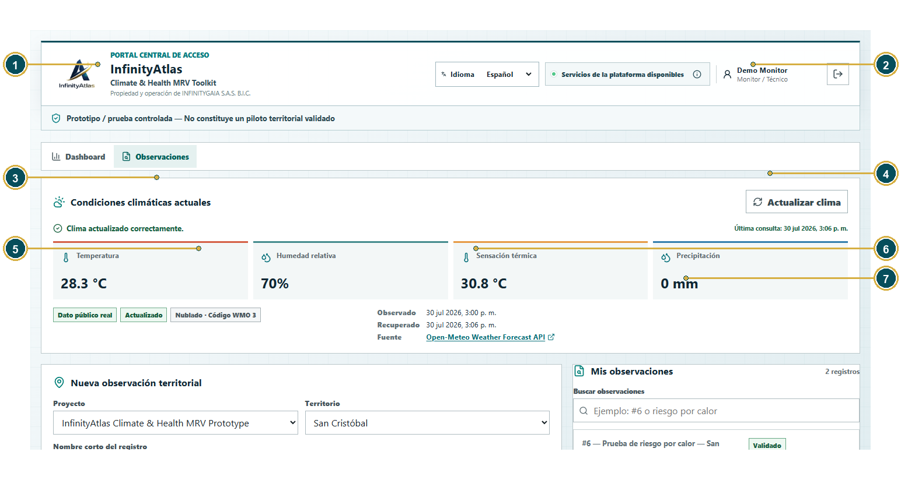
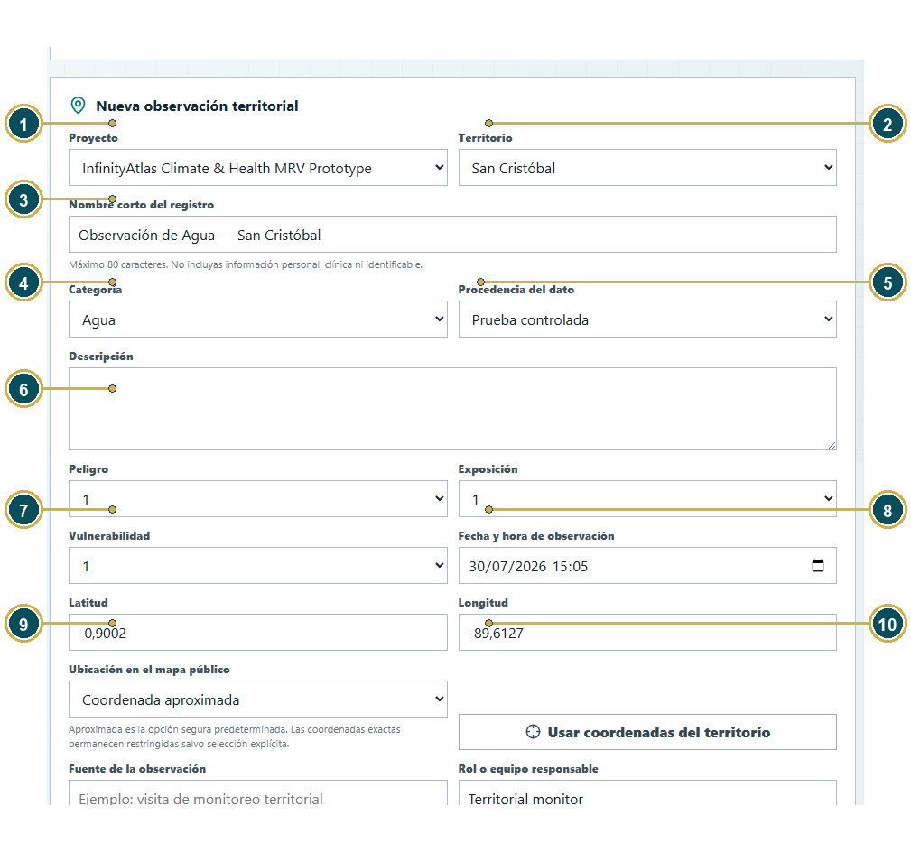
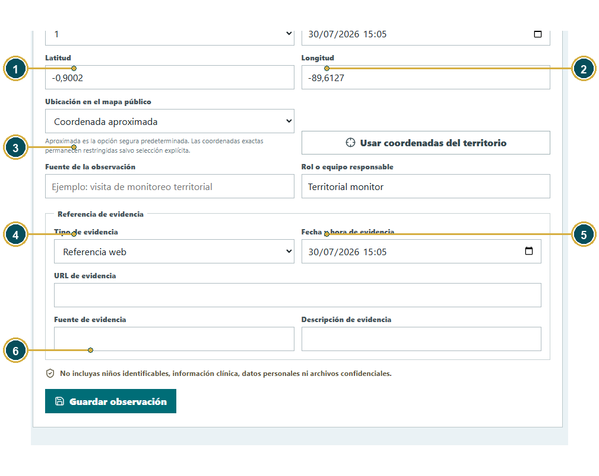
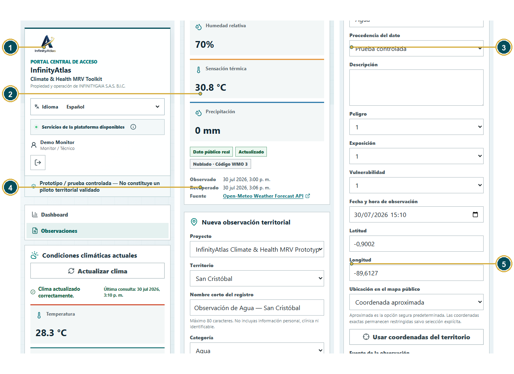

# Manual de Usuario Monitor

## Registro de observaciones territoriales

**Producto:** InfinityAtlas Climate & Health MRV Toolkit  
**Propiedad y operación:** INFINITYGAIA S.A.S. B.I.C.  
**Versión del manual:** 1.0 — Cierre de entrega
**Fecha:** 8 de agosto de 2026
**Etiqueta de entrega:** `unicef-rfps-503931-submission-2026-08-08-final`

> Prototipo / prueba controlada - No constituye un piloto territorial validado.

## Control documental

| Versión | Fecha | Descripción del cambio | Preparado por | Aprobado por |
| --- | --- | --- | --- | --- |
| 1.0 — Cierre de entrega | 8 de agosto de 2026 | Edición institucional final: control documental actualizado, referencias personales eliminadas y comportamiento funcional sincronizado con el cierre de entrega. | INFINITYGAIA S.A.S. B.I.C. — Product & Technical Team | INFINITYGAIA S.A.S. B.I.C. |

<a id="indice"></a>

## Tabla de contenidos

- [1. ¿Qué es InfinityAtlas?](#chapter-1)
  - [1.1 ¿Qué significa MRV?](#section-1-1)
  - [1.2 Responsabilidades del Monitor](#section-1-2)
  - [1.3 Acciones que el Monitor no puede realizar](#section-1-3)
- [2. Cómo encender InfinityAtlas](#chapter-2)
  - [2.1 ¿Qué es PowerShell?](#section-2-1)
- [3. Cómo entrar al Portal Central](#chapter-3)
- [4. Explicación de la pantalla Monitor](#chapter-4)
- [5. Formulario Nueva observación territorial: campo por campo](#chapter-5)
- [6. Peligro, Exposición y Vulnerabilidad](#chapter-6)
- [7. Ejercicio completo del Monitor](#chapter-7)
- [8. Información que nunca debe ingresar el Monitor](#chapter-8)
- [9. Cómo cerrar sesión y apagar el sistema](#chapter-9)
- [10. Errores frecuentes del Monitor](#chapter-10)
- [11. Apéndice A. Cómo presentar InfinityAtlas en una demostración en vivo](#chapter-11)
- [12. Apéndice B. Solución de problemas](#chapter-12)

---

<a id="chapter-1"></a>

# 1. ¿Qué es InfinityAtlas?

[Volver al índice](#indice)

InfinityAtlas Climate & Health MRV Toolkit organiza información territorial para que sea más fácil observar, registrar, revisar y explicar riesgos relacionados con clima, salud, agua, residuos y contaminación ambiental.

<a id="section-1-1"></a>

## 1.1 ¿Qué significa MRV?

| Palabra | Explicación sencilla |
| --- | --- |
| Medir | Registrar qué se observó, dónde, cuándo y con qué nivel metodológico. |
| Reportar | Guardar la información de forma ordenada y producir reportes comprensibles. |
| Verificar | Revisar que el registro esté completo y siga la metodología acordada. |

En este manual el enfoque es observar, documentar y enviar registros para revisión. InfinityAtlas puede apoyar decisiones que protejan a niños, familias y comunidades, pero no reemplaza la evaluación de especialistas.

> **Límite importante**  
> InfinityAtlas no es una herramienta de diagnóstico médico. No ingreses nombres de niños, historias clínicas, documentos de identidad, fotografías identificables ni otros datos personales.

<a id="section-1-2"></a>

## 1.2 Responsabilidades del Monitor

- Observar una situación territorial.
- Registrar información clara y verificable.
- Añadir una referencia de evidencia.
- Clasificar la categoría, procedencia y nivel metodológico.
- Guardar el registro con estado Pendiente.

<a id="section-1-3"></a>

## 1.3 Acciones que el Monitor no puede realizar

- No valida ni rechaza.
- No escribe comentarios metodológicos de decisión.
- No modifica la auditoría.
- No administra usuarios.
- No elimina registros.
- No publica directamente en el Dashboard Público.
- Solo consulta los registros permitidos por su rol.

<a id="chapter-2"></a>

# 2. Cómo encender InfinityAtlas

[Volver al índice](#indice)

InfinityAtlas funciona localmente mediante tres servicios: el Portal Central, la API institucional y el Dashboard Público. El script de inicio los enciende juntos.

<a id="section-2-1"></a>

## 2.1 ¿Qué es PowerShell?

PowerShell es una ventana de Windows donde se escriben instrucciones. No necesitas saber programar. Solo debes copiar los dos comandos exactamente como aparecen.

1. Presiona la tecla Windows.
2. Escribe PowerShell.
3. Abre Windows PowerShell en la raíz del repositorio.
4. Copia el comando y presiona Enter.
5. Espera hasta que aparezcan las direcciones de los servicios.

```powershell
.\start-local.ps1
```

> **Resultado esperado**  
> El Portal Central debe responder en <http://127.0.0.1:5173/> y la API debe responder en <http://127.0.0.1:8000/health>. Si una página no abre, espera 20 segundos y actualiza una vez.

<a id="chapter-3"></a>

# 3. Cómo entrar al Portal Central

[Volver al índice](#indice)

1. Abre Google Chrome.
2. Escribe <http://127.0.0.1:5173/> en la barra superior.
3. Presiona Enter.
4. Selecciona Español.
5. Presiona Iniciar sesión.
6. Escribe demo-monitor en Usuario o correo.
7. Escribe la contraseña local. La contraseña no aparece en este manual.
8. Presiona Iniciar sesión.
9. Confirma que el encabezado muestra Demo Monitor y el rol Monitor / Técnico.

> **Protege la contraseña**  
> No fotografíes, grabes, copies en un chat ni compartas la contraseña. Si Chrome ofrece guardarla, sigue la política de credenciales de la organización. Este manual nunca contiene contraseñas.


*Figura 1. Portal Central de InfinityAtlas. 1: marca; 2: idioma; 3: estado de servicios; 4: acceso público; 5: acceso institucional; 6: aviso de prototipo; 7: frontera de datos.*


*Figura 2. Acceso institucional. 1: marca; 2: volver al portal; 3: idioma; 4: usuario; 5: contraseña protegida; 6: iniciar sesión; 7: aviso de prototipo.*

<div style="page-break-after: always;"></div>

<a id="chapter-4"></a>

# 4. Explicación de la pantalla Monitor

[Volver al índice](#indice)



*Figura 3. Encabezado y condiciones climáticas. Los números se explican en las fichas siguientes.*

### Ficha: Logo y nombre InfinityAtlas

| Elemento | Explicación |
| --- | --- |
| Nombre exacto en español | Logo y nombre InfinityAtlas |
| Nombre exacto en inglés | InfinityAtlas logo and name |
| Tipo de elemento | Elemento de navegación |
| ¿Para qué sirve? | Identifica la plataforma oficial. |
| ¿Qué debe escribir o seleccionar el usuario? | Comprueba que diga InfinityAtlas, sin espacio. |
| Ejemplo correcto | InfinityAtlas |
| Ejemplo incorrecto | Infinity Atlas |
| ¿Es obligatorio? | No |
| ¿Qué sucede si se deja vacío? | No es un campo para llenar. Si no se utiliza, el usuario permanece en la vista o sección actual. |
| ¿Quién puede verlo? | Monitor y Administrador |
| ¿Contiene información privada? | No |
| Publicación pública | No aplica: no es un dato territorial publicable. |
| Error común | Confundir la marca con otro sistema. |
| Cómo corregirlo | Regresa al Portal Central y verifica la URL. |

### Ficha: Idioma

| Elemento | Explicación |
| --- | --- |
| Nombre exacto en español | Idioma |
| Nombre exacto en inglés | Language |
| Tipo de elemento | Elemento de navegación |
| ¿Para qué sirve? | Cambia los textos entre español e inglés. |
| ¿Qué debe escribir o seleccionar el usuario? | Selecciona Español o English. |
| Ejemplo correcto | Español |
| Ejemplo incorrecto | Buscar un botón de rol dentro del selector. |
| ¿Es obligatorio? | No |
| ¿Qué sucede si se deja vacío? | No es un campo para llenar. Si no se utiliza, el usuario permanece en la vista o sección actual. |
| ¿Quién puede verlo? | Monitor y Administrador |
| ¿Contiene información privada? | No |
| Publicación pública | No aplica: no es un dato territorial publicable. |
| Error común | Pensar que cierra la sesión. |
| Cómo corregirlo | Selecciona el idioma; la ruta y sesión se conservan. |

### Ficha: Servicios de la plataforma disponibles

| Elemento | Explicación |
| --- | --- |
| Nombre exacto en español | Servicios de la plataforma disponibles |
| Nombre exacto en inglés | Platform services available |
| Tipo de elemento | Indicador informativo |
| ¿Para qué sirve? | Comprueba Portal, backend /health y API pública. |
| ¿Qué debe escribir o seleccionar el usuario? | Observa el color y abre el icono de información. |
| Ejemplo correcto | Estado disponible con punto verde. |
| Ejemplo incorrecto | Ignorar un estado parcial antes de guardar. |
| ¿Es obligatorio? | No |
| ¿Qué sucede si se deja vacío? | El usuario no lo escribe. Si no aparece, debe comprobar la fuente o el estado del servicio y no suponer un valor. |
| ¿Quién puede verlo? | Todos |
| ¿Contiene información privada? | No |
| ¿Puede incluirse en una publicación pública? | Solo después de revisión, autorización y sanitización; nunca de forma automática. |
| Error común | El tooltip queda abierto. |
| Cómo corregirlo | Presiona Escape o toca fuera. |

### Ficha: Nombre del usuario

| Elemento | Explicación |
| --- | --- |
| Nombre exacto en español | Nombre del usuario |
| Nombre exacto en inglés | User display name |
| Tipo de elemento | Indicador informativo |
| ¿Para qué sirve? | Confirma qué cuenta inició sesión. |
| ¿Qué debe escribir o seleccionar el usuario? | Debe mostrar Demo Monitor. |
| Ejemplo correcto | Demo Monitor |
| Ejemplo incorrecto | Una cuenta de otra persona. |
| ¿Es obligatorio? | No |
| ¿Qué sucede si se deja vacío? | El usuario no lo escribe. Si no aparece, debe comprobar la fuente o el estado del servicio y no suponer un valor. |
| ¿Quién puede verlo? | Monitor y Administrador |
| ¿Contiene información privada? | Sí: identifica la cuenta local. |
| ¿Puede incluirse en una publicación pública? | No en su forma institucional. Requiere autorización, sanitización y una revisión de privacidad. |
| Error común | Trabajar con una cuenta equivocada. |
| Cómo corregirlo | Cierra sesión y entra con demo-monitor. |

### Ficha: Rol

| Elemento | Explicación |
| --- | --- |
| Nombre exacto en español | Rol |
| Nombre exacto en inglés | Role |
| Tipo de elemento | Indicador informativo |
| ¿Para qué sirve? | Muestra los permisos reconocidos por la API. |
| ¿Qué debe escribir o seleccionar el usuario? | Comprueba Monitor / Técnico. |
| Ejemplo correcto | Monitor / Técnico |
| Ejemplo incorrecto | Administrador |
| ¿Es obligatorio? | No |
| ¿Qué sucede si se deja vacío? | El usuario no lo escribe. Si no aparece, debe comprobar la fuente o el estado del servicio y no suponer un valor. |
| ¿Quién puede verlo? | Monitor y Administrador |
| ¿Contiene información privada? | No |
| ¿Puede incluirse en una publicación pública? | Solo después de revisión, autorización y sanitización; nunca de forma automática. |
| Error común | Esperar controles de validación. |
| Cómo corregirlo | Recuerda que el Monitor no valida. |

### Ficha: Cerrar sesión

| Elemento | Explicación |
| --- | --- |
| Nombre exacto en español | Cerrar sesión |
| Nombre exacto en inglés | Log out |
| Tipo de elemento | Botón o acción |
| ¿Para qué sirve? | Revoca la sesión actual. |
| ¿Qué debe escribir o seleccionar el usuario? | Presiona al terminar. |
| Ejemplo correcto | Usar el botón antes de cerrar Chrome. |
| Ejemplo incorrecto | Cerrar solo la pestaña. |
| ¿Es obligatorio? | No |
| ¿Qué sucede si se deja vacío? | No es un campo para llenar. Si no se pulsa, la operación asociada no se ejecuta y no cambia ningún registro. |
| ¿Quién puede verlo? | Monitor y Administrador |
| ¿Contiene información privada? | No |
| Publicación pública | No aplica: no es un dato territorial publicable. |
| Error común | Dejar la sesión abierta. |
| Cómo corregirlo | Vuelve a entrar y ciérrala correctamente. |

### Ficha: Pestaña Dashboard

| Elemento | Explicación |
| --- | --- |
| Nombre exacto en español | Pestaña Dashboard |
| Nombre exacto en inglés | Dashboard tab |
| Tipo de elemento | Elemento de navegación |
| ¿Para qué sirve? | Abre el resumen del rol y sus accesos. |
| ¿Qué debe escribir o seleccionar el usuario? | Presiona Dashboard. |
| Ejemplo correcto | Ver métricas del Monitor. |
| Ejemplo incorrecto | Buscar auditoría global. |
| ¿Es obligatorio? | No |
| ¿Qué sucede si se deja vacío? | No es un campo para llenar. Si no se utiliza, el usuario permanece en la vista o sección actual. |
| ¿Quién puede verlo? | Monitor |
| ¿Contiene información privada? | No |
| Publicación pública | No aplica: no es un dato territorial publicable. |
| Error común | Confundirlo con el Dashboard Público. |
| Cómo corregirlo | Usa Abrir información pública desde el Portal para la vista pública. |

### Ficha: Pestaña Observaciones

| Elemento | Explicación |
| --- | --- |
| Nombre exacto en español | Pestaña Observaciones |
| Nombre exacto en inglés | Observations tab |
| Tipo de elemento | Elemento de navegación |
| ¿Para qué sirve? | Abre clima, formulario y registros propios. |
| ¿Qué debe escribir o seleccionar el usuario? | Presiona Observaciones. |
| Ejemplo correcto | Ver Nueva observación territorial. |
| Ejemplo incorrecto | Esperar usuarios o auditoría. |
| ¿Es obligatorio? | No |
| ¿Qué sucede si se deja vacío? | No es un campo para llenar. Si no se utiliza, el usuario permanece en la vista o sección actual. |
| ¿Quién puede verlo? | Monitor |
| ¿Contiene información privada? | No |
| Publicación pública | No aplica: no es un dato territorial publicable. |
| Error común | No encontrar el formulario. |
| Cómo corregirlo | Selecciona Observaciones. |

### Ficha: Actualizar clima

| Elemento | Explicación |
| --- | --- |
| Nombre exacto en español | Actualizar clima |
| Nombre exacto en inglés | Refresh climate |
| Tipo de elemento | Botón o acción |
| ¿Para qué sirve? | Consulta nuevamente el proveedor climático. |
| ¿Qué debe escribir o seleccionar el usuario? | Presiona una vez y espera. |
| Ejemplo correcto | Esperar hasta que termine el giro. |
| Ejemplo incorrecto | Presionar varias veces rápido. |
| ¿Es obligatorio? | No |
| ¿Qué sucede si se deja vacío? | No es un campo para llenar. Si no se pulsa, la operación asociada no se ejecuta y no cambia ningún registro. |
| ¿Quién puede verlo? | Monitor |
| ¿Contiene información privada? | No |
| Publicación pública | No aplica: no es un dato territorial publicable. |
| Error común | Creer que cambió la hora observada. |
| Cómo corregirlo | Revisa la última consulta y la hora del proveedor por separado. |

### Ficha: Estado de la consulta climática

| Elemento | Explicación |
| --- | --- |
| Nombre exacto en español | Estado de la consulta climática |
| Nombre exacto en inglés | Climate query status |
| Tipo de elemento | Indicador informativo |
| ¿Para qué sirve? | Informa éxito, error o uso de último dato. |
| ¿Qué debe escribir o seleccionar el usuario? | Lee el mensaje antes de usar el dato. |
| Ejemplo correcto | Clima actualizado correctamente. |
| Ejemplo incorrecto | Presentar un dato desactualizado como actual. |
| ¿Es obligatorio? | No |
| ¿Qué sucede si se deja vacío? | El usuario no lo escribe. Si no aparece, debe comprobar la fuente o el estado del servicio y no suponer un valor. |
| ¿Quién puede verlo? | Monitor |
| ¿Contiene información privada? | No |
| ¿Puede incluirse en una publicación pública? | Solo después de revisión, autorización y sanitización; nunca de forma automática. |
| Error común | Ignorar la etiqueta desactualizado. |
| Cómo corregirlo | Explica que se muestra un dato almacenado. |

### Ficha: Temperatura

| Elemento | Explicación |
| --- | --- |
| Nombre exacto en español | Temperatura |
| Nombre exacto en inglés | Temperature |
| Tipo de elemento | Indicador informativo |
| ¿Para qué sirve? | Muestra la temperatura del aire en °C. |
| ¿Qué debe escribir o seleccionar el usuario? | Solo consulta el valor. |
| Ejemplo correcto | 28.4 °C como dato público real. |
| Ejemplo incorrecto | Escribirlo como diagnóstico. |
| ¿Es obligatorio? | No |
| ¿Qué sucede si se deja vacío? | El usuario no lo escribe. Si no aparece, debe comprobar la fuente o el estado del servicio y no suponer un valor. |
| ¿Quién puede verlo? | Monitor |
| ¿Contiene información privada? | No |
| ¿Puede incluirse en una publicación pública? | Solo después de revisión, autorización y sanitización; nunca de forma automática. |
| Error común | Confundir temperatura con sensación térmica. |
| Cómo corregirlo | Lee el nombre de la tarjeta. |

### Ficha: Humedad relativa

| Elemento | Explicación |
| --- | --- |
| Nombre exacto en español | Humedad relativa |
| Nombre exacto en inglés | Relative humidity |
| Tipo de elemento | Indicador informativo |
| ¿Para qué sirve? | Muestra el porcentaje de humedad. |
| ¿Qué debe escribir o seleccionar el usuario? | Solo consulta el porcentaje. |
| Ejemplo correcto | 69%. |
| Ejemplo incorrecto | 69 °C. |
| ¿Es obligatorio? | No |
| ¿Qué sucede si se deja vacío? | El usuario no lo escribe. Si no aparece, debe comprobar la fuente o el estado del servicio y no suponer un valor. |
| ¿Quién puede verlo? | Monitor |
| ¿Contiene información privada? | No |
| ¿Puede incluirse en una publicación pública? | Solo después de revisión, autorización y sanitización; nunca de forma automática. |
| Error común | Usar una unidad incorrecta. |
| Cómo corregirlo | La humedad se expresa con %. |

### Ficha: Sensación térmica

| Elemento | Explicación |
| --- | --- |
| Nombre exacto en español | Sensación térmica |
| Nombre exacto en inglés | Feels like |
| Tipo de elemento | Indicador informativo |
| ¿Para qué sirve? | Indica cómo se siente la temperatura según el modelo. |
| ¿Qué debe escribir o seleccionar el usuario? | Lee el valor en °C. |
| Ejemplo correcto | 31.4 °C. |
| Ejemplo incorrecto | Afirmar que mide una condición clínica. |
| ¿Es obligatorio? | No |
| ¿Qué sucede si se deja vacío? | El usuario no lo escribe. Si no aparece, debe comprobar la fuente o el estado del servicio y no suponer un valor. |
| ¿Quién puede verlo? | Monitor |
| ¿Contiene información privada? | No |
| ¿Puede incluirse en una publicación pública? | Solo después de revisión, autorización y sanitización; nunca de forma automática. |
| Error común | Confundirla con temperatura real. |
| Cómo corregirlo | Compara ambas tarjetas. |

### Ficha: Precipitación

| Elemento | Explicación |
| --- | --- |
| Nombre exacto en español | Precipitación |
| Nombre exacto en inglés | Precipitation |
| Tipo de elemento | Indicador informativo |
| ¿Para qué sirve? | Muestra milímetros de precipitación del intervalo. |
| ¿Qué debe escribir o seleccionar el usuario? | Lee el valor en mm. |
| Ejemplo correcto | 0 mm. |
| Ejemplo incorrecto | Interpretarlo como lluvia anual. |
| ¿Es obligatorio? | No |
| ¿Qué sucede si se deja vacío? | El usuario no lo escribe. Si no aparece, debe comprobar la fuente o el estado del servicio y no suponer un valor. |
| ¿Quién puede verlo? | Monitor |
| ¿Contiene información privada? | No |
| ¿Puede incluirse en una publicación pública? | Solo después de revisión, autorización y sanitización; nunca de forma automática. |
| Error común | Confundir intervalo con acumulado largo. |
| Cómo corregirlo | Explica que es contexto actual. |

### Ficha: Código meteorológico

| Elemento | Explicación |
| --- | --- |
| Nombre exacto en español | Código meteorológico |
| Nombre exacto en inglés | Weather code |
| Tipo de elemento | Indicador informativo |
| ¿Para qué sirve? | Identifica la condición WMO usada por Open-Meteo. |
| ¿Qué debe escribir o seleccionar el usuario? | Consulta el código y su texto. |
| Ejemplo correcto | Nublado - Código WMO 2. |
| Ejemplo incorrecto | Usarlo como nivel de riesgo. |
| ¿Es obligatorio? | No |
| ¿Qué sucede si se deja vacío? | El usuario no lo escribe. Si no aparece, debe comprobar la fuente o el estado del servicio y no suponer un valor. |
| ¿Quién puede verlo? | Monitor |
| ¿Contiene información privada? | No |
| ¿Puede incluirse en una publicación pública? | Solo después de revisión, autorización y sanitización; nunca de forma automática. |
| Error común | Confundirlo con el puntaje territorial. |
| Cómo corregirlo | El riesgo usa otra metodología. |

### Ficha: Fuente Open-Meteo

| Elemento | Explicación |
| --- | --- |
| Nombre exacto en español | Fuente Open-Meteo |
| Nombre exacto en inglés | Open-Meteo source |
| Tipo de elemento | Indicador informativo |
| ¿Para qué sirve? | Mantiene visible el origen del clima. |
| ¿Qué debe escribir o seleccionar el usuario? | Abre el enlace solo si necesitas auditoría técnica. |
| Ejemplo correcto | Open-Meteo Weather Forecast API. |
| Ejemplo incorrecto | Ocultar la fuente. |
| ¿Es obligatorio? | No |
| ¿Qué sucede si se deja vacío? | El usuario no lo escribe. Si no aparece, debe comprobar la fuente o el estado del servicio y no suponer un valor. |
| ¿Quién puede verlo? | Monitor |
| ¿Contiene información privada? | No |
| ¿Puede incluirse en una publicación pública? | Solo después de revisión, autorización y sanitización; nunca de forma automática. |
| Error común | Sorprenderse por el JSON. |
| Cómo corregirlo | La respuesta técnica es para trazabilidad. |

### Ficha: Hora observada por el proveedor

| Elemento | Explicación |
| --- | --- |
| Nombre exacto en español | Hora observada por el proveedor |
| Nombre exacto en inglés | Observed by provider |
| Tipo de elemento | Indicador informativo |
| ¿Para qué sirve? | Indica cuándo corresponde el dato meteorológico. |
| ¿Qué debe escribir o seleccionar el usuario? | Lee la hora del proveedor. |
| Ejemplo correcto | 1:45 p. m. |
| Ejemplo incorrecto | Cambiarla manualmente. |
| ¿Es obligatorio? | No |
| ¿Qué sucede si se deja vacío? | El usuario no lo escribe. Si no aparece, debe comprobar la fuente o el estado del servicio y no suponer un valor. |
| ¿Quién puede verlo? | Monitor |
| ¿Contiene información privada? | No |
| ¿Puede incluirse en una publicación pública? | Solo después de revisión, autorización y sanitización; nunca de forma automática. |
| Error común | Confundirla con la hora del clic. |
| Cómo corregirlo | Compara con Última consulta. |

### Ficha: Última consulta de InfinityAtlas

| Elemento | Explicación |
| --- | --- |
| Nombre exacto en español | Última consulta de InfinityAtlas |
| Nombre exacto en inglés | Last InfinityAtlas query |
| Tipo de elemento | Indicador informativo |
| ¿Para qué sirve? | Indica cuándo InfinityAtlas pidió el dato. |
| ¿Qué debe escribir o seleccionar el usuario? | Comprueba que cambie después del clic. |
| Ejemplo correcto | 1:55 p. m. |
| Ejemplo incorrecto | Afirmar que el proveedor cambió el intervalo. |
| ¿Es obligatorio? | No |
| ¿Qué sucede si se deja vacío? | El usuario no lo escribe. Si no aparece, debe comprobar la fuente o el estado del servicio y no suponer un valor. |
| ¿Quién puede verlo? | Monitor |
| ¿Contiene información privada? | No |
| ¿Puede incluirse en una publicación pública? | Solo después de revisión, autorización y sanitización; nunca de forma automática. |
| Error común | Esperar que ambos tiempos sean iguales. |
| Cómo corregirlo | Una nueva consulta puede devolver el mismo intervalo. |

### Ficha: Nueva observación territorial

| Elemento | Explicación |
| --- | --- |
| Nombre exacto en español | Nueva observación territorial |
| Nombre exacto en inglés | New territorial observation |
| Tipo de elemento | Campo obligatorio |
| ¿Para qué sirve? | Agrupa los campos de creación. |
| ¿Qué debe escribir o seleccionar el usuario? | Completa cada campo antes de guardar. |
| Ejemplo correcto | Una prueba controlada sin datos personales. |
| Ejemplo incorrecto | Un registro con nombres de niños. |
| ¿Es obligatorio? | Sí para crear |
| ¿Qué sucede si se deja vacío? | InfinityAtlas detiene el guardado o la acción y señala este campo para que el usuario lo complete. |
| ¿Quién puede verlo? | Monitor |
| ¿Contiene información privada? | Puede contener información interna. |
| ¿Puede incluirse en una publicación pública? | Solo después de revisión, autorización y sanitización; nunca de forma automática. |
| Error común | Omitir un campo requerido. |
| Cómo corregirlo | Revisa las fichas campo por campo. |

### Ficha: Mis observaciones

| Elemento | Explicación |
| --- | --- |
| Nombre exacto en español | Mis observaciones |
| Nombre exacto en inglés | My observations |
| Tipo de elemento | Campo opcional |
| ¿Para qué sirve? | Muestra los registros permitidos para el Monitor. |
| ¿Qué debe escribir o seleccionar el usuario? | Busca por número o nombre. |
| Ejemplo correcto | #6 - Prueba de riesgo por calor. |
| Ejemplo incorrecto | Esperar todos los registros institucionales. |
| ¿Es obligatorio? | No |
| ¿Qué sucede si se deja vacío? | El registro puede continuar. InfinityAtlas conserva el valor predeterminado o deja este dato opcional sin registrar, según corresponda. |
| ¿Quién puede verlo? | Monitor |
| ¿Contiene información privada? | Sí: información institucional. |
| ¿Puede incluirse en una publicación pública? | No en su forma institucional. Requiere autorización, sanitización y una revisión de privacidad. |
| Error común | No encontrar un registro ajeno. |
| Cómo corregirlo | El alcance depende del usuario creador. |

### Ficha: Buscar observaciones

| Elemento | Explicación |
| --- | --- |
| Nombre exacto en español | Buscar observaciones |
| Nombre exacto en inglés | Search observations |
| Tipo de elemento | Botón o acción |
| ¿Para qué sirve? | Filtra por número o nombre corto. |
| ¿Qué debe escribir o seleccionar el usuario? | Escribe #6 o parte del título. |
| Ejemplo correcto | #6 |
| Ejemplo incorrecto | Una contraseña. |
| ¿Es obligatorio? | No |
| ¿Qué sucede si se deja vacío? | No es un campo para llenar. Si no se pulsa, la operación asociada no se ejecuta y no cambia ningún registro. |
| ¿Quién puede verlo? | Monitor |
| ¿Contiene información privada? | No |
| Publicación pública | No aplica: no es un dato territorial publicable. |
| Error común | Buscar por descripción completa. |
| Cómo corregirlo | Usa el número o nombre corto. |

<div style="page-break-after: always;"></div>

<a id="chapter-5"></a>

# 5. Formulario Nueva observación territorial: campo por campo

[Volver al índice](#indice)



*Figura 4. Campos principales del formulario. Los números 1-14 corresponden a las fichas siguientes.*

### Ficha: Proyecto

| Elemento | Explicación |
| --- | --- |
| Nombre exacto en español | Proyecto |
| Nombre exacto en inglés | Project |
| Tipo de elemento | Campo obligatorio |
| ¿Para qué sirve? | Relaciona la observación con un proyecto. |
| ¿Qué debe escribir o seleccionar el usuario? | Selecciona InfinityAtlas Climate & Health MRV Prototype. |
| Ejemplo correcto | Proyecto Prototype. |
| Ejemplo incorrecto | Proyecto Synthetic Demo para un ejercicio que se presentará como controlado. |
| ¿Es obligatorio? | Sí |
| ¿Qué sucede si se deja vacío? | InfinityAtlas detiene el guardado o la acción y señala este campo para que el usuario lo complete. |
| ¿Quién puede verlo? | Monitor y Administrador |
| ¿Contiene información privada? | No |
| ¿Puede incluirse en una publicación pública? | Solo después de revisión, autorización y sanitización; nunca de forma automática. |
| Error común | Elegir el proyecto equivocado. |
| Cómo corregirlo | Revisa la procedencia antes de guardar. |

### Ficha: Territorio

| Elemento | Explicación |
| --- | --- |
| Nombre exacto en español | Territorio |
| Nombre exacto en inglés | Territory |
| Tipo de elemento | Campo obligatorio |
| ¿Para qué sirve? | Indica dónde ocurrió la observación. |
| ¿Qué debe escribir o seleccionar el usuario? | Selecciona San Cristóbal. |
| Ejemplo correcto | San Cristóbal. |
| Ejemplo incorrecto | Escribir una dirección particular. |
| ¿Es obligatorio? | Sí |
| ¿Qué sucede si se deja vacío? | InfinityAtlas detiene el guardado o la acción y señala este campo para que el usuario lo complete. |
| ¿Quién puede verlo? | Monitor y Administrador |
| ¿Contiene información privada? | Puede ser sensible si se combina con coordenadas. |
| ¿Puede incluirse en una publicación pública? | Solo después de revisión, autorización y sanitización; nunca de forma automática. |
| Error común | Territorio vacío. |
| Cómo corregirlo | Selecciona el territorio disponible. |

### Ficha: Nombre corto del registro

| Elemento | Explicación |
| --- | --- |
| Nombre exacto en español | Nombre corto del registro |
| Nombre exacto en inglés | Record title |
| Tipo de elemento | Campo obligatorio |
| ¿Para qué sirve? | Permite reconocer el registro sin depender del número. |
| ¿Qué debe escribir o seleccionar el usuario? | Usa máximo 80 caracteres y ningún dato personal. |
| Ejemplo correcto | Prueba controlada de calor en San Cristóbal. |
| Ejemplo incorrecto | Calor de Juan Pérez en su casa. |
| ¿Es obligatorio? | Sí |
| ¿Qué sucede si se deja vacío? | InfinityAtlas detiene el guardado o la acción y señala este campo para que el usuario lo complete. |
| ¿Quién puede verlo? | Monitor y Administrador |
| ¿Contiene información privada? | No debe contener datos privados. |
| ¿Puede incluirse en una publicación pública? | Solo después de revisión, autorización y sanitización; nunca de forma automática. |
| Error común | Título demasiado largo o personal. |
| Cómo corregirlo | Resume categoría y territorio. |

### Ficha: Categoría

| Elemento | Explicación |
| --- | --- |
| Nombre exacto en español | Categoría |
| Nombre exacto en inglés | Category |
| Tipo de elemento | Campo obligatorio |
| ¿Para qué sirve? | Clasifica el tema observado. |
| ¿Qué debe escribir o seleccionar el usuario? | Elige Agua, Residuos, Calor o Contaminación ambiental. |
| Ejemplo correcto | Calor. |
| Ejemplo incorrecto | Salud de un niño. |
| ¿Es obligatorio? | Sí |
| ¿Qué sucede si se deja vacío? | InfinityAtlas detiene el guardado o la acción y señala este campo para que el usuario lo complete. |
| ¿Quién puede verlo? | Monitor, Administrador y público si se autoriza. |
| ¿Contiene información privada? | No |
| ¿Es visible en la interfaz pública? | Sí. Forma parte de la superficie pública de solo lectura, con los límites de privacidad indicados. |
| Error común | Elegir una categoría que no coincide. |
| Cómo corregirlo | Lee la descripción y selecciona la más cercana. |

### Ficha: Procedencia del dato

| Elemento | Explicación |
| --- | --- |
| Nombre exacto en español | Procedencia del dato |
| Nombre exacto en inglés | Data provenance |
| Tipo de elemento | Campo obligatorio |
| ¿Para qué sirve? | Distingue dato real, prueba controlada o demo sintética. |
| ¿Qué debe escribir o seleccionar el usuario? | Selecciona la opción demostrable. |
| Ejemplo correcto | Prueba controlada para un ejercicio. |
| Ejemplo incorrecto | Dato público real sin fuente verificable. |
| ¿Es obligatorio? | Sí |
| ¿Qué sucede si se deja vacío? | InfinityAtlas detiene el guardado o la acción y señala este campo para que el usuario lo complete. |
| ¿Quién puede verlo? | Monitor, Administrador y público si se autoriza. |
| ¿Contiene información privada? | No |
| ¿Es visible en la interfaz pública? | Sí. Forma parte de la superficie pública de solo lectura, con los límites de privacidad indicados. |
| Error común | Presentar una prueba como dato real. |
| Cómo corregirlo | Cambia a Prueba controlada o Demo sintética. |

### Ficha: Descripción

| Elemento | Explicación |
| --- | --- |
| Nombre exacto en español | Descripción |
| Nombre exacto en inglés | Description |
| Tipo de elemento | Campo obligatorio |
| ¿Para qué sirve? | Explica qué se observó. |
| ¿Qué debe escribir o seleccionar el usuario? | Escribe qué, dónde de forma general, cuándo y bajo qué contexto. |
| Ejemplo correcto | Durante una práctica controlada se registró exposición a calor en una zona general. |
| Ejemplo incorrecto | El niño X está enfermo en su casa. |
| ¿Es obligatorio? | Sí |
| ¿Qué sucede si se deja vacío? | InfinityAtlas detiene el guardado o la acción y señala este campo para que el usuario lo complete. |
| ¿Quién puede verlo? | Monitor y Administrador |
| ¿Contiene información privada? | Sí si incluye detalles; no los incluyas. |
| ¿Puede incluirse en una publicación pública? | No en su forma institucional. Requiere autorización, sanitización y una revisión de privacidad. |
| Error común | Descripción vaga o personal. |
| Cómo corregirlo | Usa hechos sencillos y sin nombres. |

### Ficha: Peligro

| Elemento | Explicación |
| --- | --- |
| Nombre exacto en español | Peligro |
| Nombre exacto en inglés | Hazard |
| Tipo de elemento | Campo obligatorio |
| ¿Para qué sirve? | Mide qué tan serio puede ser el problema. |
| ¿Qué debe escribir o seleccionar el usuario? | Selecciona 1, 2, 3 o 4. |
| Ejemplo correcto | 2 para calor moderado en una prueba. |
| Ejemplo incorrecto | 5 o una palabra libre. |
| ¿Es obligatorio? | Sí |
| ¿Qué sucede si se deja vacío? | InfinityAtlas detiene el guardado o la acción y señala este campo para que el usuario lo complete. |
| ¿Quién puede verlo? | Monitor y Administrador; puntaje público si se autoriza. |
| ¿Contiene información privada? | No |
| ¿Es visible en la interfaz pública? | Sí. Forma parte de la superficie pública de solo lectura, con los límites de privacidad indicados. |
| Error común | Elegir fuera de 1-4. |
| Cómo corregirlo | Usa la escala explicada más adelante. |

### Ficha: Exposición

| Elemento | Explicación |
| --- | --- |
| Nombre exacto en español | Exposición |
| Nombre exacto en inglés | Exposure |
| Tipo de elemento | Campo obligatorio |
| ¿Para qué sirve? | Mide cuántas personas, lugares o recursos podrían estar en contacto. |
| ¿Qué debe escribir o seleccionar el usuario? | Selecciona 1-4. |
| Ejemplo correcto | 2 para exposición limitada. |
| Ejemplo incorrecto | Usar nombres de personas. |
| ¿Es obligatorio? | Sí |
| ¿Qué sucede si se deja vacío? | InfinityAtlas detiene el guardado o la acción y señala este campo para que el usuario lo complete. |
| ¿Quién puede verlo? | Monitor y Administrador; puntaje público si se autoriza. |
| ¿Contiene información privada? | No |
| ¿Es visible en la interfaz pública? | Sí. Forma parte de la superficie pública de solo lectura, con los límites de privacidad indicados. |
| Error común | Confundirla con gravedad. |
| Cómo corregirlo | Piensa en alcance, no en intensidad. |

### Ficha: Vulnerabilidad

| Elemento | Explicación |
| --- | --- |
| Nombre exacto en español | Vulnerabilidad |
| Nombre exacto en inglés | Vulnerability |
| Tipo de elemento | Campo obligatorio |
| ¿Para qué sirve? | Mide qué tan difícil sería protegerse o recuperarse. |
| ¿Qué debe escribir o seleccionar el usuario? | Selecciona 1-4. |
| Ejemplo correcto | 2 para capacidad de respuesta parcial. |
| Ejemplo incorrecto | Describir una condición médica. |
| ¿Es obligatorio? | Sí |
| ¿Qué sucede si se deja vacío? | InfinityAtlas detiene el guardado o la acción y señala este campo para que el usuario lo complete. |
| ¿Quién puede verlo? | Monitor y Administrador; puntaje público si se autoriza. |
| ¿Contiene información privada? | No |
| ¿Es visible en la interfaz pública? | Sí. Forma parte de la superficie pública de solo lectura, con los límites de privacidad indicados. |
| Error común | Usar datos clínicos. |
| Cómo corregirlo | Evalúa capacidad territorial de forma general. |

### Ficha: Fecha y hora de observación

| Elemento | Explicación |
| --- | --- |
| Nombre exacto en español | Fecha y hora de observación |
| Nombre exacto en inglés | Observation date and time |
| Tipo de elemento | Campo obligatorio |
| ¿Para qué sirve? | Registra cuándo se observó la situación. |
| ¿Qué debe escribir o seleccionar el usuario? | Selecciona fecha y hora local correctas. |
| Ejemplo correcto | 30/07/2026 10:00. |
| Ejemplo incorrecto | Una fecha futura accidental. |
| ¿Es obligatorio? | Sí |
| ¿Qué sucede si se deja vacío? | InfinityAtlas detiene el guardado o la acción y señala este campo para que el usuario lo complete. |
| ¿Quién puede verlo? | Monitor, Administrador y fecha pública si se autoriza. |
| ¿Contiene información privada? | No |
| ¿Puede incluirse en una publicación pública? | Solo después de revisión, autorización y sanitización; nunca de forma automática. |
| Error común | Confundirla con fecha de evidencia. |
| Cómo corregirlo | Comprueba el calendario antes de guardar. |

### Ficha: Latitud

| Elemento | Explicación |
| --- | --- |
| Nombre exacto en español | Latitud |
| Nombre exacto en inglés | Latitude |
| Tipo de elemento | Campo obligatorio |
| ¿Para qué sirve? | Ubica el registro de norte a sur. |
| ¿Qué debe escribir o seleccionar el usuario? | Usa un valor entre -90 y 90. |
| Ejemplo correcto | -0.9002. |
| Ejemplo incorrecto | -89.6127 en Latitud. |
| ¿Es obligatorio? | Sí |
| ¿Qué sucede si se deja vacío? | InfinityAtlas detiene el guardado o la acción y señala este campo para que el usuario lo complete. |
| ¿Quién puede verlo? | Monitor y Administrador; se protege para público. |
| ¿Contiene información privada? | Sí: puede ser sensible. |
| ¿Es visible en la interfaz pública? | Sí. Forma parte de la superficie pública de solo lectura, con los límites de privacidad indicados. |
| Error común | Intercambiar latitud y longitud. |
| Cómo corregirlo | Usa el botón de coordenadas del territorio. |

### Ficha: Longitud

| Elemento | Explicación |
| --- | --- |
| Nombre exacto en español | Longitud |
| Nombre exacto en inglés | Longitude |
| Tipo de elemento | Campo obligatorio |
| ¿Para qué sirve? | Ubica el registro de este a oeste. |
| ¿Qué debe escribir o seleccionar el usuario? | Usa un valor entre -180 y 180. |
| Ejemplo correcto | -89.6127. |
| Ejemplo incorrecto | -0.9002 en Longitud. |
| ¿Es obligatorio? | Sí |
| ¿Qué sucede si se deja vacío? | InfinityAtlas detiene el guardado o la acción y señala este campo para que el usuario lo complete. |
| ¿Quién puede verlo? | Monitor y Administrador; se protege para público. |
| ¿Contiene información privada? | Sí: puede ser sensible. |
| ¿Es visible en la interfaz pública? | Sí. Forma parte de la superficie pública de solo lectura, con los límites de privacidad indicados. |
| Error común | Intercambiar coordenadas. |
| Cómo corregirlo | Comprueba que San Cristóbal use longitud cercana a -89. |

### Ficha: Ubicación en el mapa público

| Elemento | Explicación |
| --- | --- |
| Nombre exacto en español | Ubicación en el mapa público |
| Nombre exacto en inglés | Public map location |
| Tipo de elemento | Gráfico o mapa |
| ¿Para qué sirve? | Define la geoprivacidad pública. |
| ¿Qué debe escribir o seleccionar el usuario? | Elige Exacta, Aproximada, Agregada u Oculta. |
| Ejemplo correcto | Coordenada aproximada. |
| Ejemplo incorrecto | Exacta para un lugar sensible. |
| ¿Es obligatorio? | Sí |
| ¿Qué sucede si se deja vacío? | No es un campo para llenar. Si no existen ubicaciones públicas compatibles con los filtros, el mapa conserva su base y muestra un estado sin puntos. |
| ¿Quién puede verlo? | Monitor y Administrador; el modo puede ser público. |
| ¿Contiene información privada? | Sí si se elige exacta. |
| ¿Es visible en la interfaz pública? | Sí. Forma parte de la superficie pública de solo lectura, con los límites de privacidad indicados. |
| Error común | Usar exacta sin autorización. |
| Cómo corregirlo | Usa Aproximada como opción segura. |

### Ficha: Usar coordenadas del territorio

| Elemento | Explicación |
| --- | --- |
| Nombre exacto en español | Usar coordenadas del territorio |
| Nombre exacto en inglés | Use territory coordinates |
| Tipo de elemento | Botón o acción |
| ¿Para qué sirve? | Rellena latitud y longitud de San Cristóbal. |
| ¿Qué debe escribir o seleccionar el usuario? | Presiona si no necesitas un punto distinto. |
| Ejemplo correcto | -0.9002, -89.6127. |
| Ejemplo incorrecto | Presionar y luego afirmar que es una ubicación exacta del evento. |
| ¿Es obligatorio? | No |
| ¿Qué sucede si se deja vacío? | No es un campo para llenar. Si no se pulsa, la operación asociada no se ejecuta y no cambia ningún registro. |
| ¿Quién puede verlo? | Monitor |
| ¿Contiene información privada? | No |
| Publicación pública | No aplica: no es un dato territorial publicable. |
| Error común | Creer que confirma el evento. |
| Cómo corregirlo | Aclara que son coordenadas de referencia. |

### Ficha: Fuente de la observación

| Elemento | Explicación |
| --- | --- |
| Nombre exacto en español | Fuente de la observación |
| Nombre exacto en inglés | Observation source |
| Tipo de elemento | Campo obligatorio |
| ¿Para qué sirve? | Explica de dónde salió la información. |
| ¿Qué debe escribir o seleccionar el usuario? | Escribe una fuente general y comprobable. |
| Ejemplo correcto | Visita de monitoreo territorial. |
| Ejemplo incorrecto | Me dijeron algo. |
| ¿Es obligatorio? | Sí |
| ¿Qué sucede si se deja vacío? | InfinityAtlas detiene el guardado o la acción y señala este campo para que el usuario lo complete. |
| ¿Quién puede verlo? | Monitor y Administrador |
| ¿Contiene información privada? | No debe incluir nombres personales. |
| ¿Puede incluirse en una publicación pública? | Solo después de revisión, autorización y sanitización; nunca de forma automática. |
| Error común | Fuente demasiado vaga. |
| Cómo corregirlo | Describe el tipo de actividad o documento. |

### Ficha: Rol o equipo responsable

| Elemento | Explicación |
| --- | --- |
| Nombre exacto en español | Rol o equipo responsable |
| Nombre exacto en inglés | Responsible role or team |
| Tipo de elemento | Indicador informativo |
| ¿Para qué sirve? | Identifica el equipo, no una persona. |
| ¿Qué debe escribir o seleccionar el usuario? | Escribe un rol o unidad. |
| Ejemplo correcto | Equipo de monitoreo territorial. |
| Ejemplo incorrecto | Nombre personal + teléfono. |
| ¿Es obligatorio? | Sí |
| ¿Qué sucede si se deja vacío? | El usuario no lo escribe. Si no aparece, debe comprobar la fuente o el estado del servicio y no suponer un valor. |
| ¿Quién puede verlo? | Monitor y Administrador |
| ¿Contiene información privada? | Sí si se escribe un nombre; no lo hagas. |
| ¿Puede incluirse en una publicación pública? | No en su forma institucional. Requiere autorización, sanitización y una revisión de privacidad. |
| Error común | Usar nombre personal. |
| Cómo corregirlo | Sustituye por el rol o equipo. |

### Ficha: Tipo de evidencia

| Elemento | Explicación |
| --- | --- |
| Nombre exacto en español | Tipo de evidencia |
| Nombre exacto en inglés | Evidence type |
| Tipo de elemento | Campo obligatorio |
| ¿Para qué sirve? | Clasifica la referencia. |
| ¿Qué debe escribir o seleccionar el usuario? | Elige web, fotográfica o documental. |
| Ejemplo correcto | Referencia web. |
| Ejemplo incorrecto | Archivo clínico. |
| ¿Es obligatorio? | Sí |
| ¿Qué sucede si se deja vacío? | InfinityAtlas detiene el guardado o la acción y señala este campo para que el usuario lo complete. |
| ¿Quién puede verlo? | Monitor y Administrador |
| ¿Contiene información privada? | Puede ser sensible según la fuente. |
| ¿Puede incluirse en una publicación pública? | Solo después de revisión, autorización y sanitización; nunca de forma automática. |
| Error común | Tipo no coincide con el enlace. |
| Cómo corregirlo | Selecciona el tipo real. |

### Ficha: Fecha y hora de evidencia

| Elemento | Explicación |
| --- | --- |
| Nombre exacto en español | Fecha y hora de evidencia |
| Nombre exacto en inglés | Evidence date and time |
| Tipo de elemento | Campo obligatorio |
| ¿Para qué sirve? | Registra cuándo fue producida o consultada la evidencia. |
| ¿Qué debe escribir o seleccionar el usuario? | Selecciona la fecha correcta. |
| Ejemplo correcto | 30/07/2026 10:05. |
| Ejemplo incorrecto | Fecha futura accidental. |
| ¿Es obligatorio? | Sí |
| ¿Qué sucede si se deja vacío? | InfinityAtlas detiene el guardado o la acción y señala este campo para que el usuario lo complete. |
| ¿Quién puede verlo? | Monitor y Administrador |
| ¿Contiene información privada? | No |
| ¿Puede incluirse en una publicación pública? | Solo después de revisión, autorización y sanitización; nunca de forma automática. |
| Error común | Copiar una fecha incorrecta. |
| Cómo corregirlo | Verifica la fuente original. |

### Ficha: URL de evidencia

| Elemento | Explicación |
| --- | --- |
| Nombre exacto en español | URL de evidencia |
| Nombre exacto en inglés | Evidence URL |
| Tipo de elemento | Campo obligatorio |
| ¿Para qué sirve? | Guarda una referencia sin subir archivos al repositorio. |
| ¿Qué debe escribir o seleccionar el usuario? | Escribe una URL completa que empiece por https://. |
| Ejemplo correcto | <https://github.com/Carlos-Hub1111/infinity-atlas-climate-health-mrv> |
| Ejemplo incorrecto | example.local o una ruta privada. |
| ¿Es obligatorio? | Sí |
| ¿Qué sucede si se deja vacío? | InfinityAtlas detiene el guardado o la acción y señala este campo para que el usuario lo complete. |
| ¿Quién puede verlo? | Monitor y Administrador |
| ¿Contiene información privada? | Puede revelar información; usa solo enlaces autorizados. |
| ¿Puede incluirse en una publicación pública? | Solo después de revisión, autorización y sanitización; nunca de forma automática. |
| Error común | Dejarla vacía o sin https://. |
| Cómo corregirlo | Usa una referencia pública controlada. |

### Ficha: Fuente de evidencia

| Elemento | Explicación |
| --- | --- |
| Nombre exacto en español | Fuente de evidencia |
| Nombre exacto en inglés | Evidence source |
| Tipo de elemento | Campo obligatorio |
| ¿Para qué sirve? | Nombra a la organización o sistema de origen. |
| ¿Qué debe escribir o seleccionar el usuario? | Escribe una fuente institucional. |
| Ejemplo correcto | INFINITYGAIA S.A.S. B.I.C. |
| Ejemplo incorrecto | Nombre de un niño. |
| ¿Es obligatorio? | Sí |
| ¿Qué sucede si se deja vacío? | InfinityAtlas detiene el guardado o la acción y señala este campo para que el usuario lo complete. |
| ¿Quién puede verlo? | Monitor y Administrador |
| ¿Contiene información privada? | No debe contener datos personales. |
| ¿Puede incluirse en una publicación pública? | Solo después de revisión, autorización y sanitización; nunca de forma automática. |
| Error común | Confundir fuente con descripción. |
| Cómo corregirlo | Escribe quién publicó o custodia la evidencia. |

### Ficha: Descripción de evidencia

| Elemento | Explicación |
| --- | --- |
| Nombre exacto en español | Descripción de evidencia |
| Nombre exacto en inglés | Evidence description |
| Tipo de elemento | Campo obligatorio |
| ¿Para qué sirve? | Explica qué contiene el enlace y por qué se relaciona. |
| ¿Qué debe escribir o seleccionar el usuario? | Escribe una frase concreta. |
| Ejemplo correcto | Rama pública usada para una práctica controlada del flujo MRV. |
| Ejemplo incorrecto | Evidencia. |
| ¿Es obligatorio? | Sí |
| ¿Qué sucede si se deja vacío? | InfinityAtlas detiene el guardado o la acción y señala este campo para que el usuario lo complete. |
| ¿Quién puede verlo? | Monitor y Administrador |
| ¿Contiene información privada? | Puede ser sensible; evita detalles personales. |
| ¿Puede incluirse en una publicación pública? | Solo después de revisión, autorización y sanitización; nunca de forma automática. |
| Error común | Texto demasiado corto. |
| Cómo corregirlo | Explica contenido y relación. |

### Ficha: Confirmación de demo sintética

| Elemento | Explicación |
| --- | --- |
| Nombre exacto en español | Confirmación de demo sintética |
| Nombre exacto en inglés | Synthetic demo confirmation |
| Tipo de elemento | Campo obligatorio cuando aplica |
| ¿Para qué sirve? | Evita presentar datos ficticios como reales. |
| ¿Qué debe escribir o seleccionar el usuario? | Marca la casilla solo cuando la procedencia sea Demo sintética. |
| Ejemplo correcto | Confirmación marcada para un dato ficticio. |
| Ejemplo incorrecto | Marcar dato público real como sintético. |
| ¿Es obligatorio? | Condicional |
| ¿Qué sucede si se deja vacío? | Cuando la condición está activa, InfinityAtlas detiene la acción hasta completarlo; si la condición no aplica, puede permanecer vacío. |
| ¿Quién puede verlo? | Monitor y Administrador |
| ¿Contiene información privada? | No |
| ¿Puede incluirse en una publicación pública? | Solo después de revisión, autorización y sanitización; nunca de forma automática. |
| Error común | No marcarla cuando corresponde. |
| Cómo corregirlo | Marca la confirmación antes de guardar. |

### Ficha: Guardar observación

| Elemento | Explicación |
| --- | --- |
| Nombre exacto en español | Guardar observación |
| Nombre exacto en inglés | Save observation |
| Tipo de elemento | Botón o acción |
| ¿Para qué sirve? | Envía el formulario a la API institucional. |
| ¿Qué debe escribir o seleccionar el usuario? | Presiona una sola vez después de revisar. |
| Ejemplo correcto | Mensaje Observación #... guardada con estado Pendiente. |
| Ejemplo incorrecto | Presionar dos veces rápidamente. |
| ¿Es obligatorio? | Sí para completar |
| ¿Qué sucede si se deja vacío? | No es un campo para llenar. Si no se pulsa, la operación asociada no se ejecuta y no cambia ningún registro. |
| ¿Quién puede verlo? | Monitor |
| ¿Contiene información privada? | No |
| Publicación pública | No aplica: no es un dato territorial publicable. |
| Error común | No ver el mensaje de éxito. |
| Cómo corregirlo | Espera, revisa errores y busca el registro. |



*Figura 5. Fuente, equipo responsable, evidencia, privacidad y guardado. Los números 1-9 corresponden a las fichas anteriores.*

<a id="chapter-6"></a>

# 6. Peligro, Exposición y Vulnerabilidad

[Volver al índice](#indice)

| Componente | Pregunta sencilla | Ejemplo |
| --- | --- | --- |
| Peligro | ¿Qué tan fuerte o serio puede ser el problema? | Calor ligero: 1; calor intenso: 3; peligro muy grave: 4. |
| Exposición | ¿Cuántas personas, lugares o recursos podrían estar en contacto? | Alcance pequeño: 1; alcance amplio: 4. |
| Vulnerabilidad | ¿Qué tan difícil sería protegerse o recuperarse? | Buena capacidad de respuesta: 1; capacidad muy limitada: 4. |

> **Fórmula**  
> Puntaje de riesgo = Peligro + Exposición + Vulnerabilidad. 3-5: Bajo; 6-8: Moderado; 9-10: Alto; 11-12: Crítico. Sirve para ordenar y revisar información territorial. No es un diagnóstico médico.

<div style="page-break-after: always;"></div>

<a id="chapter-7"></a>

# 7. Ejercicio completo del Monitor

[Volver al índice](#indice)

Este ejercicio crea una prueba controlada. No representa una emergencia ni un evento territorial validado.

| Campo | Valor del ejercicio |
| --- | --- |
| Nombre corto | Prueba controlada de calor en San Cristóbal |
| Categoría | Calor |
| Procedencia | Prueba controlada |
| Descripción | Ejercicio controlado para practicar el registro de exposición a calor sin datos personales. |
| Peligro | 2 |
| Exposición | 2 |
| Vulnerabilidad | 2 |
| Resultado esperado | 6 / Moderado |
| Fuente | INFINITYGAIA S.A.S. B.I.C. controlled training |
| Rol o equipo | Equipo de monitoreo territorial |
| Evidencia | Rama pública de GitHub |
| URL | <https://github.com/Carlos-Hub1111/infinity-atlas-climate-health-mrv> |
| Ubicación pública | Aproximada |

1. Completa todos los campos con los valores de la tabla.
2. Comprueba que no hay nombres, teléfonos, diagnósticos ni fotografías personales.
3. Presiona Guardar observación una sola vez.
4. Lee el mensaje con el número creado y estado Pendiente.
5. Busca el número en Mis observaciones.
6. Actualiza la página.
7. Confirma que el registro permanece.
8. Comprueba que no existen botones Validar, Observar o Rechazar para el Monitor.



*Figura 6. Vista móvil del Monitor a 390 px. La información se organiza verticalmente y conserva las mismas reglas.*

<a id="chapter-8"></a>

# 8. Información que nunca debe ingresar el Monitor

[Volver al índice](#indice)

- Nombres completos de niños.
- Fotografías identificables de menores.
- Diagnósticos médicos o historias clínicas.
- Números de identificación.
- Teléfonos personales.
- Direcciones particulares.
- Contraseñas o tokens.
- Documentos confidenciales.
- Información que pueda poner en riesgo a una persona, comunidad o lugar sensible.

<a id="chapter-9"></a>

# 9. Cómo cerrar sesión y apagar el sistema

[Volver al índice](#indice)

1. Presiona el botón Cerrar sesión del encabezado.
2. Confirma que regresaste al Portal Central.
3. No dejes una sesión institucional abierta en un equipo compartido.
4. Abre PowerShell en la raíz del repositorio cuando termine la demostración.
5. Ejecuta el comando siguiente.

```powershell
.\stop-local.ps1
```

Cerrar la pestaña no siempre revoca la sesión de la misma forma que el botón Cerrar sesión. Usa primero el botón y después apaga los servicios.

<a id="chapter-10"></a>

# 10. Errores frecuentes del Monitor

[Volver al índice](#indice)

| Situación | Qué hacer |
| --- | --- |
| La página no abre | Comprueba que start-local.ps1 siga abierto y prueba /health. |
| API no conectada | Espera 20 segundos y revisa <http://127.0.0.1:8000/health>. |
| Contraseña incorrecta | Elimina la contraseña antigua guardada y usa la local vigente. |
| URL de evidencia vacía o inválida | Usa una URL completa https:// autorizada. |
| Falta un campo obligatorio | Busca el campo marcado y complétalo. |
| Coordenadas incorrectas | Usa coordenadas del territorio y revisa latitud/longitud. |
| No aparece el registro | Busca por número; confirma que pertenece al Monitor actual. |
| Clima no se actualiza | Espera; el formulario continúa disponible. |
| Se presionó Guardar dos veces | No repitas. Busca si ya se creó un número. |
| El usuario intenta validar | El Monitor no tiene ese permiso. Inicia sesión como Administrador. |
| El sistema muestra 401 | La sesión expiró. Cierra sesión e ingresa otra vez. |
| El servidor fue apagado | Ejecuta start-local.ps1 nuevamente. |

<div style="page-break-after: always;"></div>

<a id="chapter-11"></a>

# 11. Apéndice A. Cómo presentar InfinityAtlas en una demostración en vivo

[Volver al índice](#indice)

Este recorrido dura aproximadamente siete minutos. Las frases entre comillas pueden ser utilizadas por la persona presentadora.

| Minuto | Qué mostrar | Frase exacta sugerida |
| --- | --- | --- |
| 0-1 | Portal Central, dos accesos y estado de servicios. | “InfinityAtlas reúne en una sola plataforma el acceso público y el trabajo institucional, manteniendo separadas las fronteras de datos y permisos.” |
| 1-2 | Dashboard Público: indicadores, clima, mapa, gráficos, filtros y reportes. | “La superficie pública es de solo lectura. Presenta información controlada, geoprivada y explicable, sin usuarios, comentarios internos ni evidencia restringida.” |
| 2-4 | Monitor: inicio seguro, formulario, evidencia y puntaje. | “El Monitor registra una observación territorial y una referencia de evidencia. El puntaje se calcula en el backend y el Monitor no puede validar su propio registro.” |
| 4-6 | Administrador: cola, decisión, comentario, historial y auditoría. | “El Administrador revisa la integridad metodológica, registra una decisión y deja una trazabilidad que no puede editarse desde la interfaz normal.” |
| 6-7 | Valor para una demostración dirigida a UNICEF. | “Para una demostración dirigida a UNICEF, InfinityAtlas muestra cómo mejorar la información territorial, proteger datos y apoyar decisiones basadas en evidencia sobre clima, agua, residuos y salud. Este prototipo no implica selección, financiamiento, asociación ni respaldo de UNICEF.” |

<div style="page-break-after: always;"></div>

<a id="chapter-12"></a>

# 12. Apéndice B. Solución de problemas

[Volver al índice](#indice)

| Problema | Posible causa | Solución paso a paso | Cuándo pedir ayuda técnica |
| --- | --- | --- | --- |
| El sistema está apagado | No se ejecutó start-local.ps1. | Abre PowerShell, entra a la carpeta y ejecuta .\start-local.ps1. | Si el script termina con error. |
| Puerto ocupado | Otro programa usa 5173, 4173 u 8000. | Cierra la otra copia de InfinityAtlas. Ejecuta stop-local.ps1 y vuelve a iniciar. | Si el mensaje continúa. |
| Backend no disponible | La API no inició. | Abre <http://127.0.0.1:8000/health>. Reinicia con stop-local.ps1 y start-local.ps1. | Si /health no responde 200. |
| Frontend no disponible | El Portal Central no inició. | Abre <http://127.0.0.1:5173/>. Reinicia los servicios. | Si la página sigue en blanco. |
| API desconectada | El Portal no recibe respuesta del backend. | Comprueba /health y espera 20 segundos. | Si el estado sigue rojo. |
| Contraseña antigua | Chrome guardó una clave anterior. | Borra la entrada antigua del administrador de contraseñas y usa la clave local actual. | Si la persona autorizada no dispone de la credencial local vigente. |
| Usuario inactivo | La cuenta fue desactivada. | Pide al Administrador que compruebe Usuarios demo. | Si la cuenta correcta sigue inactiva. |
| Token expirado | La sesión terminó. | Vuelve al acceso institucional e inicia sesión otra vez. | Si ocurre inmediatamente después de ingresar. |
| Error 401 | Falta sesión o la sesión expiró. | Cierra sesión, vuelve a entrar y repite la acción. | Si ocurre con una sesión nueva. |
| Error 404 | La ruta o el recurso no existe. | Revisa la URL y vuelve al Portal Central. | Si una ruta documentada devuelve 404. |
| Error 405 | Se intentó escribir en una ruta de solo lectura. | No repitas la solicitud. Usa únicamente los botones visibles. | Si una acción permitida devuelve 405. |
| Error 422 | Falta un campo o su formato no es válido. | Revisa los campos marcados, la URL y los valores 1-4. | Si todos los campos parecen correctos. |
| Open-Meteo no responde | El proveedor climático no está disponible temporalmente. | Espera y pulsa Actualizar clima una vez. Usa el último dato solo si aparece como desactualizado. | Si no hay dato almacenado. |
| El mapa no carga | Red, mosaicos o navegador bloqueados. | Actualiza una vez y comprueba la conexión. | Si la atribución y el mapa siguen ausentes. |
| D1 no responde | La base pública remota está temporalmente inaccesible. | Prueba la versión local o espera unos minutos. | Si /health público falla. |
| PDF vacío | La descarga fue interrumpida o no hay resultados. | Revisa los filtros, limpia filtros y descarga otra vez. | Si el archivo sigue vacío. |
| CSV en una columna | Se abrió el CSV técnico con configuración regional española. | Descarga CSV para Excel, que usa punto y coma y BOM UTF-8. | Si Excel no separa columnas. |
| Idioma mezclado | Hay datos históricos controlados en inglés o caché antigua. | Cambia de idioma y actualiza una vez. | Si botones críticos permanecen mezclados. |
| Navegador congelado | La pestaña tiene demasiados recursos o quedó esperando. | Cierra solo la pestaña, abre el Portal y repite. | Si ocurre en varios intentos. |
| Pantalla pequeña | El zoom o el ancho no permiten ver la tabla. | Usa 100% de zoom o gira el dispositivo. En móvil, desplázate verticalmente. | Si existe desplazamiento horizontal incoherente. |
| Caché antigua | Chrome conserva una versión anterior. | Presiona Ctrl+F5 una vez. | Si la interfaz no coincide con este manual. |
| Servicio local apagado | PowerShell se cerró o stop-local.ps1 fue ejecutado. | Ejecuta start-local.ps1 nuevamente. | Si el servicio se apaga solo. |
| Error al guardar | Falta un dato, la URL es inválida o la API no está disponible. | Revisa los campos obligatorios y /health. Presiona Guardar una sola vez. | Si no aparece un mensaje claro. |
| Campo obligatorio | Un casillero requerido está vacío. | Busca el campo señalado, complétalo y vuelve a guardar. | Si no se identifica el campo. |
| URL de evidencia inválida | No empieza por http:// o https://. | Usa una dirección pública completa y segura. | Si el enlace correcto es rechazado. |

---

InfinityAtlas Climate & Health MRV Toolkit  
Propiedad y operación de INFINITYGAIA S.A.S. B.I.C.  
Prototipo / prueba controlada - No constituye un piloto territorial validado.
