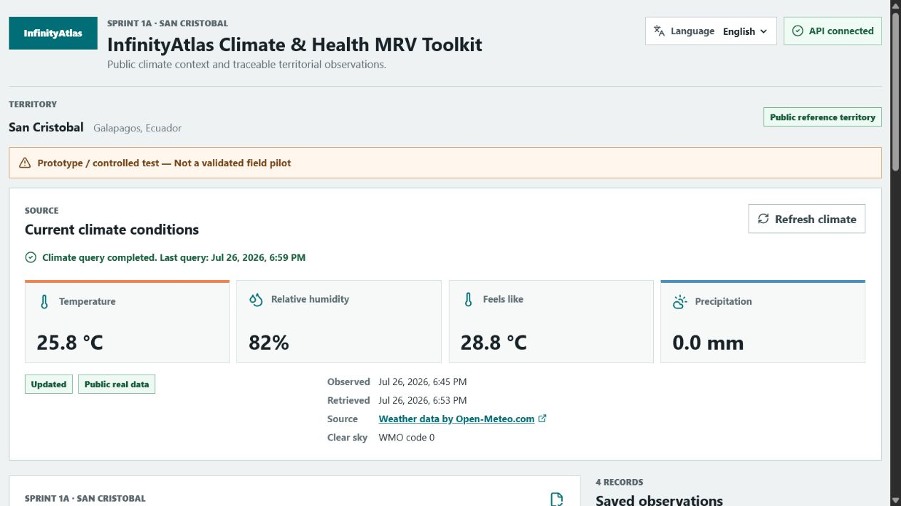
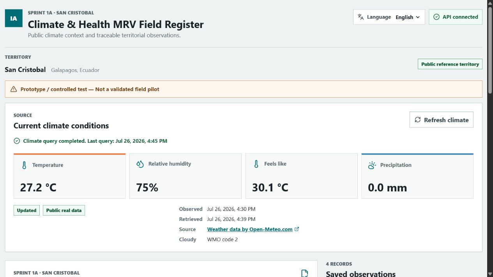
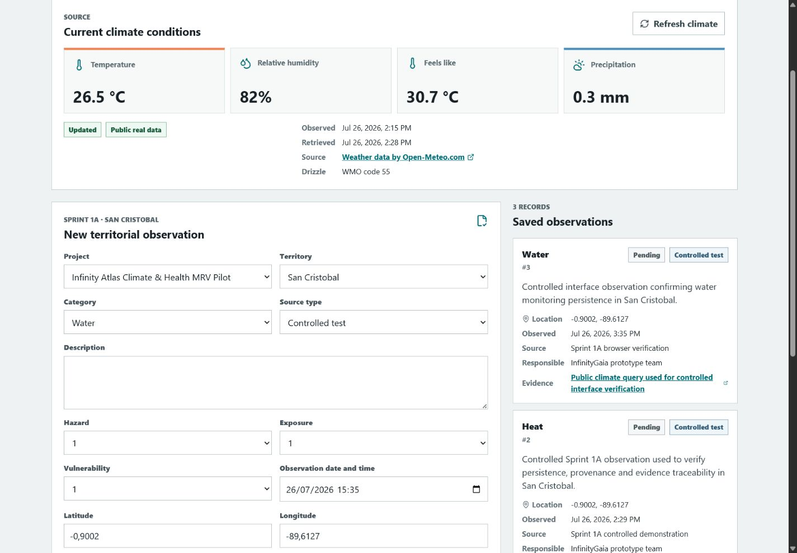
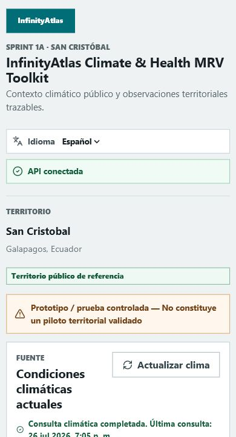
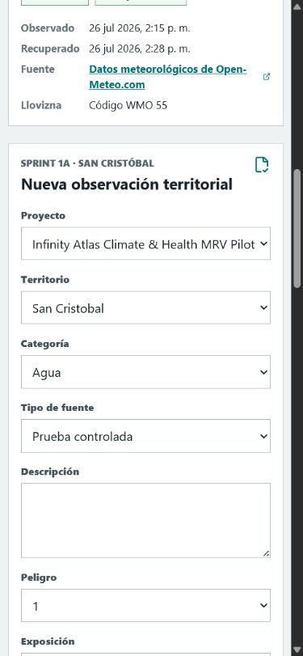

# Sprint 1A delivery note

Date: 2026-07-26

Status: implemented and pending final branch review.

## Functional delivery

- San Cristobal public reference territory.
- Current attributed Open-Meteo conditions.
- Visible observation and retrieval times.
- Database-backed 15-minute cache.
- Stale fallback when the climate provider fails.
- English-default and Spanish-selectable interface.
- Persistent territorial observation form.
- Required evidence URL reference.
- Initial observation status `pending`.
- Visible provenance for public real, controlled test and synthetic demo data.
- Manual idempotent reference-data bootstrap.
- Explicit prototype notice: no validated territorial field pilot is claimed.
- Visible save confirmation with the created observation number.
- Climate refresh progress, outcome and last query time.
- Safe synthetic evidence marker and technical Open-Meteo link labels.

## Endpoints

| Method | Path | Purpose |
| --- | --- | --- |
| `GET` | `/api/v1/climate/current?territory_id={id}` | Current or stored public climate record |
| `GET` | `/api/v1/projects` | Available projects |
| `GET` | `/api/v1/territories` | Available territories |
| `GET` | `/api/v1/observations` | Persistent observation list |
| `POST` | `/api/v1/observations` | Create a pending observation and evidence reference |

The existing `POST /api/v1/admin/seed` remains hidden and disabled outside local development.

## Model changes

Migration `0002_sprint_1a` adds:

- `ClimateData.retrieved_at`;
- apparent temperature and WMO weather code;
- provenance fields;
- observation creation time, source and responsible role;
- explicit synthetic confirmation;
- evidence source, date and provenance;

Reference project and territory data are intentionally absent from migrations. Run
`python -m app.bootstrap` after migrations to create or update the reference prototype and San
Cristobal. Existing controlled observations are preserved.

## Evidence implementation

Sprint 1A implements the minimum accepted URL reference option. This avoids placing photographs,
documents, personal data or confidential material in Git while storage permissions, retention,
malware scanning and privacy review are not yet available.

## Automated checks

- Python dependency consistency and source compilation.
- Alembic migration from an empty database.
- Open-Meteo transformation, mocked success and mocked failure.
- Climate source and timestamp persistence.
- Stale fallback behavior.
- Observation creation and pending status.
- Scale validation from 1 to 4.
- Synthetic confirmation and visible provenance.
- Persistence across separate API requests.
- Bootstrap idempotence and migration without operational data.
- Local-only confirmed clean-demo procedure.
- Synthetic evidence without a fictitious external link.
- Frontend form, climate display, refresh feedback, numbered save confirmation, translations and
  visible error state.
- Frontend production build.

## Known limits

- Open-Meteo output is model-based, not a local weather station reading.
- Open-Meteo data are CC BY 4.0. Its free endpoint is used only for evaluation/prototyping and is
  non-commercial and rate-limited under current terms.
- A funded stage requires a commercial plan, self-hosting, or a reviewed alternative source. The
  isolated climate adapter supports provider replacement.
- URL evidence can change or disappear.
- Authentication, technical validation, final risk score, advanced dashboard, map and PDF report are
  intentionally outside Sprint 1A.
- Docker/PostGIS remains pending validation on a machine with Docker.

## Demonstration evidence

Real climate example retrieved on 2026-07-26:

| Field | Value |
| --- | --- |
| Territory | San Cristobal, Galapagos, Ecuador |
| Source | Open-Meteo Weather Forecast API |
| Observed in Galapagos | 2026-07-26 14:15 |
| Retrieved in Galapagos | 2026-07-26 14:28 |
| Temperature | 26.5 °C |
| Relative humidity | 82% |
| Apparent temperature | 30.7 °C |
| Precipitation | 0.3 mm |
| WMO weather code | 55, drizzle |
| Provenance | `public_real` |
| Stale | `false` |

Controlled observation example:

| Field | Value |
| --- | --- |
| Category | Water |
| Status | `pending` |
| Provenance | `controlled_test` |
| Location | `-0.9002, -89.6127` |
| Source | Sprint 1A browser verification |
| Responsible role/team | InfinityGaia prototype team |
| Evidence | Public Open-Meteo query used for controlled interface verification |
| Persistence | Recovered after a full browser reload |

Screenshots:

- `docs/demo/sprint-1a-uat-hardening-desktop.png`
- `docs/demo/sprint-1a-climate-desktop.png`
- `docs/demo/sprint-1a-observation-desktop.png`
- `docs/demo/sprint-1a-mobile-es.png`
- `docs/demo/sprint-1a-mobile-form-es.png`

Browser verification confirmed:

- form submission from the real interface;
- pending observation visible immediately;
- the same record present after browser reload;
- correct Galapagos time after UTC normalization;
- no browser console warnings or errors;
- no incoherent overlap at desktop or mobile viewports.

No Sprint 1B work may begin without explicit approval.
